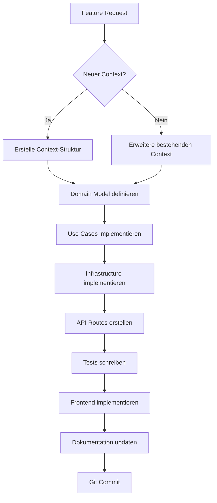

# 📋 DocuMind-AI V2 - Project Rules & Agent Guidelines

> **WICHTIG:** Diese Datei ist die **Single Source of Truth** für alle Entwickler und AI-Agenten.  
> Sie wird bei jeder Änderung automatisch aktualisiert und dokumentiert den aktuellen Stand des Projekts.

---

## 🎯 Projekt-Mission

**DocuMind-AI V2** ist ein **sauberer Neustart** mit Clean DDD-Architektur für Quality Management Systems (QMS).

### Ziele:
- ✅ **Keine Legacy-Kompromisse** - Alles wird von Grund auf richtig gemacht
- ✅ **DDD-First** - Jede Funktionalität als Bounded Context
- ✅ **Docker-First** - Deployment muss trivial sein
- ✅ **Type-Safe** - TypeScript Frontend, Python Type Hints
- ✅ **Dokumentiert** - Code UND Architektur sind dokumentiert

### Anti-Ziele:
- ❌ **Kein Legacy-Code** portieren ohne DDD-Refactoring
- ❌ **Keine Quick-Fixes** die Architektur brechen
- ❌ **Keine undokumentierten Features**

---

## 🏗️ Architektur-Regeln (NICHT VERHANDELBAR)

### 1. **Domain-Driven Design (DDD)**

Jede Funktionalität gehört in einen **Bounded Context**:

```
contexts/
└── [context-name]/
    ├── domain/              # Pure Business Logic (NO dependencies!)
    │   ├── entities.py      # Domain Entities
    │   ├── value_objects.py # Value Objects
    │   ├── repositories.py  # Repository Interfaces (Ports)
    │   └── events.py        # Domain Events
    │
    ├── application/         # Use Cases
    │   ├── use_cases.py     # Application Logic
    │   └── services.py      # Application Services
    │
    ├── infrastructure/      # Technical Implementation
    │   ├── repositories.py  # SQLAlchemy/Concrete Repos
    │   └── mappers.py       # DTO ↔ Entity Mapping
    │
    └── interface/           # External Interface
        └── router.py        # FastAPI Routes
```

**Dependency Rule:**
```
interface → application → domain
          ↘ infrastructure ↗
```

**WICHTIG:** Domain-Layer hat KEINE Abhängigkeiten nach außen!

### 2. **Naming Conventions**

| Typ | Convention | Beispiel |
|-----|------------|----------|
| **Contexts** | lowercase, plural | `interestgroups/`, `users/` |
| **Entities** | PascalCase | `User`, `InterestGroup` |
| **Value Objects** | PascalCase + VO | `EmailVO`, `PermissionVO` |
| **Repositories** | Interface in domain/ | `UserRepository` (abstract) |
| **Use Cases** | Verb + UseCase | `CreateUserUseCase` |
| **DTOs/Schemas** | PascalCase + Create/Update | `UserCreate`, `UserUpdate` |
| **Routes** | kebab-case, REST | `/api/interest-groups` |

### 3. **File Organization Rules**

```
✅ DO:
- Ein Context = Ein Verzeichnis unter contexts/
- Ein Entity = Eine Datei
- Interfaces (Ports) in domain/repositories.py
- Implementations in infrastructure/repositories.py

❌ DON'T:
- Vermische Contexts (keine Cross-Context Imports!)
- Vermische Layer (Domain darf NICHT infrastructure importieren)
- Riesen-Dateien (max. 500 Zeilen pro Datei)
```

---

## 📝 Dokumentations-Regeln (AUTOMATISCH)

### **Regel: Bei JEDER Änderung**

1. **Code-Dokumentation:**
   - Alle Klassen/Funktionen haben Docstrings (Google-Style)
   - Type Hints ÜBERALL (Python + TypeScript)
   - Komplexe Logik hat Inline-Kommentare

2. **Architektur-Dokumentation:**
   - Neuer Context? → Erstelle `contexts/[name]/README.md`
   - Neue API? → Update `docs/api.md`
   - Neues Feature? → Update `README.md` Feature-Liste

3. **Diese Datei (`PROJECT_RULES.md`):**
   - Neue Regel? → Füge hier hinzu
   - Regel geändert? → Update hier
   - Neuer Context? → Update Context-Liste (siehe unten)

### **Auto-Dokumentations-Template**

Wenn du einen neuen Context erstellst:

```bash
# 1. Erstelle Context-Verzeichnis
mkdir -p contexts/[name]/{domain,application,infrastructure,interface}

# 2. Erstelle README.md
cat > contexts/[name]/README.md << 'EOF'
# [Context Name] Context

## Verantwortlichkeit
[Was macht dieser Context?]

## Entities
- [Entity Name]: [Beschreibung]

## Use Cases
- [Use Case]: [Beschreibung]

## API Endpoints
- `GET /api/[...]`: [Beschreibung]
- `POST /api/[...]`: [Beschreibung]

## Dependencies
- Domain Events: [Liste]
- External Contexts: [Liste oder "None"]

## Status
- [x] Domain Model
- [ ] Use Cases
- [ ] Infrastructure
- [ ] API Routes
- [ ] Tests
- [ ] Frontend Integration
EOF

# 3. Update PROJECT_RULES.md (siehe unten)
```

---

## 🗂️ Aktuelle Contexts (Stand: 2025-10-06)

### ✅ Implementiert

#### 1. **interestgroups** - Interest Groups Management
- **Verantwortlichkeit:** Verwaltung der 13 Stakeholder-Gruppen
- **Status:** ✅ Vollständig (CRUD, API, Frontend)
- **Endpoints:** `/api/interest-groups`
- **Frontend:** `/interest-groups`

#### 2. **users** - User Management (RBAC)
- **Verantwortlichkeit:** Benutzerverwaltung, Rollen, Berechtigungen
- **Status:** ✅ Vollständig (Multi-Department Support)
- **Endpoints:** `/api/users`, `/api/user-group-memberships`
- **Frontend:** ⏳ TODO (`/users` Page fehlt noch)

#### 3. **accesscontrol** - Authentication & Authorization
- **Verantwortlichkeit:** JWT Auth, Login, Permissions
- **Status:** ✅ Vollständig
- **Endpoints:** `/api/auth/login`, `/api/auth/me`
- **Frontend:** `/login`

#### 4. **aiplayground** - AI Model Testing & Comparison
- **Verantwortlichkeit:** AI Provider Connection Tests, Interactive Testing, Model Comparison
- **Status:** ✅ Vollständig (OpenAI + Google AI Support)
- **Endpoints:** `/api/ai-playground/models`, `/api/ai-playground/test`, `/api/ai-playground/compare`
- **Frontend:** `/models` (nur für QMS Admin)
- **Features:** Single Model Test, Multi-Model Comparison, Token Metrics, Response Time Tracking

---

### 🔜 Geplant (Roadmap)

#### 5. **documents** - Document Management
- **Verantwortlichkeit:** QMS-Dokumente (SOP, Forms, etc.)
- **Priorität:** 🔥 HOCH
- **TODO:**
  - [ ] Domain Model (Document Entity, DocumentType VO)
  - [ ] Use Cases (Create, Update, Version)
  - [ ] API Routes
  - [ ] Frontend Pages

#### 6. **uploads** - File Upload & Processing
- **Verantwortlichkeit:** OCR, Vision AI, File Management
- **Priorität:** 🔥 HOCH
- **Abhängigkeiten:** `documents` Context
- **TODO:**
  - [ ] Domain Model (Upload Entity)
  - [ ] OCR Integration (Infrastructure)
  - [ ] Vision AI Integration
  - [ ] API Routes

#### 7. **qmworkflow** - QM Workflow Engine
- **Verantwortlichkeit:** Review → Approval Workflow
- **Priorität:** 🟡 MITTEL
- **Abhängigkeiten:** `documents`, `users`
- **TODO:**
  - [ ] Domain Model (WorkflowState, Transition)
  - [ ] State Machine Logic
  - [ ] API Routes

---

## 🛠️ Entwicklungs-Workflow

### **Neue Funktionalität hinzufügen:**



### **Workflow-Schritte im Detail:**

#### 1. **Domain Model** (`domain/entities.py`)
```python
"""
Entities sind Pure Business Objects - KEINE Abhängigkeiten!
"""
from dataclasses import dataclass
from typing import List
from .value_objects import Email, Permission

@dataclass
class User:
    """User Entity - Repräsentiert einen Systembenutzer"""
    id: int
    email: Email
    permissions: List[Permission]
    
    def has_permission(self, permission: Permission) -> bool:
        """Business Logic: Prüfe Berechtigung"""
        return permission in self.permissions
```

#### 2. **Repository Interface** (`domain/repositories.py`)
```python
"""
Ports - Abstrakte Interfaces für Persistence
"""
from abc import ABC, abstractmethod
from typing import List, Optional
from .entities import User

class UserRepository(ABC):
    """Port: User Persistence Interface"""
    
    @abstractmethod
    def get_by_id(self, user_id: int) -> Optional[User]:
        pass
    
    @abstractmethod
    def save(self, user: User) -> User:
        pass
```

#### 3. **Use Case** (`application/use_cases.py`)
```python
"""
Application Logic - Orchestriert Domain + Infrastructure
"""
from ..domain.entities import User
from ..domain.repositories import UserRepository

class CreateUserUseCase:
    """Use Case: Erstelle neuen User"""
    
    def __init__(self, user_repo: UserRepository):
        self.user_repo = user_repo
    
    def execute(self, email: str, permissions: List[str]) -> User:
        # 1. Validate
        # 2. Create Entity
        # 3. Save via Repository
        # 4. Return
        user = User(...)
        return self.user_repo.save(user)
```

#### 4. **Infrastructure** (`infrastructure/repositories.py`)
```python
"""
Concrete Implementation - SQLAlchemy, etc.
"""
from sqlalchemy.orm import Session
from ..domain.entities import User
from ..domain.repositories import UserRepository
from .mappers import UserMapper

class SQLAlchemyUserRepository(UserRepository):
    """Adapter: SQLAlchemy Implementation"""
    
    def __init__(self, db: Session):
        self.db = db
        self.mapper = UserMapper()
    
    def get_by_id(self, user_id: int) -> Optional[User]:
        db_user = self.db.query(UserModel).filter(...).first()
        return self.mapper.to_entity(db_user) if db_user else None
```

#### 5. **API Route** (`interface/router.py`)
```python
"""
FastAPI Router - External Interface
"""
from fastapi import APIRouter, Depends
from ..application.use_cases import CreateUserUseCase
from ..infrastructure.repositories import SQLAlchemyUserRepository

router = APIRouter(prefix="/api/users")

@router.post("/")
async def create_user(
    data: UserCreate,
    db: Session = Depends(get_db)
):
    repo = SQLAlchemyUserRepository(db)
    use_case = CreateUserUseCase(repo)
    user = use_case.execute(data.email, data.permissions)
    return user
```

---

## ✅ Code-Qualitäts-Regeln

### **Python Backend:**

```python
# ✅ DO:
from typing import List, Optional  # Type Hints
from dataclasses import dataclass  # Entities
from abc import ABC, abstractmethod  # Interfaces

@dataclass
class User:
    """Google-Style Docstring
    
    Args:
        id: Eindeutige User-ID
        email: Email-Adresse (validiert)
    
    Raises:
        ValueError: Wenn Email ungültig
    """
    id: int
    email: str

# ❌ DON'T:
class User:  # Kein Docstring
    def __init__(self, id, email):  # Keine Type Hints
        self.id = id
```

### **TypeScript Frontend:**

```typescript
// ✅ DO:
export interface User {
  id: number
  email: string
  permissions: string[]
}

export const createUser = async (data: UserCreate): Promise<User> => {
  const response = await apiClient.post<User>('/api/users', data)
  return response.data
}

// ❌ DON'T:
const createUser = (data: any) => {  // any ist verboten!
  return fetch('/api/users', {...})
}
```

---

## 🔄 Git Workflow

### **Commit Messages (Conventional Commits):**

```bash
# Format
<type>(<scope>): <subject>

# Types
feat:     Neue Funktionalität
fix:      Bugfix
docs:     Dokumentation
refactor: Code-Refactoring (keine Feature-Änderung)
test:     Tests
chore:    Build/Config

# Beispiele
feat(users): add multi-department support
fix(auth): resolve JWT token expiration bug
docs(contexts): add documents context README
refactor(interestgroups): extract repository logic
```

### **Branch Strategy:**

```
main                    # Produktions-ready Code
└── develop             # Development Branch
    ├── feature/users-page
    ├── feature/documents-context
    └── fix/auth-bug
```

---

## 🧪 Testing-Regeln

### **Test-Struktur:**

```
tests/
├── unit/                    # Unit Tests (Domain/Application)
│   └── [context]/
│       ├── test_entities.py
│       └── test_use_cases.py
│
├── integration/             # Integration Tests (Infrastructure)
│   └── [context]/
│       └── test_repositories.py
│
└── e2e/                     # End-to-End Tests (API)
    └── test_[context]_api.py
```

### **Test-Beispiel:**

```python
# tests/unit/users/test_entities.py
import pytest
from contexts.users.domain.entities import User
from contexts.users.domain.value_objects import Email

def test_user_has_permission():
    """User sollte Berechtigung korrekt prüfen"""
    user = User(id=1, email=Email("test@example.com"), permissions=["read"])
    assert user.has_permission("read") is True
    assert user.has_permission("write") is False
```

---

## 📊 Performance & Monitoring

### **Regeln:**

1. **API Response Time:** < 200ms (P95)
2. **Database Queries:** Lazy Loading nur wenn nötig
3. **Docker Images:** < 500MB pro Service
4. **Frontend Bundle:** < 500KB (gzipped)

### **Monitoring-Endpoints:**

- `/health` - Basic Health Check
- `/metrics` - Prometheus Metrics (TODO)
- `/api/docs` - API Documentation

---

## 🚀 Deployment-Regeln

### **Deployment Checklist:**

- [ ] Alle Tests grün
- [ ] Dokumentation aktualisiert
- [ ] Docker Images gebaut
- [ ] Environment Variables gesetzt
- [ ] Database Migrations durchgeführt
- [ ] Health Checks validiert

### **Deployment-Befehle:**

```bash
# Development
docker-compose up -d

# Production (später)
docker-compose -f docker-compose.prod.yml up -d
```

---

## 📚 Wichtige Dateien (Immer aktuell halten!)

| Datei | Zweck | Update bei |
|-------|-------|-----------|
| `PROJECT_RULES.md` | Diese Datei | Jeder Regel-Änderung |
| `README.md` | Projekt-Übersicht | Neuem Feature, Deployment-Änderung |
| `docs/architecture.md` | Architektur-Diagramme | Neuem Context, Architektur-Änderung |
| `docs/api.md` | API-Dokumentation | Neuem Endpoint |
| `contexts/[name]/README.md` | Context-Dokumentation | Context-Änderung |

---

## 🤖 Agent-Onboarding (für neue Sessions)

**Wenn ein neuer Agent dieses Projekt öffnet:**

1. **Lies diese Datei komplett** (`PROJECT_RULES.md`)
2. **Lies `README.md`** für Projekt-Übersicht
3. **Prüfe aktuelle Contexts** (siehe Liste oben)
4. **Frage nach aktuellem Task** bevor du Code änderst
5. **Folge IMMER der DDD-Architektur**
6. **Dokumentiere ALLE Änderungen**

**Wichtige Kommandos:**

```bash
# Projekt starten
./start.sh

# Logs anzeigen
docker-compose logs -f

# Backend lokal entwickeln
cd backend && uvicorn app.main:app --reload

# Frontend lokal entwickeln
cd frontend && npm run dev

# Tests ausführen
cd backend && pytest
```

---

## 📝 Änderungshistorie dieser Datei

| Datum | Änderung | Author |
|-------|----------|--------|
| 2025-09-30 | Initial erstellt mit DDD-Regeln, Contexts, Workflows | AI Assistant |
| 2025-10-06 | AI Playground Context hinzugefügt (OpenAI + Google AI Support) | AI Assistant |

---

**🎯 Merke:** Dieses Projekt ist ein **sauberer Neustart**. Kein Legacy-Code, keine Kompromisse. Jede Zeile Code folgt DDD-Prinzipien und ist vollständig dokumentiert.
