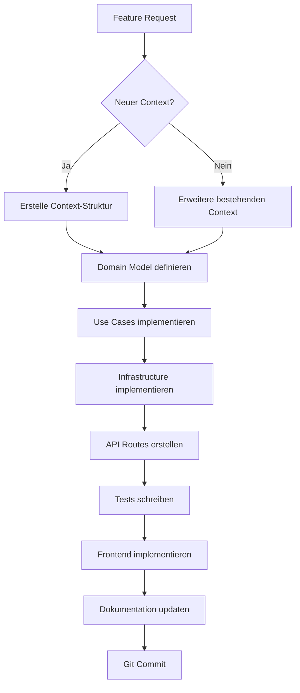

# 📋 DocuMind-AI V2 - Project Rules & Agent Guidelines

> **WICHTIG:** Diese Datei ist die **Single Source of Truth** für alle Entwickler und AI-Agenten.  
> Sie wird bei jeder Änderung automatisch aktualisiert und dokumentiert den aktuellen Stand des Projekts.

---

## 🎯 Projekt-Mission

**DocuMind-AI V2** ist ein **sauberer Neustart** mit Clean DDD-Architektur für Quality Management Systems (QMS).

### Ziele:
- ✅ **Keine Legacy-Kompromisse** - Alles wird von Grund auf richtig gemacht
- ✅ **DDD-First** - Jede Funktionalität als Bounded Context
- ✅ **Docker-First** - Deployment muss trivial sein
- ✅ **Type-Safe** - TypeScript Frontend, Python Type Hints
- ✅ **Dokumentiert** - Code UND Architektur sind dokumentiert

### Anti-Ziele:
- ❌ **Kein Legacy-Code** portieren ohne DDD-Refactoring
- ❌ **Keine Quick-Fixes** die Architektur brechen
- ❌ **Keine undokumentierten Features**

---

## 🏗️ Architektur-Regeln (NICHT VERHANDELBAR)

### 1. **Domain-Driven Design (DDD)**

Jede Funktionalität gehört in einen **Bounded Context**:

```
contexts/
└── [context-name]/
    ├── domain/              # Pure Business Logic (NO dependencies!)
    │   ├── entities.py      # Domain Entities
    │   ├── value_objects.py # Value Objects
    │   ├── repositories.py  # Repository Interfaces (Ports)
    │   └── events.py        # Domain Events
    │
    ├── application/         # Use Cases
    │   ├── use_cases.py     # Application Logic
    │   └── services.py      # Application Services
    │
    ├── infrastructure/      # Technical Implementation
    │   ├── repositories.py  # SQLAlchemy/Concrete Repos
    │   └── mappers.py       # DTO ↔ Entity Mapping
    │
    └── interface/           # External Interface
        └── router.py        # FastAPI Routes
```

**Dependency Rule:**
```
interface → application → domain
          ↘ infrastructure ↗
```

**WICHTIG:** Domain-Layer hat KEINE Abhängigkeiten nach außen!

### 2. **Naming Conventions**

| Typ | Convention | Beispiel |
|-----|------------|----------|
| **Contexts** | lowercase, plural | `interestgroups/`, `users/` |
| **Entities** | PascalCase | `User`, `InterestGroup` |
| **Value Objects** | PascalCase + VO | `EmailVO`, `PermissionVO` |
| **Repositories** | Interface in domain/ | `UserRepository` (abstract) |
| **Use Cases** | Verb + UseCase | `CreateUserUseCase` |
| **DTOs/Schemas** | PascalCase + Create/Update | `UserCreate`, `UserUpdate` |
| **Routes** | kebab-case, REST | `/api/interest-groups` |

### 3. **File Organization Rules**

```
✅ DO:
- Ein Context = Ein Verzeichnis unter contexts/
- Ein Entity = Eine Datei
- Interfaces (Ports) in domain/repositories.py
- Implementations in infrastructure/repositories.py

❌ DON'T:
- Vermische Contexts (keine Cross-Context Imports!)
- Vermische Layer (Domain darf NICHT infrastructure importieren)
- Riesen-Dateien (max. 500 Zeilen pro Datei)
```

---

## 🧪 Test-Driven Development (TDD) - STANDARD

### **TDD-Workflow (IMMER befolgen!)**

Für **ALLE** neuen Features/Contexts:

```
1. RED:   Schreibe Tests ZUERST (sie schlagen fehl)
2. GREEN: Implementiere Code bis Tests GRÜN sind
3. REFACTOR: Optimiere Code (Tests bleiben GRÜN)
```

### **Test-Struktur**

```
tests/
├── unit/                  # Domain + Application Layer
│   └── [context]/
│       ├── test_entities.py
│       ├── test_value_objects.py
│       ├── test_use_cases.py
│       └── test_repositories.py
├── integration/           # Infrastructure Layer
│   └── [context]/
│       └── test_repositories_integration.py
└── e2e/                   # API + Frontend
    └── test_[feature]_api.py
```

### **Test-Coverage Ziele**

- **Domain Layer:** 100% (TDD)
- **Application Layer:** 100% (TDD)
- **Infrastructure Layer:** 80%
- **Interface Layer:** 80%
- **E2E Tests:** Kritische Workflows

### **Beispiel: documentupload Phase 2.7 (AI-Verarbeitung)**

✅ **RED Phase:**
```python
# tests/unit/documentupload/test_ai_processing.py
def test_create_valid_ai_processing_result():
    # Test schlägt fehl - AIProcessingResult existiert noch nicht
    result = AIProcessingResult(...)
    assert result.processing_status == "completed"
```

✅ **GREEN Phase:**
```python
# contexts/documentupload/domain/entities.py
@dataclass
class AIProcessingResult:
    # Implementierung bis Test GRÜN ist
    ...
```

✅ **REFACTOR Phase:**
- Code-Optimierung
- Performance-Verbesserungen
- Tests bleiben GRÜN

**Ergebnis:** 10/10 Tests GRÜN! 🟢

---

## 📝 Dokumentations-Regeln (AUTOMATISCH)

### **Regel: Bei JEDER Änderung**

1. **Code-Dokumentation:**
   - Alle Klassen/Funktionen haben Docstrings (Google-Style)
   - Type Hints ÜBERALL (Python + TypeScript)
   - Komplexe Logik hat Inline-Kommentare

2. **Architektur-Dokumentation:**
   - Neuer Context? → Erstelle `contexts/[name]/README.md`
   - Neue API? → Update `docs/api.md`
   - Neues Feature? → Update `README.md` Feature-Liste

3. **Diese Datei (`PROJECT_RULES.md`):**
   - Neue Regel? → Füge hier hinzu
   - Regel geändert? → Update hier
   - Neuer Context? → Update Context-Liste (siehe unten)

### **Auto-Dokumentations-Template**

Wenn du einen neuen Context erstellst:

```bash
# 1. Erstelle Context-Verzeichnis
mkdir -p contexts/[name]/{domain,application,infrastructure,interface}

# 2. Erstelle README.md
cat > contexts/[name]/README.md << 'EOF'
# [Context Name] Context

## Verantwortlichkeit
[Was macht dieser Context?]

## Entities
- [Entity Name]: [Beschreibung]

## Use Cases
- [Use Case]: [Beschreibung]

## API Endpoints
- `GET /api/[...]`: [Beschreibung]
- `POST /api/[...]`: [Beschreibung]

## Dependencies
- Domain Events: [Liste]
- External Contexts: [Liste oder "None"]

## Status
- [x] Domain Model
- [ ] Use Cases
- [ ] Infrastructure
- [ ] API Routes
- [ ] Tests
- [ ] Frontend Integration
EOF

# 3. Update PROJECT_RULES.md (siehe unten)
```

---

## 🗂️ Aktuelle Contexts (Stand: 2025-10-27)

### ✅ Implementiert

#### 1. **interestgroups** - Interest Groups Management
- **Verantwortlichkeit:** Verwaltung der Stakeholder-Gruppen
- **Status:** ✅ Vollständig (CRUD, API, Frontend)
- **Endpoints:** `/api/interest-groups`
- **Frontend:** `/interest-groups`

#### 2. **users** - User Management (RBAC)
- **Verantwortlichkeit:** Benutzerverwaltung, Rollen, Berechtigungen
- **Status:** ✅ Vollständig (Multi-Department Support)
- **Endpoints:** `/api/users`, `/api/user-group-memberships`
- **Frontend:** ⏳ TODO (`/users` Page fehlt noch)

#### 3. **accesscontrol** - Authentication & Authorization
- **Verantwortlichkeit:** JWT Auth, Login, Permissions
- **Status:** ✅ Vollständig
- **Endpoints:** `/api/auth/login`, `/api/auth/me`
- **Frontend:** `/login`

#### 4. **aiplayground** - AI Model Testing & Comparison
- **Verantwortlichkeit:** AI Provider Connection Tests, Interactive Testing, Model Comparison, Model Evaluation
- **Status:** ✅ Vollständig (Multi-Provider Support mit Parallel Processing + Step-by-Step Evaluation)
- **Endpoints:** 
  - `/api/ai-playground/models` - Liste verfügbarer AI Modelle
  - `/api/ai-playground/test` - Single Model Test
  - `/api/ai-playground/compare` - Multi-Model Comparison (parallel)
  - `/api/ai-playground/test-model-stream` - Streaming Tests (Server-Sent Events)
  - `/api/ai-playground/evaluate` - Model Comparison Evaluation (deprecated, legacy)
  - `/api/ai-playground/evaluate-single` - **Single Model Evaluation** (aktuell, empfohlen)
  - `/api/ai-playground/upload-image` - Multimodal Support (Bild/Dokument Upload)
- **Frontend:** `/models` (nur für QMS Admin, Session-Based Auth)
- **Supported Models:**
  - OpenAI: GPT-4o Mini, GPT-5 Mini (separate API Keys)
  - Google AI: Gemini 2.5 Flash
- **Features:** 
  - ✅ Single Model Test mit Token Breakdown (Text vs. Image)
  - ✅ Multi-Model Comparison mit echtem Parallel-Processing (Thread-Pool für Google AI)
  - ✅ **Step-by-Step Model Evaluation System** (Schrittweise Bewertung)
    - Evaluator-Prompt frei editierbar (4600+ Zeichen, 10 Kriterien)
    - Evaluator-Modell auswählbar (GPT-5 Mini, Gemini, GPT-4o Mini)
    - Max Tokens auf Model-Maximum gesetzt (keine Truncation mehr)
    - Einzelbewertung: "Evaluate First Model" → "Evaluate Second Model"
    - Finale Vergleichstabelle mit Gewinner-Markierung
    - JSON-Output: `category_scores` (0-10), `strengths`, `weaknesses`, `summary`
    - Debug-Anzeige: Input JSON Preview + Komplette Evaluation Response
  - ✅ Image/Document Upload (Drag & Drop, max 10MB)
  - ✅ Vision API Support (High/Low Detail für OpenAI)
  - ✅ Dynamic Max Tokens (passt sich an kleinste Modell-Limit an)
  - ✅ 4 Min Timeout pro Modell (für komplexe Prompts + Bilder)
  - ✅ Detaillierte Error-Messages (Safety Ratings, Finish Reasons)
  - ✅ JSON Response Highlighting
  - ✅ Konfigurierbar (Temperature, Max Tokens, Top P, Detail Level)
  - ✅ **Model Verification Badges** (zeigt echte API Model-IDs)
  - ✅ **Progress Indicators** für langsame Modelle (GPT-5, Gemini)
  - ✅ **Abort Functionality** für alle Test-Modi
  - ✅ **Streaming Support** mit Live-Content (GPT-4o Mini) und Progress (GPT-5, Gemini)

#### 5. **documenttypes** - Document Type Management
- **Verantwortlichkeit:** Verwaltung von QMS-Dokumentkategorien
- **Status:** ✅ Vollständig (CRUD, API, Frontend)
- **Endpoints:** 
  - `GET /api/document-types` - Liste aller Dokumenttypen
  - `GET /api/document-types/{id}` - Einzelner Dokumenttyp
  - `POST /api/document-types` - Neuen Typ erstellen
  - `PUT /api/document-types/{id}` - Typ aktualisieren
  - `DELETE /api/document-types/{id}` - Typ löschen (Soft Delete)
- **Frontend:** `/prompt-management` (integriert)
- **Features:**
  - ✅ CRUD für Dokumenttypen (SOP, Flussdiagramm, Formular, etc.)
  - ✅ File Type Validation (allowed_file_types als JSON Array)
  - ✅ Max File Size Configuration (in MB)
  - ✅ AI Processing Requirements (requires_ocr, requires_vision)
  - ✅ Prompt Template Assignment (default_prompt_template_id)
  - ✅ Sortierung (sort_order) & Aktivierung/Deaktivierung Toggle
  - ✅ 7 Standard-Dokumenttypen vorkonfiguriert (via seed_data.py)
  - ✅ Search & Filter (OCR, Vision) im Frontend
  - ✅ Responsive Grid-Layout mit Karten-Design
  - ✅ Drag & Drop Target für Standard-Prompt Zuweisung

#### 6. **prompttemplates** - Prompt Template Management & Versioning
- **Verantwortlichkeit:** Verwaltung wiederverwendbarer AI Prompts mit Versionierung (Generation + Evaluation)
- **Status:** ✅ Vollständig (Backend, Frontend, AI Playground Integration, Evaluation Support)
- **Endpoints:** 
  - `GET /api/prompt-templates` - Liste (mit Filter: status, document_type_id, active_only)
  - `GET /api/prompt-templates/{id}` - Einzelnes Template
  - `POST /api/prompt-templates` - Neues Template erstellen
  - `POST /api/prompt-templates/from-playground` - Template aus AI Playground speichern
  - `PUT /api/prompt-templates/{id}` - Template aktualisieren
  - `POST /api/prompt-templates/{id}/activate` - Template aktivieren
  - `POST /api/prompt-templates/{id}/archive` - Template archivieren
  - `DELETE /api/prompt-templates/{id}` - Template löschen
- **Frontend:** `/prompt-management` (Moderne Split-View mit Gestapelten Karten)
- **Features:**
  - ✅ CRUD für Prompt Templates
  - ✅ **Template Types:** Generation (JSON-Erstellung) + Evaluation (Modell-Bewertung)
  - ✅ **Default Evaluator Support:** Ein Default Evaluator pro Dokument-Typ
  - ✅ Status Management (draft, active, archived, deprecated)
  - ✅ AI Model Configuration Storage (temperature, max_tokens, top_p, detail_level)
  - ✅ Document Type Linking (Foreign Key zu document_types)
  - ✅ Semantic Versioning (version field)
  - ✅ Usage Tracking (tested_successfully, success_count, last_used_at)
  - ✅ Tag-based Categorization (JSON Array)
  - ✅ "Save from Playground" Workflow (inkl. Test-Metrics)
  - ✅ Example Input/Output Storage
  - ✅ **Frontend: Prompt-Verwaltung Page** (Master-Detail Split-View)
    - Links: Dokumenttypen-Grid mit Search & Filter
    - Rechts: Gestapelte Prompt-Karten (Stacked Cards Design)
    - Drag & Drop: Prompt auf Dokumenttyp ziehen = Als Standard setzen
    - ⭐ Standard-Prompt visuell hervorgehoben (grüner Gradient, AKTIV Badge)
    - Preview Modal: Vollständiger Prompt-Text + Config + Example Output
    - Edit-Integration: "Bearbeiten" öffnet AI Playground mit vorausgefüllten Daten
  - ✅ **AI Playground Integration:**
    - "💾 Als Template speichern" Button nach erfolgreichem Test
    - Modal mit Dokumenttyp-Auswahl
    - Automatische Token-Metrics Speicherung (tokens_sent, tokens_received, response_time)
    - Redirect zu Prompt-Verwaltung nach Speichern
  - ✅ **Model Evaluation Integration:**
    - Evaluator-Prompts für automatische Modell-Bewertung
    - 10 spezifische Bewertungskriterien (0-10 Punkte pro Kriterium)
    - JSON-basierte Score-Ausgabe mit Begründungen
    - Integration in AI Playground Comparison Tests

---

### 🔜 In Entwicklung (Feature Branch: `feature/document-upload-system`)

> **Roadmap:** Siehe `docs/ROADMAP_DOCUMENT_UPLOAD.md` für detaillierte Task-Liste

#### 7. **documentupload** - Document Upload & Workflow System (VOLLSTÄNDIG)
- **Verantwortlichkeit:** File Upload (PDF, DOCX, PNG, JPG), Page Splitting, Preview Generation, Metadata Management, **4-Status Workflow (Draft → Reviewed → Approved/Rejected)**
- **Status:** ✅ Vollständig implementiert (Backend + Frontend + Workflow + Permissions + Audit Trail)
- **Features:**
  - 4-Status Workflow (Draft → Reviewed → Approved/Rejected)
  - Permission-basiert (Level 2-5)
  - Audit Trail (document_status_changes)
  - Kommentare (document_comments)
  - Interest Groups Filter
  - Kanban Board mit Drag & Drop
- **Endpoints:** 
  - `POST /api/document-upload/upload` - Upload document (multipart/form-data)
  - `POST /api/document-upload/{id}/generate-preview` - Generate page previews
  - `POST /api/document-upload/{id}/assign-interest-groups` - Assign interest groups
  - `POST /api/document-upload/{id}/process-page/{page_number}` - AI-Verarbeitung einer Seite
  - `GET /api/document-upload/{id}` - Get upload details (with pages & assignments)
  - `GET /api/document-upload/` - List uploads (with filters: user_id, document_type_id, processing_status)
  - `DELETE /api/document-upload/{id}` - Delete upload (cascade: files + DB)
  - **Workflow Endpoints:**
  - `POST /api/document-workflow/change-status` - Status ändern
  - `GET /api/document-workflow/status/{status}` - Dokumente nach Status
  - `GET /api/document-workflow/history/{document_id}` - Workflow-Historie
  - `GET /api/document-workflow/allowed-transitions/{document_id}` - Erlaubte Transitions
- **Frontend:** 
  - `/document-upload` - Upload Page (Drag & Drop, Metadata, Interest Groups)
  - `/documents` - Document List (Search, Filters, Table View)
  - `/documents/:id` - Document Detail (Preview, Metadata, Interest Groups, Page Navigation)
- **Features:**
  - ✅ **Domain Layer:** 8 Value Objects, 4 Entities, 4 Repository Interfaces, 6 Domain Events
    - **NEU:** `AIProcessingResult` Entity (mit JSON-Parsing, Status-Management, Token-Tracking)
    - **NEU:** `AIResponse` Value Object (unveränderlich, mit JSON-Validierung)
    - **NEU:** `ProcessingStatus.PARTIAL` (für teilweise erfolgreiche AI-Responses)
    - **NEU:** `AIResponseRepository` Interface (Port für AI-Responses)
  - ✅ **Application Layer:** 5 Use Cases + 2 Service Ports
    - 4 bestehende Use Cases (Upload, GeneratePreview, AssignInterestGroups, GetUploadDetails)
    - **NEU:** `ProcessDocumentPageUseCase` - **AI-Verarbeitung mit Standard-Prompt**
    - **NEU:** `AIProcessingService` Protocol (Port für AI-Service)
    - **NEU:** `PromptTemplateRepository` Protocol (Port für Prompt-Templates)
  - ✅ **Infrastructure Layer:**
    - LocalFileStorageService (Date-based: `YYYY/MM/DD` structure)
    - PDFSplitterService (PDF → Images, DPI: 200)
    - ImageProcessorService (Thumbnails: 200x200, JPEG quality: 85, Auto-rotation)
    - 4 SQLAlchemy Repositories (Adapters)
    - **NEU:** `AIPlaygroundProcessingService` - **Cross-Context Integration (aiplayground)**
    - **NEU:** `SQLAlchemyAIResponseRepository` - **Vollständiges CRUD für AI-Responses**
    - 3 Mappers (DTO ↔ Entity)
  - ✅ **Interface Layer:** 7 FastAPI Endpoints, Pydantic Schemas, Dependency Injection, Permission Checks (Level 4)
    - **NEU:** `POST /process-page/{page_number}` - **AI-Verarbeitung mit vollständigem Error Handling**
  - ✅ **Frontend (React/Next.js 14):**
    - Drag & Drop Upload (max 50MB)
    - File Type Validation (PDF, DOCX, PNG, JPG)
    - Document Type Selection
    - QM Chapter + Version Input
    - Interest Group Multi-Selection
    - Upload Progress Indicator (10% → 30% → 50% → 70% → 100%)
    - Document List with Search & Filters
    - Document Detail with Page-by-Page Preview Navigation
  - ✅ **Permissions:** Upload/Delete nur für Quality Manager (Level 4)
  - ✅ **Processing Status:** pending → processing → completed / failed
- **Dependencies Installiert:**
  - PyPDF2 (3.0.1) - PDF parsing
  - pdf2image (1.17.0) - PDF to image conversion
  - python-docx (1.2.0) - DOCX support
  - pytesseract (0.3.13) - OCR (future use)
  - Pillow (11.1.0) - Image processing

### 🔜 Geplant (Phases 4-5)

> **Roadmap:** Siehe `docs/ROADMAP_DOCUMENT_UPLOAD.md` für detaillierte Task-Liste

#### 8. **ragintegration** - RAG System Integration (VOLLSTÄNDIG)
- **Verantwortlichkeit:** RAG Chat, Vector Store (Qdrant), Document Indexing, Semantic Search, Chat Sessions
- **Status:** ✅ Vollständig implementiert (Backend + Frontend + Integration)
- **Features:**
  - ✅ **Domain Layer:** 4 Entities, 4 Value Objects, 4 Repository Interfaces, 3 Domain Events
    - `IndexedDocument` Entity (Status-Management, Chunk-Count)
    - `DocumentChunk` Entity (Metadata, Confidence-Score, Token-Count)
    - `ChatSession` Entity (Session-Management, Message-Count)
    - `ChatMessage` Entity (Role-Management, Source-References, Structured-Data)
    - `EmbeddingVector` Value Object (1536-Dimension, Immutable)
    - `ChunkMetadata` Value Object (Page-Numbers, Heading-Hierarchy, Confidence)
    - `SourceReference` Value Object (Document-Link, Relevance-Score, Text-Excerpt)
    - `SearchQuery` Value Object (Query-Parameters, Filters)
  - ✅ **Application Layer:** 5 Use Cases + 3 Services
    - `IndexApprovedDocumentUseCase` - Dokument-Indexierung (nur freigegebene)
    - `AskQuestionUseCase` - RAG Chat mit Source-References
    - `CreateChatSessionUseCase` - Session-Management
    - `GetChatHistoryUseCase` - Chat-Historie
    - `ReindexDocumentUseCase` - Dokument-Re-Indexierung
    - `HeadingAwareChunkingService` - Intelligentes Chunking (Vision-AI + Fallback)
    - `MultiQueryService` - Query-Expansion für bessere Suche
    - `StructuredDataExtractorService` - Strukturierte Daten-Extraktion
  - ✅ **Infrastructure Layer:**
    - `QdrantVectorStoreAdapter` - In-Memory Vector Store (1536-Dimension)
    - `OpenAIEmbeddingAdapter` - text-embedding-3-small Integration
    - `VisionDataExtractorAdapter` - Vision AI Data Processing
    - `HybridSearchService` - Vektor + Text-Suche mit Re-Ranking
    - 4 SQLAlchemy Repositories (IndexedDocument, DocumentChunk, ChatSession, ChatMessage)
    - `RAGInfrastructureAdapter` - Zentrale Koordination aller Services
  - ✅ **Interface Layer:** 8 FastAPI Endpoints + Pydantic Schemas
    - `POST /api/rag/documents/index` - Dokument indexieren
    - `POST /api/rag/chat/ask` - Frage stellen
    - `POST /api/rag/chat/sessions` - Chat-Session erstellen
    - `GET /api/rag/chat/sessions/{id}/history` - Chat-Historie
    - `POST /api/rag/search` - Dokumente suchen
    - `POST /api/rag/documents/{id}/reindex` - Re-indexieren
    - `GET /api/rag/system/info` - System-Info
    - `GET /api/rag/health` - Health Check
  - ✅ **Frontend (React/Next.js 14):**
    - **RAG Chat Dashboard** - Zentraler Chat (60% Viewport)
    - **Session Sidebar** - Session-Management (20% Viewport)
    - **Filter Panel** - Erweiterte Suche (20% Viewport)
    - **Source Preview Modal** - Vollbild-Preview mit Zoom
    - **RAG Indexierung Panel** - Document Detail Integration
    - **Multi-Model Support** - GPT-4o Mini, GPT-5 Mini, Gemini 2.5 Flash
    - **Structured Data Rendering** - Tabellen, Listen, Sicherheitshinweise
    - **Suggested Questions** - UX-Optimierung
    - **Voice Input** - Vorbereitet für Voice-Recording
- **Chunking-Strategie:**
  - Vision-AI-basiert (strukturierte JSON-Response)
  - Fallback: Page-Boundary-aware Chunking
  - Fallback: Plain-Text Chunking
  - Max 1000 Zeichen pro Chunk
  - Metadaten: Page-Numbers, Heading-Hierarchy, Confidence-Score, Token-Count
  - TÜV-Audit-tauglich (präzise Quellenangaben)
- **Database:**
  - 4 neue Tabellen: `rag_indexed_documents`, `rag_document_chunks`, `rag_chat_sessions`, `rag_chat_messages`
  - Indizes für optimale Performance
  - Trigger für automatische Updates
  - Views für komplexe Queries
- **Permissions:**
  - Level 1 (Angestellte): RAG Chat (nur eigene Interest Groups)
  - Level 2-4: RAG Chat (alle freigegebenen Dokumente)
  - Indexierung: Nur freigegebene Dokumente
- **Dependencies:**
  - qdrant-client (Vector Store)
  - openai (Embeddings)
  - numpy (Vector Operations)

---

## 🛠️ Entwicklungs-Workflow

### **Neue Funktionalität hinzufügen:**



### **Workflow-Schritte im Detail:**

#### 1. **Domain Model** (`domain/entities.py`)
```python
"""
Entities sind Pure Business Objects - KEINE Abhängigkeiten!
"""
from dataclasses import dataclass
from typing import List
from .value_objects import Email, Permission

@dataclass
class User:
    """User Entity - Repräsentiert einen Systembenutzer"""
    id: int
    email: Email
    permissions: List[Permission]
    
    def has_permission(self, permission: Permission) -> bool:
        """Business Logic: Prüfe Berechtigung"""
        return permission in self.permissions
```

#### 2. **Repository Interface** (`domain/repositories.py`)
```python
"""
Ports - Abstrakte Interfaces für Persistence
"""
from abc import ABC, abstractmethod
from typing import List, Optional
from .entities import User

class UserRepository(ABC):
    """Port: User Persistence Interface"""
    
    @abstractmethod
    def get_by_id(self, user_id: int) -> Optional[User]:
        pass
    
    @abstractmethod
    def save(self, user: User) -> User:
        pass
```

#### 3. **Use Case** (`application/use_cases.py`)
```python
"""
Application Logic - Orchestriert Domain + Infrastructure
"""
from ..domain.entities import User
from ..domain.repositories import UserRepository

class CreateUserUseCase:
    """Use Case: Erstelle neuen User"""
    
    def __init__(self, user_repo: UserRepository):
        self.user_repo = user_repo
    
    def execute(self, email: str, permissions: List[str]) -> User:
        # 1. Validate
        # 2. Create Entity
        # 3. Save via Repository
        # 4. Return
        user = User(...)
        return self.user_repo.save(user)
```

#### 4. **Infrastructure** (`infrastructure/repositories.py`)
```python
"""
Concrete Implementation - SQLAlchemy, etc.
"""
from sqlalchemy.orm import Session
from ..domain.entities import User
from ..domain.repositories import UserRepository
from .mappers import UserMapper

class SQLAlchemyUserRepository(UserRepository):
    """Adapter: SQLAlchemy Implementation"""
    
    def __init__(self, db: Session):
        self.db = db
        self.mapper = UserMapper()
    
    def get_by_id(self, user_id: int) -> Optional[User]:
        db_user = self.db.query(UserModel).filter(...).first()
        return self.mapper.to_entity(db_user) if db_user else None
```

#### 5. **API Route** (`interface/router.py`)
```python
"""
FastAPI Router - External Interface
"""
from fastapi import APIRouter, Depends
from ..application.use_cases import CreateUserUseCase
from ..infrastructure.repositories import SQLAlchemyUserRepository

router = APIRouter(prefix="/api/users")

@router.post("/")
async def create_user(
    data: UserCreate,
    db: Session = Depends(get_db)
):
    repo = SQLAlchemyUserRepository(db)
    use_case = CreateUserUseCase(repo)
    user = use_case.execute(data.email, data.permissions)
    return user
```

---

## ✅ Code-Qualitäts-Regeln

### **Python Backend:**

```python
# ✅ DO:
from typing import List, Optional  # Type Hints
from dataclasses import dataclass  # Entities
from abc import ABC, abstractmethod  # Interfaces

@dataclass
class User:
    """Google-Style Docstring
    
    Args:
        id: Eindeutige User-ID
        email: Email-Adresse (validiert)
    
    Raises:
        ValueError: Wenn Email ungültig
    """
    id: int
    email: str

# ❌ DON'T:
class User:  # Kein Docstring
    def __init__(self, id, email):  # Keine Type Hints
        self.id = id
```

### **TypeScript Frontend:**

```typescript
// ✅ DO:
export interface User {
  id: number
  email: string
  permissions: string[]
}

export const createUser = async (data: UserCreate): Promise<User> => {
  const response = await apiClient.post<User>('/api/users', data)
  return response.data
}

// ❌ DON'T:
const createUser = (data: any) => {  // any ist verboten!
  return fetch('/api/users', {...})
}
```

---

## 🔄 Git Workflow

### **Commit Messages (Conventional Commits):**

```bash
# Format
<type>(<scope>): <subject>

# Types
feat:     Neue Funktionalität
fix:      Bugfix
docs:     Dokumentation
refactor: Code-Refactoring (keine Feature-Änderung)
test:     Tests
chore:    Build/Config

# Beispiele
feat(users): add multi-department support
fix(auth): resolve JWT token expiration bug
docs(contexts): add documents context README
refactor(interestgroups): extract repository logic
```

### **Branch Strategy:**

```
main                    # Produktions-ready Code
└── develop             # Development Branch
    ├── feature/users-page
    ├── feature/documents-context
    └── fix/auth-bug
```

---

## 🧪 Testing-Regeln

### **Test-Struktur:**

```
tests/
├── unit/                    # Unit Tests (Domain/Application)
│   └── [context]/
│       ├── test_entities.py
│       └── test_use_cases.py
│
├── integration/             # Integration Tests (Infrastructure)
│   └── [context]/
│       └── test_repositories.py
│
└── e2e/                     # End-to-End Tests (API)
    └── test_[context]_api.py
```

### **Test-Beispiel:**

```python
# tests/unit/users/test_entities.py
import pytest
from contexts.users.domain.entities import User
from contexts.users.domain.value_objects import Email

def test_user_has_permission():
    """User sollte Berechtigung korrekt prüfen"""
    user = User(id=1, email=Email("test@example.com"), permissions=["read"])
    assert user.has_permission("read") is True
    assert user.has_permission("write") is False
```

---

## 📊 Performance & Monitoring

### **Regeln:**

1. **API Response Time:** < 200ms (P95)
2. **Database Queries:** Lazy Loading nur wenn nötig
3. **Docker Images:** < 500MB pro Service
4. **Frontend Bundle:** < 500KB (gzipped)

### **Monitoring-Endpoints:**

- `/health` - Basic Health Check
- `/metrics` - Prometheus Metrics (TODO)
- `/api/docs` - API Documentation

---

## 🚀 Deployment-Regeln

### **Deployment Checklist:**

- [ ] Alle Tests grün
- [ ] Dokumentation aktualisiert
- [ ] Docker Images gebaut
- [ ] Environment Variables gesetzt
- [ ] Database Migrations durchgeführt
- [ ] Health Checks validiert

### **Deployment-Befehle:**

```bash
# Development
docker-compose up -d

# Production (später)
docker-compose -f docker-compose.prod.yml up -d
```

---

## 📚 Wichtige Dateien (Immer aktuell halten!)

| Datei | Zweck | Update bei |
|-------|-------|-----------|
| `PROJECT_RULES.md` | Diese Datei | Jeder Regel-Änderung |
| `README.md` | Projekt-Übersicht | Neuem Feature, Deployment-Änderung |
| `docs/architecture.md` | Architektur-Diagramme | Neuem Context, Architektur-Änderung |
| `docs/api.md` | API-Dokumentation | Neuem Endpoint |
| `contexts/[name]/README.md` | Context-Dokumentation | Context-Änderung |

---

## 🤖 Agent-Onboarding (für neue Sessions)

**Wenn ein neuer Agent dieses Projekt öffnet:**

1. **Lies diese Datei komplett** (`PROJECT_RULES.md`)
2. **Lies `README.md`** für Projekt-Übersicht
3. **Prüfe aktuelle Contexts** (siehe Liste oben)
4. **Frage nach aktuellem Task** bevor du Code änderst
5. **Folge IMMER der DDD-Architektur**
6. **Dokumentiere ALLE Änderungen**

**Wichtige Kommandos:**

```bash
# Projekt starten
./start.sh

# Logs anzeigen
docker-compose logs -f

# Backend lokal entwickeln
cd backend && uvicorn app.main:app --reload

# Frontend lokal entwickeln
cd frontend && npm run dev

# Tests ausführen
cd backend && pytest
```

---

## 📝 Änderungshistorie dieser Datei

| Datum | Änderung | Author |
|-------|----------|--------|
| 2025-09-30 | Initial erstellt mit DDD-Regeln, Contexts, Workflows | AI Assistant |
| 2025-10-06 | AI Playground Context hinzugefügt (OpenAI + Google AI Support) | AI Assistant |
| 2025-10-07 | AI Playground erweitert: Multimodal Support, Parallel Processing, GPT-5 Mini, Dynamic Token Limits | AI Assistant |
| 2025-10-07 | Document Types Context implementiert (Phase 1 von Document Management) | AI Assistant |
| 2025-10-07 | Prompt Templates Context - Backend vollständig (Phase 2 von Document Management) | AI Assistant |
| 2025-10-08 | **Prompt-Verwaltung vollständig:** Split-View Frontend, Gestapelte Karten, Drag & Drop, AI Playground Integration, Template Editing | AI Assistant |
| 2025-10-08 | **Model Evaluation System:** Evaluator-Prompts, 10-Kriterien-Bewertung, AI Playground Integration, Inline-Editor, Score-Visualisierung | AI Assistant |
| 2025-10-13 | **Document Upload System (2 neue Contexts):** documentupload, ragintegration - Roadmap erstellt, TÜV-Audit-taugliche Chunking-Strategie definiert | AI Assistant |
| 2025-10-13 | **Document Upload System (Phases 1-3 COMPLETE):** Backend vollständig (Domain, Application, Infrastructure, Interface), Frontend vollständig (Upload, List, Detail), Dependencies installiert, Tests erfolgreich | AI Assistant |
| 2025-10-13 | **TDD-Standard eingeführt:** RED → GREEN → REFACTOR Workflow dokumentiert, Test-Struktur definiert, Coverage-Ziele gesetzt (Domain/Application: 100%) | AI Assistant |
| 2025-10-13 | **Phase 2.7: AI-Verarbeitung Backend KOMPLETT (TDD):** AIProcessingResult Entity, ProcessDocumentPageUseCase, AIPlaygroundProcessingService, SQLAlchemyAIResponseRepository, API Endpoint, 10/10 Tests GRÜN! | AI Assistant |
| 2025-10-21 | **AI Processing Update-Logik & Prompt Management:** TDD Update-Logik implementiert (Update statt Insert), UNIQUE constraint Fehler behoben, AI Playground Default-Werte korrigiert, Prompt Management verbessert, documentworkflow Context entfernt, Integration Tests geschrieben | AI Assistant |
| 2025-10-21 | **Document Detail Page UX-Optimierung:** Einheitlicher weißer Hintergrund, Border-Style Cards, Modal-Vergrößerung für Dokument/Prompt/JSON, heller Code-Style, klickbare Inhalte, SUCCESS Badge repositioniert, Delete Button entfernt, einheitlicher blauer Button-Style | AI Assistant |

---

|| 2025-10-27 | **RAG Integration System VOLLSTÄNDIG:** Domain Layer (4 Entities, 4 VOs, 4 Repos, 3 Events), Application Layer (5 Use Cases, 3 Services), Infrastructure Layer (Qdrant, OpenAI, Hybrid Search), Interface Layer (8 Endpoints), Frontend (RAG Chat Dashboard, Session Sidebar, Filter Panel, Source Preview Modal, Document Integration), Database (4 Tabellen), TDD Testing (Domain + Application), Chunking-Strategie (Vision-AI + Fallbacks) | AI Assistant |

---

**🎯 Merke:** Dieses Projekt ist ein **sauberer Neustart**. Kein Legacy-Code, keine Kompromisse. Jede Zeile Code folgt DDD-Prinzipien und ist vollständig dokumentiert.
