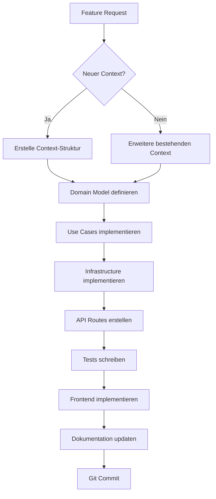

# 📋 DocuMind-AI V2 - Project Rules & Agent Guidelines

> **Version:** 2.9.4  
> **Stand:** 2025-12-28  
> **WICHTIG:** Diese Datei ist die **Single Source of Truth** für alle Entwickler und AI-Agenten.  
> Sie wird bei jeder Änderung automatisch aktualisiert und dokumentiert den aktuellen Stand des Projekts.

---

## 🎯 Projekt-Mission

**DocuMind-AI V2** ist ein **sauberer Neustart** mit Clean DDD-Architektur für Quality Management Systems (QMS).

### Ziele:
- ✅ **Keine Legacy-Kompromisse** - Alles wird von Grund auf richtig gemacht
- ✅ **DDD-First** - Jede Funktionalität als Bounded Context
- ✅ **Docker-First** - Deployment muss trivial sein
- ✅ **Type-Safe** - TypeScript Frontend, Python Type Hints
- ✅ **Dokumentiert** - Code UND Architektur sind dokumentiert

### Anti-Ziele:
- ❌ **Kein Legacy-Code** portieren ohne DDD-Refactoring
- ❌ **Keine Quick-Fixes** die Architektur brechen
- ❌ **Keine undokumentierten Features**

---

## 🏗️ Architektur-Regeln (NICHT VERHANDELBAR)

### 1. **Domain-Driven Design (DDD)**

Jede Funktionalität gehört in einen **Bounded Context**:

```
contexts/
└── [context-name]/
    ├── domain/              # Pure Business Logic (NO dependencies!)
    │   ├── entities.py      # Domain Entities
    │   ├── value_objects.py # Value Objects
    │   ├── repositories.py  # Repository Interfaces (Ports)
    │   └── events.py        # Domain Events
    │
    ├── application/         # Use Cases
    │   ├── use_cases.py     # Application Logic
    │   └── services.py      # Application Services
    │
    ├── infrastructure/      # Technical Implementation
    │   ├── repositories.py  # SQLAlchemy/Concrete Repos
    │   └── mappers.py       # DTO ↔ Entity Mapping
    │
    └── interface/           # External Interface
        └── router.py        # FastAPI Routes
```

**Dependency Rule:**
```
interface → application → domain
          ↘ infrastructure ↗
```

**WICHTIG:** Domain-Layer hat KEINE Abhängigkeiten nach außen!

### 1.1. **Event-Driven Design (EDD) - Für Cross-Context Communication**

Für **ALLE** neuen Features, die **mehrere Bounded Contexts** betreffen:

```
✅ DO:
- Verwende Domain Events für Cross-Context Communication
- Events in domain/events.py definieren
- Event Publisher als optionaler Parameter (Dependency Injection)
- Event Handler in application/event_handlers.py
- Loose Coupling zwischen Contexts

❌ DON'T:
- Direkte Cross-Context Imports (verletzt DDD!)
- Synchronous Cross-Context Calls
- Tight Coupling zwischen Contexts
```

**EDD-Workflow:**

```python
# 1. Domain Event definieren (documentupload/domain/events.py)
@dataclass
class DocumentRejectedEvent:
    document_id: int
    rejected_by_user_id: int
    rejection_reason: str
    timestamp: datetime

# 2. Event in Use Case publizieren (documentupload/application/use_cases.py)
class RejectDocumentUseCase:
    def __init__(self, ..., event_publisher=None):
        self.event_publisher = event_publisher
    
    async def execute(self, ...):
        # Business Logic
        updated_document = await self.upload_repository.save(document)
        
        # Event publizieren (optional)
        if self.event_publisher:
            event = DocumentRejectedEvent(...)
            await self.event_publisher.publish(event)
        
        return updated_document

# 3. Event Handler implementieren (ragintegration/application/event_handlers.py)
class DocumentRejectedEventHandler:
    def __init__(self, remove_document_from_rag_use_case):
        self.remove_document_from_rag_use_case = remove_document_from_rag_use_case
    
    async def handle(self, event: DocumentRejectedEvent):
        # Cross-Context Action (RAG Cleanup)
        self.remove_document_from_rag_use_case.execute(event.document_id)

# 4. Handler registrieren (backend/app/events.py)
def setup_event_handlers(event_publisher):
    event_publisher.subscribe(
        DocumentRejectedEvent,
        DocumentRejectedEventHandler(remove_document_use_case)
    )
```

**Vorteile:**
- ✅ **Loose Coupling:** Contexts sind unabhängig
- ✅ **Scalability:** Events können asynchron verarbeitet werden
- ✅ **Testability:** Events können gemockt werden
- ✅ **DDD-Konform:** Keine direkten Cross-Context Abhängigkeiten

**Siehe auch:** `docs/technical/EVENT_DRIVEN_ARCHITECTURE.md` für detaillierte Erklärung

### 2. **Naming Conventions**

| Typ | Convention | Beispiel |
|-----|------------|----------|
| **Contexts** | lowercase, plural | `interestgroups/`, `users/` |
| **Entities** | PascalCase | `User`, `InterestGroup` |
| **Value Objects** | PascalCase + VO | `EmailVO`, `PermissionVO` |
| **Repositories** | Interface in domain/ | `UserRepository` (abstract) |
| **Use Cases** | Verb + UseCase | `CreateUserUseCase` |
| **DTOs/Schemas** | PascalCase + Create/Update | `UserCreate`, `UserUpdate` |
| **Routes** | kebab-case, REST | `/api/interest-groups` |

### 3. **File Organization Rules**

```
✅ DO:
- Ein Context = Ein Verzeichnis unter contexts/
- Ein Entity = Eine Datei
- Interfaces (Ports) in domain/repositories.py
- Implementations in infrastructure/repositories.py

❌ DON'T:
- Vermische Contexts (keine Cross-Context Imports!)
- Vermische Layer (Domain darf NICHT infrastructure importieren)
- Riesen-Dateien (max. 500 Zeilen pro Datei)
```

---

## 🧪 Test-Driven Development (TDD) - STANDARD

### **TDD-Workflow (IMMER befolgen!)**

Für **ALLE** neuen Features/Contexts:

```
1. RED:   Schreibe Tests ZUERST (sie schlagen fehl)
2. GREEN: Implementiere Code bis Tests GRÜN sind
3. REFACTOR: Optimiere Code (Tests bleiben GRÜN)
```

### **Test-Struktur**

```
tests/
├── unit/                  # Domain + Application Layer
│   └── [context]/
│       ├── test_entities.py
│       ├── test_value_objects.py
│       ├── test_use_cases.py
│       └── test_repositories.py
├── integration/           # Infrastructure Layer
│   └── [context]/
│       └── test_repositories_integration.py
└── e2e/                   # API + Frontend
    └── test_[feature]_api.py
```

### **Test-Coverage Ziele**

- **Domain Layer:** 100% (TDD)
- **Application Layer:** 100% (TDD)
- **Infrastructure Layer:** 80%
- **Interface Layer:** 80%
- **E2E Tests:** Kritische Workflows

### **Beispiel: documentupload Phase 2.7 (AI-Verarbeitung)**

✅ **RED Phase:**
```python
# tests/unit/documentupload/test_ai_processing.py
def test_create_valid_ai_processing_result():
    # Test schlägt fehl - AIProcessingResult existiert noch nicht
    result = AIProcessingResult(...)
    assert result.processing_status == "completed"
```

✅ **GREEN Phase:**
```python
# contexts/documentupload/domain/entities.py
@dataclass
class AIProcessingResult:
    # Implementierung bis Test GRÜN ist
    ...
```

✅ **REFACTOR Phase:**
- Code-Optimierung
- Performance-Verbesserungen
- Tests bleiben GRÜN

**Ergebnis:** 10/10 Tests GRÜN! 🟢

---

## 📝 Dokumentations-Regeln (AUTOMATISCH)

### **Regel: Bei JEDER Änderung**

1. **Code-Dokumentation:**
   - Alle Klassen/Funktionen haben Docstrings (Google-Style)
   - Type Hints ÜBERALL (Python + TypeScript)
   - Komplexe Logik hat Inline-Kommentare

2. **Architektur-Dokumentation:**
   - Neuer Context? → Erstelle `contexts/[name]/README.md`
   - Neue API? → Update `docs/api.md`
   - Neues Feature? → Update `README.md` Feature-Liste
   - **SCHEMA-ÄNDERUNG?** → Update Models + Dokumentation + Tests synchron!

3. **Diese Datei (`docs/PROJECT_RULES.md`):**
   - Neue Regel? → Füge hier hinzu
   - Regel geändert? → Update hier
   - Neuer Context? → Update Context-Liste (siehe unten)

---

## 📚 Dokumentations-Update Workflow (OBLIGATORISCH)

> **WICHTIG:** Wenn der User sagt "aktualisiere die Dokumentation" oder bei Feature-Änderungen, muss dieser Workflow **VOLLSTÄNDIG** durchgeführt werden!

### **Checklist: Was muss aktualisiert werden?**

#### **1. Haupt-Dokumentation (IMMER)**
- [ ] **`README.md`**
  - Feature-Liste aktualisiert?
  - Version aktualisiert? (z.B. 2.5.1)
  - Neue Endpoints dokumentiert?
  - Neue Abhängigkeiten dokumentiert?

- [ ] **`docs/PROJECT_RULES.md`**
  - Neue Regel hinzugefügt?
  - Context-Liste aktualisiert?
  - Status-Änderungen dokumentiert?

- [ ] **`docs/architecture.md`**
  - Architektur-Diagramme aktualisiert?
  - Neue Contexts dokumentiert?
  - Event-Flows aktualisiert?
  - Version und Datum aktualisiert?

- [ ] **`docs/database-schema.md`**
  - Neue Tabellen dokumentiert?
  - Schema-Änderungen dokumentiert?
  - ERD aktualisiert?
  - Version und Datum aktualisiert?

#### **2. Technische Dokumentation (PRÜFEN & AKTUALISIEREN)**
- [ ] **`docs/technical/` Ordner prüfen:**
  - Alle Dateien in `docs/technical/` auf Relevanz prüfen
  - Veraltete Informationen aktualisieren?
  - Neue technische Dokumentation nötig?
  - Verweise auf andere Dokumentation aktualisiert?

- [ ] **Spezifische technische Dokumentation:**
  - `docs/technical/EVENT_DRIVEN_ARCHITECTURE.md` - Neue Events dokumentiert?
  - `docs/technical/DELETE_RAG_CLEANUP.md` - Änderungen am RAG Cleanup?
  - `docs/technical/DUPLICATE_BEHAVIOR_DOCUMENTATION.md` - Duplikat-Verhalten geändert?
  - `docs/technical/MULTIQUERY_SERVICE.md` - Multi-Query Änderungen?
  - `docs/technical/CHUNK_OVERLAP_AND_REINDEX_GUIDE.md` - Chunk-Overlap Änderungen?
  - `docs/technical/RAG_ANALYSE_UND_FIXES.md` - Neue Fixes dokumentiert?

#### **3. Abgearbeitete Dokumentation (ARCHIVIEREN)**
- [ ] **`docs/archive/` Ordner prüfen:**
  - **`docs/archive/test-reports/`** - Test-Reports auf Vollständigkeit prüfen
  - **`docs/archive/implementation-reports/`** - Implementierungs-Berichte auf Vollständigkeit prüfen
  - **`docs/archive/proposals/`** - Proposals/Pläne die vollständig abgearbeitet sind?
  - Status auf "ABGEARBEITET" gesetzt?
  - Veraltete Referenzen entfernt?

- [ ] **Neue abgearbeitete Dokumentation:**
  - Implementierungspläne die fertig sind → Status "ABGEARBEITET" setzen
  - Vorschläge die umgesetzt wurden → Status "ABGEARBEITET" setzen
  - Veraltete Features entfernt (z.B. Wiederherstellung die nicht implementiert wurde)
  - Nach `docs/archive/` verschieben wenn nötig (in passenden Unterordner)

#### **4. Context-Dokumentation (SYSTEMATISCH PRÜFEN!)**
- [ ] **`contexts/[name]/README.md`** - **FÜR JEDEN CONTEXT PRÜFEN:**
  - **Version aktualisiert?** (z.B. 2.5.1) - **KRITISCH: Immer prüfen!**
  - **Stand/Datum aktualisiert?** (z.B. 2025-11-17) - **KRITISCH: Immer prüfen!**
  - Neue Use Cases dokumentiert?
  - Neue Endpoints dokumentiert?
  - Status-Liste aktualisiert?
  - Dependencies aktualisiert?
  - **NEU-Sektion aktualisiert?** (NEU v2.5.1 Features dokumentiert?)
  
**WICHTIG:** Nicht nur prüfen ob Datei existiert, sondern **tatsächlich Version/Datum/Inhalt prüfen**!

#### **5. User Manual**
- [ ] **`docs/user-manual/`**
  - Neue Features dokumentiert?
  - Workflows aktualisiert?
  - Screenshots/Videos aktualisiert (falls vorhanden)?

#### **6. API-Dokumentation**
- [ ] **`docs/api.md`** (falls vorhanden)
  - Neue Endpoints dokumentiert?
  - Request/Response-Schemas aktualisiert?
  - Beispiele aktualisiert?

#### **7. Code-Dateien: Models & Schemas (KRITISCH - SCHEMA-SYNC!)**
- [ ] **`backend/app/models.py`** (Kern-Modelle)
  - Neue Models hinzugefügt?
  - Felder aktualisiert?
  - Relationships aktualisiert?
  - Version aktualisiert?

- [ ] **`contexts/[name]/infrastructure/models.py`** (DDD Context Models)
  - Context-spezifische Models aktualisiert?
  - Felder synchron mit DB-Schema?
  - Relationships korrekt?

- [ ] **`contexts/[name]/domain/entities.py`** (Domain Entities)
  - Entities synchron mit Models?
  - Neue Value Objects hinzugefügt?
  - Felder aktualisiert?

- [ ] **`contexts/[name]/interface/schemas.py`** (API Schemas)
  - Request-Schemas aktualisiert?
  - Response-Schemas aktualisiert?
  - Neue Endpoints dokumentiert?
  - Felder synchron mit Models/Entities?

- [ ] **`contexts/[name]/infrastructure/mappers.py`** (Entity ↔ Model Mapping)
  - Mapper synchron mit Models/Entities?
  - Migration-Safe Checks vorhanden? (`hasattr`, `getattr`)
  - Neue Felder gemappt?

- [ ] **`backend/init_database.sql`** (Single Source of Truth)
  - Schema-Änderungen dokumentiert?
  - Neue Tabellen/Spalten hinzugefügt?
  - Indizes aktualisiert?
  - Version aktualisiert?

**WICHTIG:** Bei Schema-Änderungen müssen ALLE diese Dateien synchron sein! Siehe auch: `## 🗄️ SCHEMA-SYNC REGELN (KRITISCH!)` weiter unten.

---

### **Workflow: Dokumentation aktualisieren**

**Wenn User sagt: "aktualisiere die Dokumentation" oder bei Feature-Änderungen:**

```bash
# 1. Haupt-Dokumentation aktualisieren
✅ README.md prüfen und aktualisieren
✅ docs/PROJECT_RULES.md prüfen und aktualisieren
✅ docs/architecture.md prüfen und aktualisieren
✅ docs/database-schema.md prüfen und aktualisieren (bei Schema-Änderungen)

# 2. Code-Dateien prüfen (SCHEMA-SYNC!)
✅ backend/app/models.py prüfen und aktualisieren
✅ contexts/[name]/infrastructure/models.py prüfen und aktualisieren
✅ contexts/[name]/domain/entities.py prüfen und aktualisieren
✅ contexts/[name]/interface/schemas.py prüfen und aktualisieren
✅ contexts/[name]/infrastructure/mappers.py prüfen und aktualisieren
✅ backend/init_database.sql prüfen und aktualisieren
✅ Alle Dateien synchron? (Models ↔ Entities ↔ Schemas ↔ SQL)

# 3. Technische Dokumentation prüfen
✅ docs/technical/ Ordner durchgehen
✅ Alle Dateien auf Relevanz prüfen
✅ Veraltete Informationen aktualisieren
✅ Neue technische Dokumentation erstellen (falls nötig)

# 4. Abgearbeitete Dokumentation archivieren
✅ docs/archive/ Ordner prüfen
✅ Vollständig abgearbeitete Pläne identifizieren
✅ Status auf "ABGEARBEITET" setzen
✅ Veraltete Referenzen entfernen
✅ Nach docs/archive/ verschieben (falls noch nicht dort)

# 5. Context-Dokumentation aktualisieren (SYSTEMATISCH!)
✅ ALLE contexts/[name]/README.md Dateien finden (glob search)
✅ FÜR JEDE Datei prüfen:
   - Version aktuell? (z.B. 2.5.1)
   - Stand/Datum aktuell? (z.B. 2025-11-17)
   - NEU-Sektion aktualisiert?
   - Status-Liste aktualisiert?
   - Neue Features dokumentiert?
✅ Bei veralteter Version/Datum → SOFORT aktualisieren!

# 6. User Manual aktualisieren
✅ docs/user-manual/ prüfen und aktualisieren

# 7. Verweise prüfen
✅ Alle Verweise in Dokumentation auf korrekte Pfade prüfen
✅ Interne Links funktionieren noch?
```

---

### **Regeln für technische Dokumentation**

1. **Aktuelle Dokumentation** → `docs/technical/`
   - Nur aktuelle, relevante technische Dokumentation
   - Muss mit aktueller Codebase übereinstimmen
   - Wird bei Änderungen aktualisiert
  - **Aktuell:** Mehrere Dateien (Stand: 2025-12-28)

2. **Abgearbeitete Dokumentation** → `docs/archive/`
   - **`docs/archive/test-reports/`** - Test-Berichte (13 Dateien)
   - **`docs/archive/implementation-reports/`** - Implementierungs-Berichte
     - CR-P2.1: Strikte Prompt-Verwendungslogik (abgeschlossen)
     - CR-P2.2: Custom-Prompt-Enforcement (abgeschlossen)
     - docker-fixes: Docker-Diagnose und Fixes (abgeschlossen)
     - fixes: Verschiedene Bugfix-Dokumentationen (abgeschlossen)
   - **`docs/archive/proposals/`** - Abgearbeitete Proposals/Pläne (4 Dateien)
   - Status muss "ABGEARBEITET" sein
   - Veraltete Referenzen müssen entfernt sein

3. **Neue technische Dokumentation:**
   - Bei neuen Features/Architekturen → Neue Datei in `docs/technical/`
   - Bei abgearbeiteten Plänen → Status setzen, nach `docs/archive/` verschieben (in passenden Unterordner)

---

### **Beispiel: Feature "X" wurde implementiert**

```markdown
✅ Checklist durchgehen:
1. README.md → Feature-Liste aktualisiert
2. docs/architecture.md → Architektur-Diagramm aktualisiert
3. Code-Dateien → Models, Entities, Schemas, Mappers synchron (SCHEMA-SYNC!)
4. docs/technical/ → Neue Dokumentation erstellt (falls nötig)
5. docs/archive/ → Implementierungsplan auf "ABGEARBEITET" gesetzt
6. contexts/[name]/README.md → Status aktualisiert
7. docs/user-manual/ → Neue Anleitung erstellt (falls nötig)
```

---

### **WICHTIG: Automatische Prüfung**

**Bei JEDEM Dokumentations-Update:**
- ✅ Version-Nummern konsistent? (z.B. 2.5.1)
  - **ALLE Haupt-Dokumentationen:** README.md, PROJECT_RULES.md, architecture.md, database-schema.md
  - **ALLE Context-READMEs:** contexts/[name]/README.md (systematisch prüfen!)
- ✅ Datum aktualisiert? (Stand: 2025-12-28)
  - **ALLE Haupt-Dokumentationen**
  - **ALLE Context-READMEs** (systematisch prüfen!)
- ✅ Alle Verweise funktionieren noch?
- ✅ Keine veralteten Referenzen?
- ✅ Technische Dokumentation aktuell?
- ✅ Abgearbeitete Dokumentation archiviert?
- ✅ **Context-READMEs Version/Datum geprüft?** (systematisch, nicht nur oberflächlich!)

**Bei Schema-Änderungen (KRITISCH!):**
- ✅ `backend/app/models.py` synchron mit `backend/init_database.sql`?
- ✅ `contexts/[name]/infrastructure/models.py` synchron mit DB-Schema?
- ✅ `contexts/[name]/domain/entities.py` synchron mit Models?
- ✅ `contexts/[name]/interface/schemas.py` synchron mit Entities?
- ✅ `contexts/[name]/infrastructure/mappers.py` synchron mit Models/Entities?
- ✅ `docs/database-schema.md` synchron mit SQL-Schema?
- ✅ Tests aktualisiert? (Unit + Integration + E2E)

### **Auto-Dokumentations-Template**

Wenn du einen neuen Context erstellst:

```bash
# 1. Erstelle Context-Verzeichnis
mkdir -p contexts/[name]/{domain,application,infrastructure,interface}

# 2. Erstelle README.md
cat > contexts/[name]/README.md << 'EOF'
# [Context Name] Context

## Verantwortlichkeit
[Was macht dieser Context?]

## Entities
- [Entity Name]: [Beschreibung]

## Use Cases
- [Use Case]: [Beschreibung]

## API Endpoints
- `GET /api/[...]`: [Beschreibung]
- `POST /api/[...]`: [Beschreibung]

## Dependencies
- Domain Events: [Liste]
- External Contexts: [Liste oder "None"]

## Status
- [x] Domain Model
- [ ] Use Cases
- [ ] Infrastructure
- [ ] API Routes
- [ ] Tests
- [ ] Frontend Integration
EOF

# 3. Update docs/PROJECT_RULES.md (siehe unten)
```

---

## 🗄️ **SCHEMA-SYNC REGELN (KRITISCH!)**

### **Problem:** Schema-Diskrepanz zwischen Code und DB
**Lösung:** Automatische Synchronisation bei jeder Änderung

### **WICHTIG: Schema-Änderungen IMMER dokumentieren!**

Bei **JEDER** Datenbank-Änderung müssen **ALLE** folgenden Dateien synchronisiert werden:

1. **Backend Models** (`backend/app/models.py` + `contexts/[name]/infrastructure/models.py`)
2. **Domain Entities** (`contexts/[name]/domain/entities.py`)
3. **SQL Init Script** (`backend/init_database.sql`)
4. **Migration Scripts** (`backend/migrations/add_[feature]_fields.sql`)
5. **Mappers** (`contexts/[name]/infrastructure/mappers.py`) - Migration-Safe Checks!
6. **API Schemas** (`contexts/[name]/interface/schemas.py`)
7. **Dokumentation** (`docs/database-schema.md`)
8. **Tests** (Unit + Integration + E2E)

### **Bei JEDER Schema-Änderung:**

1. **Backend Models aktualisieren:**
   ```bash
   # 1. DB-Schema prüfen
   sqlite3 data/qms.db ".schema [table_name]"
   
   # 2. Models anpassen
   # backend/app/models.py (Kern-Modelle)
   # contexts/[name]/infrastructure/models.py (DDD Context Models)
   
   # 3. Context-Entities synchronisieren
   # contexts/[name]/domain/entities.py
   ```

2. **Dokumentation aktualisieren:**
   ```bash
   # 1. Schema-Dokumentation
   docs/database-schema.md
   
   # 2. Context-README
   contexts/[name]/README.md
   
   # 3. API-Schemas
   contexts/[name]/interface/schemas.py
   ```

3. **Tests aktualisieren:**
   ```bash
   # 1. Unit Tests für neue/geänderte Models
   tests/unit/[context]/test_entities.py
   
   # 2. Integration Tests für DB-Operations
   tests/integration/[context]/test_repositories.py
   
   # 3. E2E Tests für API-Endpoints
   tests/e2e/test_[feature]_api.py
   ```

### **Schema-Sync Checklist:**

- [ ] DB-Schema geändert?
- [ ] Backend Models angepasst?
- [ ] Domain Entities synchronisiert?
- [ ] Pydantic Schemas aktualisiert?
- [ ] Tests angepasst?
- [ ] Dokumentation aktualisiert?
- [ ] Integration Tests grün?

### **Best Practice: Schema-First Development**

```bash
# 1. Schema-Änderung planen
echo "Geplante Änderung: [Beschreibung]"

# 2. Backup erstellen
cp data/qms.db data/qms_backup_$(date +%Y%m%d_%H%M%S).db

# 3. Schritt-für-Schritt implementieren
# - Models → Entities → Schemas → Tests → Docs

# 4. Validierung
pytest tests/ -v
curl http://localhost:8000/health
```

**⚠️ WICHTIG:** Schema-Diskrepanzen führen zu **500 Internal Server Errors**!

---

## 🗂️ Aktuelle Contexts (Stand: 2025-12-28)

### ✅ Implementiert

#### 1. **interestgroups** - Interest Groups Management
- **Verantwortlichkeit:** Verwaltung der Stakeholder-Gruppen
- **Status:** ✅ Vollständig (CRUD, API, Frontend, Auto-Assignment)
- **Endpoints:** `/api/interest-groups`
- **Frontend:** `/interest-groups`
- **Features:**
  - ✅ Automatische QMS Admin Zuweisung (Level 4) bei neuen Interest Groups
  - ✅ Alle QMS Admin User werden automatisch zugewiesen

#### 2. **users** - User Management (RBAC Multi-Level)
- **Verantwortlichkeit:** Benutzerverwaltung, Rollen, Berechtigungen, Multi-Level Support
- **Status:** ✅ Vollständig (Multi-Department Support, RBAC Multi-Level)
- **Endpoints:** `/api/users`, `/api/user-group-memberships`
- **Frontend:** ✅ Vollständig (`/users` Page mit Drag & Drop, RBAC Filtering)
- **RBAC Features:**
  - 5-Stufen-Berechtigungssystem (Level 1-5)
  - Interest Group-spezifische Approval Levels
  - Multi-Level Support (User mit unterschiedlichen Levels pro IG)
  - Context-Specific Permission Checks für Dokument-Aktionen
- **Validation Features:**
  - ✅ Passwort wird beim User-Create korrekt gehasht (bcrypt)
  - ✅ User muss mindestens einer Interest Group zugewiesen sein
  - ✅ User ohne Interest Group wird automatisch gelöscht

#### 3. **accesscontrol** - Authentication & Authorization
- **Verantwortlichkeit:** JWT Auth, Login, Permissions, RBAC Multi-Level
- **Status:** ✅ Vollständig (RBAC Fields im JWT Token)
- **Endpoints:** `/api/auth/login`, `/api/auth/me`
- **Frontend:** `/login`
- **RBAC Features:**
  - JWT Token enthält `user_level`, `is_qms_admin`, `interest_group_ids`
  - JWT Token enthält `interest_groups_with_levels` für Multi-Level Support
  - Integration mit `SQLAlchemyWorkflowPermissionService`

#### 4. **aiplayground** - AI Model Testing & Comparison
- **Verantwortlichkeit:** AI Provider Connection Tests, Interactive Testing, Model Comparison, Model Evaluation
- **Status:** ✅ Vollständig (Multi-Provider Support mit Parallel Processing + Step-by-Step Evaluation)
- **Endpoints:** 
  - `/api/ai-playground/models` - Liste verfügbarer AI Modelle
  - `/api/ai-playground/test` - Single Model Test
  - `/api/ai-playground/compare` - Multi-Model Comparison (parallel)
  - `/api/ai-playground/test-model-stream` - Streaming Tests (Server-Sent Events)
  - `/api/ai-playground/evaluate` - Model Comparison Evaluation (deprecated, legacy)
  - `/api/ai-playground/evaluate-single` - **Single Model Evaluation** (aktuell, empfohlen)
  - `/api/ai-playground/upload-image` - Multimodal Support (Bild/Dokument Upload)
- **Frontend:** `/models` (nur für QMS Admin, Token in sessionStorage + localStorage)
- **Supported Models:**
  - OpenAI: GPT-4o Mini, GPT-5 Mini (separate API Keys, strikte Validierung)
    - **NEU (v2.7.1):** GPT-5 Mini Strict Mode - Kein Fallback, eigener Adapter, RuntimeError bei fehlendem Key
  - Google AI: Gemini 2.5 Flash
- **Features:** 
  - ✅ Single Model Test mit Token Breakdown (Text vs. Image)
  - ✅ Multi-Model Comparison mit echtem Parallel-Processing (Thread-Pool für Google AI)
  - ✅ **Step-by-Step Model Evaluation System** (Schrittweise Bewertung)
    - Evaluator-Prompt frei editierbar (4600+ Zeichen, 10 Kriterien)
    - Evaluator-Modell auswählbar (GPT-5 Mini, Gemini, GPT-4o Mini)
    - Max Tokens auf Model-Maximum gesetzt (keine Truncation mehr)
    - Einzelbewertung: "Evaluate First Model" → "Evaluate Second Model"
    - Finale Vergleichstabelle mit Gewinner-Markierung
    - JSON-Output: `category_scores` (0-10), `strengths`, `weaknesses`, `summary`
    - Debug-Anzeige: Input JSON Preview + Komplette Evaluation Response
  - ✅ Image/Document Upload (Drag & Drop, max 10MB)
  - ✅ **PDF Support (NEU):** 
    - Google Gemini: Native PDF-Unterstützung (direkte Verarbeitung)
    - OpenAI: PDF → PNG Conversion (pdf2image für erste Seite)
    - Frontend: PDF Upload, Preview mit Dateiname-Anzeige
    - Unterstützt für alle Modelle (GPT-4o Mini, GPT-5 Mini, Gemini 2.5 Flash)
  - ✅ Vision API Support (High/Low Detail für OpenAI)
  - ✅ Dynamic Max Tokens (passt sich an kleinste Modell-Limit an)
  - ✅ 4 Min Timeout pro Modell (für komplexe Prompts + Bilder)
  - ✅ Detaillierte Error-Messages (Safety Ratings, Finish Reasons)
  - ✅ JSON Response Highlighting
  - ✅ Konfigurierbar (Temperature, Max Tokens, Top P, Detail Level)
  - ✅ **Model Verification Badges** (zeigt echte API Model-IDs)
  - ✅ **Progress Indicators** für langsame Modelle (GPT-5, Gemini)
  - ✅ **Abort Functionality** für alle Test-Modi
  - ✅ **Streaming Support** mit Live-Content (GPT-4o Mini) und Progress (GPT-5, Gemini)

#### 5. **documenttypes** - Document Type Management
- **Verantwortlichkeit:** Verwaltung von QMS-Dokumentkategorien
- **Status:** ✅ Vollständig (CRUD, API, Frontend)
- **Endpoints:** 
  - `GET /api/document-types` - Liste aller Dokumenttypen
  - `GET /api/document-types/{id}` - Einzelner Dokumenttyp
  - `POST /api/document-types` - Neuen Typ erstellen
  - `PUT /api/document-types/{id}` - Typ aktualisieren
  - `DELETE /api/document-types/{id}` - Typ löschen (Soft Delete)
- **Frontend:** `/prompt-management` (integriert)
- **Features:**
  - ✅ CRUD für Dokumenttypen (SOP, Flussdiagramm, Formular, etc.)
  - ✅ File Type Validation (allowed_file_types als JSON Array)
  - ✅ Max File Size Configuration (in MB)
  - ✅ AI Processing Requirements (requires_ocr, requires_vision)
  - ✅ Prompt Template Assignment (default_prompt_template_id)
  - ✅ Sortierung (sort_order) & Aktivierung/Deaktivierung Toggle
  - ✅ 7 Standard-Dokumenttypen vorkonfiguriert (via init_database.sql)
  - ✅ Search & Filter (OCR, Vision) im Frontend
  - ✅ Responsive Grid-Layout mit Karten-Design
  - ✅ Drag & Drop Target für Standard-Prompt Zuweisung

#### 6. **prompttemplates** - Prompt Template Management & Versioning
- **Verantwortlichkeit:** Verwaltung wiederverwendbarer AI Prompts mit Versionierung (Generation + Evaluation)
- **Status:** ✅ Vollständig (Backend, Frontend, AI Playground Integration, Evaluation Support)
- **Endpoints:** 
  - `GET /api/prompt-templates` - Liste (mit Filter: status, document_type_id, active_only)
  - `GET /api/prompt-templates/{id}` - Einzelnes Template
  - `POST /api/prompt-templates` - Neues Template erstellen
  - `POST /api/prompt-templates/from-playground` - Template aus AI Playground speichern
  - `PUT /api/prompt-templates/{id}` - Template aktualisieren
  - `POST /api/prompt-templates/{id}/activate` - Template aktivieren
  - `POST /api/prompt-templates/{id}/archive` - Template archivieren
  - `DELETE /api/prompt-templates/{id}` - Template löschen
- **Frontend:** `/prompt-management` (Moderne Split-View mit Gestapelten Karten)
- **Features:**
  - ✅ CRUD für Prompt Templates
  - ✅ **Template Types:** Generation (JSON-Erstellung) + Evaluation (Modell-Bewertung)
  - ✅ **Default Evaluator Support:** Ein Default Evaluator pro Dokument-Typ
  - ✅ Status Management (draft, active, archived, deprecated)
  - ✅ AI Model Configuration Storage (temperature, max_tokens, top_p, detail_level)
  - ✅ Document Type Linking (Foreign Key zu document_types)
  - ✅ Semantic Versioning (version field)
  - ✅ Usage Tracking (tested_successfully, success_count, last_used_at)
  - ✅ Tag-based Categorization (JSON Array)
  - ✅ "Save from Playground" Workflow (inkl. Test-Metrics)
  - ✅ Example Input/Output Storage
  - ✅ **Frontend: Prompt-Verwaltung Page** (Master-Detail Split-View)
    - Links: Dokumenttypen-Grid mit Search & Filter
    - Rechts: Gestapelte Prompt-Karten (Stacked Cards Design)
    - Drag & Drop: Prompt auf Dokumenttyp ziehen = Als Standard setzen
    - ⭐ Standard-Prompt visuell hervorgehoben (grüner Gradient, AKTIV Badge)
    - Preview Modal: Vollständiger Prompt-Text + Config + Example Output
    - Edit-Integration: "Bearbeiten" öffnet AI Playground mit vorausgefüllten Daten
  - ✅ **AI Playground Integration:**
    - "💾 Als Template speichern" Button nach erfolgreichem Test
    - Modal mit Dokumenttyp-Auswahl
    - Automatische Token-Metrics Speicherung (tokens_sent, tokens_received, response_time)
    - Redirect zu Prompt-Verwaltung nach Speichern
  - ✅ **Model Evaluation Integration:**
    - Evaluator-Prompts für automatische Modell-Bewertung
    - 10 spezifische Bewertungskriterien (0-10 Punkte pro Kriterium)
    - JSON-basierte Score-Ausgabe mit Begründungen
    - Integration in AI Playground Comparison Tests

---

### 🔜 In Entwicklung (Feature Branch: `feature/document-upload-system`)

> **Roadmap:** Siehe `docs/ROADMAP_DOCUMENT_UPLOAD.md` für detaillierte Task-Liste

#### 7. **documentupload** - Document Upload & Workflow System (VOLLSTÄNDIG)
- **Verantwortlichkeit:** File Upload (PDF, DOCX, PNG, JPG), Page Splitting, Preview Generation, Metadata Management, **4-Status Workflow (Draft → Reviewed → Approved/Rejected)**, RBAC Multi-Level
- **Status:** ✅ Vollständig implementiert (Backend + Frontend + Workflow + Permissions + Audit Trail + RBAC Multi-Level + Archiv-System)
- **RBAC Multi-Level Features:**
  - Context-Specific Permission Checks für Kanban und Workflow-Transitions
  - Interest Group Filtering für Level 1-3 (Backend + Frontend)
  - Document Type Filtering für Level 2-3 (nur Document Types mit Dokumenten in eigenen IGs)
  - Kommentar-Funktion für Level 2+
- **Features:**
  - 4-Status Workflow (Draft → Reviewed → Approved/Rejected)
  - Permission-basiert (Level 2-5)
  - Audit Trail (document_status_changes)
  - Kommentare (document_comments)
  - **📦 Archiv-System (NEU):**
    - Soft Delete: Audit-taugliche Löschung mit Grund und Zeitstempel
    - Archiv-Ansicht: Gelöschte Dokumente für Level 4+ (QM-Mitarbeiter) und QMS Admins
    - **Read-Only Archiv:** Gelöschte Dokumente nur zur Anzeige (keine Wiederherstellung)
    - Hard Delete: Endgültige Löschung (nur Level 5 - für Tests/Cleanup)
    - RAG Cleanup: Automatisches Entfernen aus Vector-DB bei Soft Delete
    - Event-Driven: `DocumentDeletedEvent`, `DocumentHardDeletedEvent`
  - Interest Groups Filter
  - Kanban Board mit Drag & Drop
- **Endpoints:** 
  - `POST /api/document-upload/upload` - Upload document (multipart/form-data)
  - `POST /api/document-upload/{id}/generate-preview` - Generate page previews
  - `POST /api/document-upload/{id}/assign-interest-groups` - Assign interest groups
  - `POST /api/document-upload/{id}/process-page/{page_number}` - AI-Verarbeitung einer Seite
  - `GET /api/document-upload/{id}` - Get upload details (with pages & assignments)
  - `GET /api/document-upload/` - List uploads (with filters: user_id, document_type_id, processing_status)
  - `DELETE /api/document-upload/{id}` - Delete upload (cascade: files + DB)
  - **Workflow Endpoints:**
  - `POST /api/document-workflow/change-status` - Status ändern
  - `GET /api/document-workflow/status/{status}` - Dokumente nach Status
  - `GET /api/document-workflow/history/{document_id}` - Workflow-Historie
  - `GET /api/document-workflow/allowed-transitions/{document_id}` - Erlaubte Transitions
- **Frontend:** 
  - `/document-upload` - Upload Page (Drag & Drop, Metadata, Interest Groups)
  - `/documents` - Document List (Search, Filters, Table View)
  - `/documents/:id` - Document Detail (Preview, Metadata, Interest Groups, Page Navigation)
- **Features:**
  - ✅ **Domain Layer:** 8 Value Objects, 4 Entities, 4 Repository Interfaces, 6 Domain Events
    - **NEU:** `AIProcessingResult` Entity (mit JSON-Parsing, Status-Management, Token-Tracking)
    - **NEU:** `AIResponse` Value Object (unveränderlich, mit JSON-Validierung)
    - **NEU:** `ProcessingStatus.PARTIAL` (für teilweise erfolgreiche AI-Responses)
    - **NEU:** `AIResponseRepository` Interface (Port für AI-Responses)
  - ✅ **Application Layer:** 5 Use Cases + 2 Service Ports
    - 4 bestehende Use Cases (Upload, GeneratePreview, AssignInterestGroups, GetUploadDetails)
    - **NEU:** `ProcessDocumentPageUseCase` - **AI-Verarbeitung mit Standard-Prompt**
    - **NEU:** `AIProcessingService` Protocol (Port für AI-Service)
    - **NEU:** `PromptTemplateRepository` Protocol (Port für Prompt-Templates)
  - ✅ **Infrastructure Layer:**
    - LocalFileStorageService (Date-based: `YYYY/MM/DD` structure)
    - PDFSplitterService (PDF → Images, DPI: 200)
    - ImageProcessorService (Thumbnails: 200x200, JPEG quality: 85, Auto-rotation)
    - 4 SQLAlchemy Repositories (Adapters)
    - **NEU:** `AIPlaygroundProcessingService` - **Cross-Context Integration (aiplayground)**
    - **NEU:** `SQLAlchemyAIResponseRepository` - **Vollständiges CRUD für AI-Responses**
    - 3 Mappers (DTO ↔ Entity)
  - ✅ **Interface Layer:** 7 FastAPI Endpoints, Pydantic Schemas, Dependency Injection, Permission Checks (Level 4)
    - **NEU:** `POST /process-page/{page_number}` - **AI-Verarbeitung mit vollständigem Error Handling**
  - ✅ **Frontend (React/Next.js 14):**
    - Drag & Drop Upload (max 50MB)
    - File Type Validation (PDF, DOCX, PNG, JPG)
    - Document Type Selection
    - QM Chapter + Version Input
    - Interest Group Multi-Selection
    - Upload Progress Indicator (10% → 30% → 50% → 70% → 100%)
    - Document List with Search & Filters
    - Document Detail with Page-by-Page Preview Navigation
  - ✅ **Permissions:** Upload/Delete nur für Quality Manager (Level 4)
  - ✅ **Processing Status:** pending → processing → completed / failed
- **Dependencies Installiert:**
  - PyPDF2 (3.0.1) - PDF parsing
  - pdf2image (1.17.0) - PDF to image conversion
  - python-docx (1.2.0) - DOCX support
  - pytesseract (0.3.13) - OCR (future use)
  - Pillow (11.1.0) - Image processing

### 🔜 Geplant (Phases 4-5)

> **Roadmap:** Siehe `docs/ROADMAP_DOCUMENT_UPLOAD.md` für detaillierte Task-Liste

#### 8. **ragintegration** - RAG System Integration (VOLLSTÄNDIG)
- **Verantwortlichkeit:** RAG Chat, Vector Store (Qdrant), Document Indexing, Semantic Search, Chat Sessions, RBAC Multi-Level Filtering, **RAG UX Transparency (PHASE 1-4)**, **ECHTE SHAP-Integration (v2.6.0)**, **Learning-to-Rank ML-Pipeline (v2.7.0)**, **GPT-5 Mini Strict Mode (v2.7.1)**, **Custom RAG Chat Prompts (CR-P2.2)**, **Einheitliches Embedding-Modell (v2.8.0)**, **Search Quality Metrics & Trend-Analyse (v2.9.0)**, **Automatisches ML-Training (v2.9.0)**, **Alert-System & Undo (v2.9.0)**, **Konfigurierbare Filter (v2.9.2)**, **Analytics Story Mode (v2.9.3)**, **Robuste SHAP Analytics Datenquelle (v2.9.3)**, **Analytics Stabilisierung (v2.9.4)**
- **Status:** ✅ Vollständig implementiert (v2.9.4) - **Aktuell mit Prompt v2.9, PDF Support, Consumables, Labels-Mapping, RBAC Multi-Level, RAG UX Transparency, ECHTE SHAP-Attribution, LTR ML-Ranking, GPT-5 Strict Mode, Custom RAG Chat Prompts (CR-P2.2), Einheitliches Embedding-Modell, Search Quality Metrics Tracking, Trend-Analyse, Automatisches ML-Training, Alert-System mit Undo, Konfigurierbare Filter (Initialer Score-Filter + Adaptive Filterung), Analytics Story Mode, robuste SHAP Analytics, Analytics Stabilisierung**
- **RBAC Multi-Level Features:**
  - Interest Group Filtering für Level 1-3 (Backend-Filter in `AskQuestionUseCase`)
  - Document Type Filtering für Level 2-3 (nur Document Types mit Dokumenten in eigenen IGs)
  - `GetDocumentTypeCountsUseCase` mit RBAC-gefilterten Counts
- **Neueste Updates (2025-12-28 - v2.9.4):**
  - ✅ **Analytics: Chunk-Feedback & Metriken stabilisiert**
    - Chunk-Feedback (Analytics/Scores) funktioniert zuverlässig (message_id robust).
    - Search Quality Metrics reloaden nach Feedback ohne 500 (None/NULL Ratings werden neutral behandelt).
    - „Zum Dokument“ im neuen Tab ohne „Not authenticated“ (Token-Persistenz konsolidiert).

- **Neueste Updates (2025-12-26 - v2.9.3):**
  - ✅ **Robuste SHAP Analytics Datenquelle (Explainability):**
    - SHAP Analytics nutzt bevorzugt die **gespeicherten Source-References** der letzten passenden Assistant-Message (tolerantes Query-Matching)
    - Fallback auf Live-Search nur wenn keine gespeicherten Source-Refs gefunden werden
  - ✅ **Testbarkeit verbessert:**
    - Neues „pure python“ Helper-Modul für Query-Matching (ohne schwere Router-Imports)
    - Neue Unit-Tests für Query-Matching und ML-Score-Normalisierung
  - ✅ **Analytics UX verbessert:**
    - “Einfach erklärt” Story Mode + Umschaltung auf “Pro / Details”
    - Live ML-Model-Info wird direkt vom Backend geladen (weniger Abhängigkeit von gespeicherten Analytics-Fallbacks)

- **Neueste Updates (2025-12-05 - v2.9.2):**
  - ✅ **Konfigurierbare Filter im Filter Panel:**
    - **Initialer Score-Filter:** Regelbarer Slider (0-5%) für Mindest-Hybrid-Score während der Suche
    - **Adaptive Filterung:** Zwei regelbare Slider für Mindest-Durchschnitts-Score (0-50%) und Mindest-Maximal-Score (0-50%)
    - **Filter-Reihenfolge erklärt:** Initialer Filter (während Suche) → Adaptive Filter (nach Suche)
    - **Info-Box:** Erklärt Filter-Reihenfolge und gibt Empfehlungen
    - **"Filter zurücksetzen":** Berücksichtigt jetzt auch adaptive Filter
  - ✅ **Verbesserte Tooltips:**
    - **InfoTooltip Komponente:** Standardisierte Tooltip-Darstellung mit Pfeil
    - **Positionierung:** Tooltips linksbündig (`left-0`) mit `max-w-[calc(100vw-2rem)]` um Überlauf zu verhindern
    - **Transparenz & Metadaten:** Alle Filter-Einstellungen werden angezeigt (Initialer Score-Filter, Adaptive Filterung, AI-Modell-Einstellungen)
    - **Umbenennung:** "Relevanz-Schwelle" → "Initialer Score-Filter" für bessere Unterscheidung
  - ✅ **Transparenz & Metadaten erweitert:**
    - **Adaptive Filterung Sektion:** Zeigt `adaptive_min_avg_score` und `adaptive_min_max_score`
    - **AI-Modell-Einstellungen Sektion:** Zeigt `temperature`, `max_tokens`, `top_p`
    - **Initialer Score-Filter:** Umbenannt und mit verbesserter Tooltip-Beschreibung
- **Updates (2025-11-14 - v2.7.0):**
  - ✅ **SQLite-Persistenz für ML/SHAP-Daten:** Migration von File/In-Memory zu SQLite
    - **3 neue Tabellen:** `training_samples`, `shap_background_data`, `shap_cache`
    - **TrainingDataRepositorySQLite:** Ersetzt FileBasedRepository (JSONL → SQLite)
    - **SHAPBackgroundDataRepositorySQLite:** Ersetzt In-Memory Service (Rolling Window in DB)
    - **SHAPCacheRepositorySQLite:** Ersetzt In-Memory Cache (LRU + TTL in DB)
    - **Feature Flag:** `PERSIST_TO_DB=true` (default) für SQLite-Repositories
    - **Migration-Script:** Automatisches Backup vor Schema-Änderungen
    - **34 neue Unit-Tests:** Alle SQLite-Repositories getestet (100% Coverage)
    - **Integration:** SubmitFeedbackUseCase, SHAPExplainerService, LTRTrainingPipeline
  - ✅ **Learning-to-Rank ML-Pipeline:** Echtes ML-Ranking mit LightGBM Ranker
  - ✅ **ML Feature Extractor:** 11 Features (vector, text, bm25, jaccard, keywords, chunk_length, doc_type, heading_depth, confidence, user_level, hybrid)
  - ✅ **Training Pipeline:** LightGBM lambdarank + sklearn Fallback, Cross-Validation (NDCG@k)
  - ✅ **Inference Service:** Model Serving, Score-Kombination (0.6 * hybrid + 0.4 * ml)
  - ✅ **UseCase Integration:** AskQuestionUseCase erweitert mit use_ml_ranking Parameter
  - ✅ **Final-Score Ranking:** Chunks werden nach final_score sortiert (ML kann Ranking ändern!)
  - ✅ **Celery Background Jobs:** Async SHAP-Berechnungen mit Progress-Tracking
  - ✅ **24/24 Tests GRÜN:** 8 Features + 5 Training + 6 Inference + 5 Integration (100% Coverage)
- **Updates (2025-11-13 - v2.6.0):**
  - ✅ **ECHTE SHAP-Integration:** KernelExplainer ersetzt heuristische Approximation
  - ✅ **Background Data Service:** Sammelt automatisch historische Search-Daten (Rolling Window, max 1000)
  - ✅ **Performance-Optimierung:** LRU Cache mit TTL (50-90% schneller bei wiederholten Queries)
  - ✅ **Interactive Analytics Dashboard:** Feature Importance & Waterfall Charts
  - ✅ **3 neue Analytics-Endpoints:** SHAP Analytics, Background Stats, Cache Stats
  - ✅ **17/17 Tests GRÜN:** 8 Unit Tests + 9 Integration Tests (100% Coverage)
- **Updates (2025-11-02):**
  - ✅ Frage-Normalisierung: Stop-Wörter entfernen für konsistentere Vector-Search
  - ✅ Erhöhte Context-Chunks: Von 5 auf 10 Chunks für bessere Abdeckung
  - ✅ User-Nachrichten-Persistenz: Beide Seiten (Frage + Antwort) werden gespeichert
  - ✅ GPT-5 Mini Fallback (damals) → **entfernt in v2.7.1** (Strict Mode)
- **Status:** ✅ Vollständig implementiert (Backend + Frontend + Integration + Explainability)
- **Features:**
  - ✅ **Domain Layer:** 4 Entities, 4 Value Objects, 4 Repository Interfaces, 3 Domain Events
    - `IndexedDocument` Entity (Status-Management, Chunk-Count)
    - `DocumentChunk` Entity (Metadata, Confidence-Score, Token-Count)
    - `ChatSession` Entity (Session-Management, Message-Count)
    - `ChatMessage` Entity (Role-Management, Source-References, Structured-Data)
    - `EmbeddingVector` Value Object (1536/768/384-Dimension, Immutable)
    - `ChunkMetadata` Value Object (Page-Numbers, Heading-Hierarchy, Confidence)
    - `SourceReference` Value Object (Document-Link, Relevance-Score, Text-Excerpt)
    - `SearchQuery` Value Object (Query-Parameters, Filters)
  - ✅ **Application Layer:** 5 Use Cases + 3 Services
    - `IndexApprovedDocumentUseCase` - Dokument-Indexierung (nur freigegebene)
    - `AskQuestionUseCase` - RAG Chat mit Source-References
    - `CreateChatSessionUseCase` - Session-Management
    - `GetChatHistoryUseCase` - Chat-Historie
    - `ReindexDocumentUseCase` - Dokument-Re-Indexierung
    - `HeadingAwareChunkingService` - Intelligentes Chunking (Vision-AI + Fallback)
    - `MultiQueryService` - Query-Expansion für bessere Suche
    - `StructuredDataExtractorService` - Strukturierte Daten-Extraktion
  - ✅ **Infrastructure Layer:**
    - `QdrantVectorStoreAdapter` - Qdrant Vector Store (persistent, dynamische Dimensionen: 1536/768/384)
      - **NEU (v2.7.1):** QDRANT_URL Environment-Variable Parsing (host:port, http://host:port, https://host:port)
    - `EmbeddingFactory` - Intelligente Provider-Auswahl (OpenAI > Google Gemini > Sentence Transformers)
    - `OpenAIEmbeddingAdapter` - text-embedding-3-small Integration (1536 dim, via OPENAI_GPT5_MINI_API_KEY)
    - **NEU (v2.7.1):** `OpenAIAdapter` - Strikte API-Key-Validierung, kein api_key Parameter mehr, nur ENV-Variable
    - `GoogleGeminiEmbeddingAdapter` - text-embedding-004 Integration (768 dim, kostenlos)
    - `SentenceTransformersEmbeddingAdapter` - Lokale Embeddings (768/384 dim, kostenlos)
    - `VisionDataExtractorAdapter` - Vision AI Data Processing
    - `HybridSearchService` - Vektor + Text-Suche mit Re-Ranking
    - 4 SQLAlchemy Repositories (IndexedDocument, DocumentChunk, ChatSession, ChatMessage)
    - `RAGInfrastructureAdapter` - Zentrale Koordination aller Services
    - **NEU (v2.6.0):** `SHAPExplainerService` - Echte SHAP-Attribution mit KernelExplainer
    - **NEU (v2.6.0):** `SHAPBackgroundDataService` - Historische Search-Daten (Rolling Window, max 1000)
    - **NEU (v2.6.0):** `SHAPCacheService` - LRU Cache mit TTL für Performance (50-90% schneller)
    - **NEU (v2.7.0):** `MLFeatureExtractor` - 11 Features für Learning-to-Rank
    - **NEU (v2.7.0):** `LTRTrainingPipeline` - LightGBM Ranker Training (lambdarank objective)
    - **NEU (v2.7.0):** `LTRInferenceService` - Model Serving für ML-Predictions
    - **NEU (v2.7.0):** `LTRService` - High-Level API für LTR-Integration
    - **NEU (v2.7.0):** `background_jobs/celery_app` - Celery App für async SHAP-Tasks
    - **NEU (v2.7.0):** `background_jobs/tasks` - compute_shap_explanation Task
  - ✅ **Interface Layer:** 15+ FastAPI Endpoints + Pydantic Schemas
    - `POST /api/rag/documents/index` - Dokument indexieren
    - `POST /api/rag/chat/ask` - Frage stellen
    - `POST /api/rag/chat/sessions` - Chat-Session erstellen
    - `GET /api/rag/chat/sessions/{id}/history` - Chat-Historie
    - `POST /api/rag/search` - Dokumente suchen
    - `POST /api/rag/documents/{id}/reindex` - Re-indexieren
    - `GET /api/rag/system/info` - System-Info
    - `GET /api/rag/health` - Health Check
    - **PHASE 1:** `GET /api/rag/audit-trail` - Audit-Trail abrufen
    - **PHASE 2:** `GET /api/rag/documents/{id}/chunks` - Chunk-Liste
    - **PHASE 2:** `GET /api/rag/chunks/{id}/preview` - Chunk-Vorschau
    - **PHASE 2:** `POST /api/rag/chunks/{id}/edit` - Chunk bearbeiten
    - **PHASE 2:** `POST /api/rag/chunks/{id}/split` - Chunk splitten
    - **PHASE 2:** `POST /api/rag/chunks/merge` - Chunks zusammenführen
    - **PHASE 2:** `GET /api/rag/chunking-strategies` - Verfügbare Strategien
    - **PHASE 3:** `GET /api/rag/chat/messages/{id}/prompt` - Prompt-Viewer
    - **PHASE 4.1:** `POST /api/rag/chat/feedback` - Feedback abgeben
    - **PHASE 4.1:** `GET /api/rag/chat/feedback/statistics` - Feedback-Statistiken
    - **PHASE 4.1:** `GET /api/rag/chat/messages/{id}/feedback` - Feedback für Message
    - **PHASE 4.2:** `GET /api/rag/analytics` - RAG Analytics Dashboard
    - **NEU (v2.6.0):** `GET /api/rag/analytics/shap` - SHAP Analytics Dashboard (Feature Importance, Waterfall Data)
    - **NEU (v2.6.0):** `GET /api/rag/analytics/shap/background-stats` - Background Data Statistiken
    - **NEU (v2.6.0):** `GET /api/rag/analytics/shap/cache-stats` - Cache Performance-Metriken
  - ✅ **Frontend (React/Next.js 14):**
    - **RAG Chat Dashboard** - Zentraler Chat (60% Viewport)
    - **Session Sidebar** - Session-Management (20% Viewport)
    - **Filter Panel** - Erweiterte Suche (20% Viewport)
    - **Source Preview Modal** - Vollbild-Preview mit Zoom
    - **RAG Indexierung Panel** - Document Detail Integration
    - **Multi-Model Support** - GPT-4o Mini, GPT-5 Mini, Gemini 2.5 Flash
    - **Structured Data Rendering** - Tabellen, Listen, Sicherheitshinweise
    - **Suggested Questions** - UX-Optimierung
    - **Voice Input** - Vorbereitet für Voice-Recording
    - **PHASE 1:** **RAG Audit-Trail** - Vollständige Transparenz für Compliance
    - **PHASE 2:** **Chunk-Vorschau & Editor** - Chunks anzeigen, bearbeiten, splitten, zusammenführen
    - **PHASE 2:** **Chunking-Strategie Selector** - Wizard für Strategie-Auswahl (OpenAI 1536, Gemini 768, Local 384)
    - **PHASE 3:** **RAG Chat Prompt Viewer** - Vollständiger Prompt mit Kontext anzeigen
    - **PHASE 3:** **RAG Chat Transparency Layer** - Sources, Metadata, Processing-Time, Tokens, Embedding-Info
    - **PHASE 4.1:** **RAG Feedback Button** - User Feedback für Chat-Antworten (Positive/Negative/Neutral)
    - **PHASE 4.2:** **RAG Analytics Dashboard** - Umfassende Performance-Metriken und Quality-Score
    - **NEU (v2.6.0):** **Interactive SHAP Analytics Dashboard** - Feature Importance & Waterfall Visualisierungen
      - Query-basierte Analyse
      - Background Data Statistics
      - Cache Performance Monitoring
    - **NEU (CR-P2.2):** **RAG Chat Prompt Editor** - Custom Prompts pro Dokumenttyp (Level 4+)
      - Prompt-Vorschau mit Standard/Custom Badge
      - Edit-Modus für Prompt-Optimierung
      - Speichern/Löschen von Custom Prompts
      - Strikte Custom-Prompt-Enforcement (keine Fallbacks)
- **Chunking-Strategie:**
  - **Prompt-Integration (Game Changer):** 
    - Vision-Extraktion verwendet Standard-Prompt für Dokumenttyp (definiert JSON-Struktur)
    - Chunking analysiert Standard-Prompt und erkennt JSON-Struktur automatisch
    - Jeder Dokumenttyp hat individuelle Strukturierung basierend auf Standard-Prompt
    - **Auto-Update:** Wenn Standard-Prompt geändert wird, wird Struktur automatisch aktualisiert
  - **Labels-Mapping für Bild-zu-Text-Verknüpfung (RAG-Performance):**
    - Systematischer Check-Prozess: Jeder Artikel mit Label wird gemappt
    - Buchstabenlabels (a, b, c, d) → visual_elements[*].labels[]
    - Ziffernlabels (1, 2, 3, 4) → visual_elements[*].labels[]
    - Vollständigkeitscheck: Anzahl Labels in visual_elements ≥ Anzahl in article_data
    - **Kritisch für RAG:** Ermöglicht präzise Bild-zu-Text-Verknüpfung bei Fragen
  - **Consumables in Chunks integriert:**
    - Chemikalien/Kleber (Aceton, Loctite, etc.) werden als separater Abschnitt in Chunks übernommen
    - `application_area` und `hazard_notes` für optimale RAG-Suche nach Sicherheitshinweisen
    - Ermöglicht Fragen wie "Welcher Kleber wird verwendet?" oder "Welche Sicherheitshinweise gibt es zu Aceton?"
  - Vision-AI-basiert (strukturierte JSON-Response gemäß Prompt)
  - Fallback: Page-Boundary-aware Chunking
  - Fallback: Plain-Text Chunking
  - Token-basiert: Max 512 Tokens pro Chunk (ca. 2000 Zeichen)
  - Metadaten: Page-Numbers, Heading-Hierarchy, Confidence-Score, Token-Count
  - TÜV-Audit-tauglich (präzise Quellenangaben)
- **Database:**
  - 6 Tabellen: `rag_indexed_documents`, `rag_document_chunks`, `rag_chat_sessions`, `rag_chat_messages`, `rag_audit_logs`, `rag_feedback`
  - Indizes für optimale Performance
  - Trigger für automatische Updates
  - Views für komplexe Queries
  - **PHASE 1:** `rag_audit_logs` - Vollständiger Audit-Trail für Compliance
  - **PHASE 4.1:** `rag_feedback` - User Feedback für Chat-Antworten
- **Permissions:**
  - Level 1 (Mitarbeiter): RAG Chat (nur eigene Interest Groups, Document Type Filter)
  - Level 2-3: RAG Chat + Dokumenten-Tabelle (nur eigene Interest Groups, Document Type Filter)
  - Level 4-5: RAG Chat (alle freigegebenen Dokumente, alle Document Types)
  - Indexierung: Nur freigegebene Dokumente
  - Document Type Filtering: Level 1-3 sehen nur Document Types mit Dokumenten in ihren IGs
- **Dependencies:**
  - qdrant-client (Vector Store)
  - openai (Embeddings, 1536 dim - verwendet OPENAI_GPT5_MINI_API_KEY)
  - google-generativeai (Gemini Embeddings, 768 dim - kostenlos)
  - sentence-transformers (Lokale Embeddings, 768/384 dim - kostenlos)
  - numpy (Vector Operations)
  - **NEU (v2.6.0):** shap==0.46.0 (Echte SHAP-Attribution)
  - **NEU (v2.6.0):** scikit-learn==1.5.2 (sklearn für SHAP-Kompatibilität)
  - **NEU (v2.7.0):** lightgbm==4.5.0 (LightGBM Ranker für LTR)
  - **NEU (v2.7.0):** xgboost==2.1.3 (XGBoost Alternative)
  - **NEU (v2.7.0):** celery==5.4.0 (Async Task Processing)
  - **NEU (v2.7.0):** redis==5.2.0 (Celery Broker & Backend)
- **Embedding-Provider (Einheitliches Modell v2.8.0):**
  1. **OpenAI text-embedding-3-small** (1536 Dimensionen) - **Standard für alle Dokumente**
    - **Einheitliches Modell:** Alle Dokumente werden mit text-embedding-3-small indexiert
    - **Re-Indexierung:** Alte Dokumente müssen re-indexiert werden (Script: `scripts/reindex_all_documents.py`)
    - **Dimension-Check:** Dokumente mit falschen Dimensionen werden automatisch übersprungen
    - **Mock Embeddings Erkennung:** Automatische Erkennung und Re-Indexierung von Mock Embeddings
    - **Keine Fallbacks:** Explizite Fehlermeldungen statt stillem Fallback zu inkompatiblen Modellen
  2. **Google Gemini** (768 Dimensionen) - Nur als Fallback wenn OpenAI nicht verfügbar
  3. **Sentence Transformers** (768/384 Dimensionen) - Nur als Fallback wenn OpenAI/Google nicht verfügbar
  - **Konfiguration:** `EMBEDDING_PROVIDER=auto|openai|google|sentence-transformers`
  - **Best Practice:** text-embedding-3-small als Standard für konsistente Suchergebnisse

---

## 🛠️ Entwicklungs-Workflow

### **Neue Funktionalität hinzufügen:**



### **Workflow-Schritte im Detail:**

#### 1. **Domain Model** (`domain/entities.py`)
```python
"""
Entities sind Pure Business Objects - KEINE Abhängigkeiten!
"""
from dataclasses import dataclass
from typing import List
from .value_objects import Email, Permission

@dataclass
class User:
    """User Entity - Repräsentiert einen Systembenutzer"""
    id: int
    email: Email
    permissions: List[Permission]
    
    def has_permission(self, permission: Permission) -> bool:
        """Business Logic: Prüfe Berechtigung"""
        return permission in self.permissions
```

#### 2. **Repository Interface** (`domain/repositories.py`)
```python
"""
Ports - Abstrakte Interfaces für Persistence
"""
from abc import ABC, abstractmethod
from typing import List, Optional
from .entities import User

class UserRepository(ABC):
    """Port: User Persistence Interface"""
    
    @abstractmethod
    def get_by_id(self, user_id: int) -> Optional[User]:
        pass
    
    @abstractmethod
    def save(self, user: User) -> User:
        pass
```

#### 3. **Use Case** (`application/use_cases.py`)
```python
"""
Application Logic - Orchestriert Domain + Infrastructure
"""
from ..domain.entities import User
from ..domain.repositories import UserRepository

class CreateUserUseCase:
    """Use Case: Erstelle neuen User"""
    
    def __init__(self, user_repo: UserRepository):
        self.user_repo = user_repo
    
    def execute(self, email: str, permissions: List[str]) -> User:
        # 1. Validate
        # 2. Create Entity
        # 3. Save via Repository
        # 4. Return
        user = User(...)
        return self.user_repo.save(user)
```

#### 4. **Infrastructure** (`infrastructure/repositories.py`)
```python
"""
Concrete Implementation - SQLAlchemy, etc.
"""
from sqlalchemy.orm import Session
from ..domain.entities import User
from ..domain.repositories import UserRepository
from .mappers import UserMapper

class SQLAlchemyUserRepository(UserRepository):
    """Adapter: SQLAlchemy Implementation"""
    
    def __init__(self, db: Session):
        self.db = db
        self.mapper = UserMapper()
    
    def get_by_id(self, user_id: int) -> Optional[User]:
        db_user = self.db.query(UserModel).filter(...).first()
        return self.mapper.to_entity(db_user) if db_user else None
```

#### 5. **API Route** (`interface/router.py`)
```python
"""
FastAPI Router - External Interface
"""
from fastapi import APIRouter, Depends
from ..application.use_cases import CreateUserUseCase
from ..infrastructure.repositories import SQLAlchemyUserRepository

router = APIRouter(prefix="/api/users")

@router.post("/")
async def create_user(
    data: UserCreate,
    db: Session = Depends(get_db)
):
    repo = SQLAlchemyUserRepository(db)
    use_case = CreateUserUseCase(repo)
    user = use_case.execute(data.email, data.permissions)
    return user
```

---

## ✅ Code-Qualitäts-Regeln

### **Python Backend:**

```python
# ✅ DO:
from typing import List, Optional  # Type Hints
from dataclasses import dataclass  # Entities
from abc import ABC, abstractmethod  # Interfaces

@dataclass
class User:
    """Google-Style Docstring
    
    Args:
        id: Eindeutige User-ID
        email: Email-Adresse (validiert)
    
    Raises:
        ValueError: Wenn Email ungültig
    """
    id: int
    email: str

# ❌ DON'T:
class User:  # Kein Docstring
    def __init__(self, id, email):  # Keine Type Hints
        self.id = id
```

### **TypeScript Frontend:**

```typescript
// ✅ DO:
export interface User {
  id: number
  email: string
  permissions: string[]
}

export const createUser = async (data: UserCreate): Promise<User> => {
  const response = await apiClient.post<User>('/api/users', data)
  return response.data
}

// ❌ DON'T:
const createUser = (data: any) => {  // any ist verboten!
  return fetch('/api/users', {...})
}
```

---

## 🔄 Git Workflow

### **Commit Messages (Conventional Commits):**

```bash
# Format
<type>(<scope>): <subject>

# Types
feat:     Neue Funktionalität
fix:      Bugfix
docs:     Dokumentation
refactor: Code-Refactoring (keine Feature-Änderung)
test:     Tests
chore:    Build/Config

# Beispiele
feat(users): add multi-department support
fix(auth): resolve JWT token expiration bug
docs(contexts): add documents context README
refactor(interestgroups): extract repository logic
```

### **Branch Strategy:**

```
main                    # Produktions-ready Code
└── develop             # Development Branch
    ├── feature/users-page
    ├── feature/documents-context
    └── fix/auth-bug
```

---

## 🧪 Testing-Regeln

### **Test-Struktur:**

```
tests/
├── unit/                    # Unit Tests (Domain/Application)
│   └── [context]/
│       ├── test_entities.py
│       └── test_use_cases.py
│
├── integration/             # Integration Tests (Infrastructure)
│   └── [context]/
│       └── test_repositories.py
│
└── e2e/                     # End-to-End Tests (API)
    └── test_[context]_api.py
```

### **Test-Beispiel:**

```python
# tests/unit/users/test_entities.py
import pytest
from contexts.users.domain.entities import User
from contexts.users.domain.value_objects import Email

def test_user_has_permission():
    """User sollte Berechtigung korrekt prüfen"""
    user = User(id=1, email=Email("test@example.com"), permissions=["read"])
    assert user.has_permission("read") is True
    assert user.has_permission("write") is False
```

---

## 📊 Performance & Monitoring

### **Regeln:**

1. **API Response Time:** < 200ms (P95)
2. **Database Queries:** Lazy Loading nur wenn nötig
3. **Docker Images:** < 500MB pro Service
4. **Frontend Bundle:** < 500KB (gzipped)

### **Monitoring-Endpoints:**

- `/health` - Basic Health Check
- `/metrics` - Prometheus Metrics (TODO)
- `/api/docs` - API Documentation

---

## 🚀 Deployment-Regeln

### **Deployment Checklist:**

- [ ] Alle Tests grün
- [ ] Dokumentation aktualisiert
- [ ] Docker Images gebaut
- [ ] Environment Variables gesetzt
- [ ] Database Migrations durchgeführt
- [ ] Health Checks validiert

### **Deployment-Befehle:**

```bash
# Development
docker-compose up -d

# Production (später)
docker-compose -f docker-compose.prod.yml up -d
```

---

## 📚 Wichtige Dateien (Immer aktuell halten!)

| Datei | Zweck | Update bei |
|-------|-------|-----------|
| `docs/PROJECT_RULES.md` | Diese Datei | Jeder Regel-Änderung |
| `README.md` | Projekt-Übersicht | Neuem Feature, Deployment-Änderung |
| `docs/architecture.md` | Architektur-Diagramme | Neuem Context, Architektur-Änderung |
| `docs/database-schema.md` | Datenbank-Schema | Schema-Änderungen |
| `docs/api.md` | API-Dokumentation | Neuem Endpoint |
| `contexts/[name]/README.md` | Context-Dokumentation | Context-Änderung |

### **Dokumentations-Struktur (NEU: 2025-11-11)**

Die Dokumentation ist jetzt strukturiert in drei Hauptbereiche:

```
docs/
├── technical/                    # Aktuelle technische Dokumentation
│   ├── EVENT_DRIVEN_ARCHITECTURE.md
│   ├── DELETE_RAG_CLEANUP.md
│   ├── DUPLICATE_BEHAVIOR_DOCUMENTATION.md
│   ├── MULTIQUERY_SERVICE.md
│   ├── CHUNK_OVERLAP_AND_REINDEX_GUIDE.md
│   └── RAG_ANALYSE_UND_FIXES.md
│
├── archive/                      # Abgearbeitete Dokumentation
│   ├── test-reports/             # Test-Berichte (13 Dateien)
│   ├── implementation-reports/   # Implementierungs-Berichte (4 Dateien)
│   └── proposals/                # Abgearbeitete Proposals/Pläne (4 Dateien)
│       ├── RAG_PROMPT_EDITOR_PROPOSAL.md
│       ├── IMPLEMENTATION_PLAN_RAG_PROMPT_EDITOR.md
│       ├── WORKFLOW_ANALYSE.md
│       └── WORKFLOW_ANALYSE_BEST_PRACTICES.md
│
└── [weitere Ordner]
    ├── user-manual/              # Benutzerhandbücher
    └── [weitere Dokumentation]
```

**Regeln:**
- ✅ **`docs/technical/`** - Nur aktuelle, relevante technische Dokumentation
- ✅ **`docs/archive/`** - Abgearbeitete Pläne, Proposals, Test-Reports
- ✅ **Root-Dateien** - Haupt-Dokumentation (README.md, PROJECT_RULES.md, etc.)

### **Technische Referenz-Dokumentation**

| Datei | Zweck | Verwendung |
|-------|-------|-----------|
| `docs/technical/EVENT_DRIVEN_ARCHITECTURE.md` | Event-Driven Architecture | Cross-Context Communication verstehen |
| `docs/technical/DELETE_RAG_CLEANUP.md` | RAG Cleanup Flow | RAG Cleanup bei Dokument-Löschung verstehen |
| `docs/technical/DUPLICATE_BEHAVIOR_DOCUMENTATION.md` | Duplikat-Verhalten | Duplikat-Erkennung und -Behandlung verstehen |
| `docs/technical/MULTIQUERY_SERVICE.md` | Multi-Query Service | Query-Expansion und Multi-Query verstehen |
| `docs/technical/CHUNK_OVERLAP_AND_REINDEX_GUIDE.md` | Chunk Overlap & Re-Indexierung | Chunk-Splitting mit Overlap, Re-Indexierung verstehen |
| `docs/technical/RAG_ANALYSE_UND_FIXES.md` | RAG System Analyse & Fixes | Identifizierte Probleme und Lösungen verstehen |

---

## 🤖 Agent-Onboarding (für neue Sessions)

**Wenn ein neuer Agent dieses Projekt öffnet:**

1. **Lies diese Datei komplett** (`docs/PROJECT_RULES.md`)
2. **Lies `README.md`** für Projekt-Übersicht
3. **Prüfe aktuelle Contexts** (siehe Liste oben)
4. **Frage nach aktuellem Task** bevor du Code änderst
5. **Folge IMMER der DDD-Architektur**
6. **Dokumentiere ALLE Änderungen**

**Wichtige Kommandos:**

```bash
# Projekt starten
./start.sh

# Logs anzeigen
docker-compose logs -f

# Backend lokal entwickeln
cd backend && uvicorn app.main:app --reload

# Frontend lokal entwickeln
cd frontend && npm run dev

# Tests ausführen
cd backend && pytest
```

---

## 📝 Änderungshistorie dieser Datei

| Datum | Änderung | Author |
|-------|----------|--------|
| 2025-09-30 | Initial erstellt mit DDD-Regeln, Contexts, Workflows | AI Assistant |
| 2025-10-06 | AI Playground Context hinzugefügt (OpenAI + Google AI Support) | AI Assistant |
| 2025-10-07 | AI Playground erweitert: Multimodal Support, Parallel Processing, GPT-5 Mini, Dynamic Token Limits | AI Assistant |
| 2025-10-07 | Document Types Context implementiert (Phase 1 von Document Management) | AI Assistant |
| 2025-10-07 | Prompt Templates Context - Backend vollständig (Phase 2 von Document Management) | AI Assistant |
| 2025-10-08 | **Prompt-Verwaltung vollständig:** Split-View Frontend, Gestapelte Karten, Drag & Drop, AI Playground Integration, Template Editing | AI Assistant |
| 2025-10-08 | **Model Evaluation System:** Evaluator-Prompts, 10-Kriterien-Bewertung, AI Playground Integration, Inline-Editor, Score-Visualisierung | AI Assistant |
| 2025-10-13 | **Document Upload System (2 neue Contexts):** documentupload, ragintegration - Roadmap erstellt, TÜV-Audit-taugliche Chunking-Strategie definiert | AI Assistant |
| 2025-10-13 | **Document Upload System (Phases 1-3 COMPLETE):** Backend vollständig (Domain, Application, Infrastructure, Interface), Frontend vollständig (Upload, List, Detail), Dependencies installiert, Tests erfolgreich | AI Assistant |
| 2025-10-13 | **TDD-Standard eingeführt:** RED → GREEN → REFACTOR Workflow dokumentiert, Test-Struktur definiert, Coverage-Ziele gesetzt (Domain/Application: 100%) | AI Assistant |
| 2025-10-13 | **Phase 2.7: AI-Verarbeitung Backend KOMPLETT (TDD):** AIProcessingResult Entity, ProcessDocumentPageUseCase, AIPlaygroundProcessingService, SQLAlchemyAIResponseRepository, API Endpoint, 10/10 Tests GRÜN! | AI Assistant |
| 2025-10-21 | **AI Processing Update-Logik & Prompt Management:** TDD Update-Logik implementiert (Update statt Insert), UNIQUE constraint Fehler behoben, AI Playground Default-Werte korrigiert, Prompt Management verbessert, documentworkflow Context entfernt, Integration Tests geschrieben | AI Assistant |
| 2025-10-21 | **Document Detail Page UX-Optimierung:** Einheitlicher weißer Hintergrund, Border-Style Cards, Modal-Vergrößerung für Dokument/Prompt/JSON, heller Code-Style, klickbare Inhalte, SUCCESS Badge repositioniert, Delete Button entfernt, einheitlicher blauer Button-Style | AI Assistant |
| 2025-11-13 | **🧠 ECHTE SHAP-Integration (v2.6.0):** KernelExplainer ersetzt heuristische SHAP-Approximation, Background Data Service (automatisches Sammeln historischer Search-Daten), Performance-Optimierung mit LRU Cache (50-90% schneller), Interactive Analytics Dashboard, 3 neue API Endpoints, 17/17 Tests GRÜN (8 Unit + 9 Integration), TDD-basierte Implementierung, +2693 Zeilen Code | AI Assistant |
| 2025-11-13 | **🤖 Learning-to-Rank ML-Pipeline (v2.7.0):** Vollständige LTR-Integration mit 11 Features, LightGBM Ranker (lambdarank + NDCG@k), Training Pipeline mit Cross-Validation, Inference Service für Model Serving, UseCase Integration (use_ml_ranking Parameter), Final-Score Ranking (0.6 * hybrid + 0.4 * ml), Celery Background Jobs (async SHAP), 24/24 Tests GRÜN, +4800 Zeilen Code, Production-Ready | AI Assistant |
| 2025-11-14 | **💾 SQLite-Persistenz für ML/SHAP-Daten (v2.7.0):** Migration von File/In-Memory zu SQLite, 3 neue Tabellen (training_samples, shap_background_data, shap_cache), TrainingDataRepositorySQLite, SHAPBackgroundDataRepositorySQLite, SHAPCacheRepositorySQLite, Feature Flag PERSIST_TO_DB=true, Migration-Script mit automatischem Backup, 34 neue Unit-Tests (100% Coverage), Integration in UseCases, Browser-Test erfolgreich, Dokumentation aktualisiert | AI Assistant |
| 2025-11-25 | **🔧 Einheitliches Embedding-Modell (v2.8.0):** text-embedding-3-small als Standard für alle Dokumente, Re-Indexierung aller Dokumente, Dimension-Check verhindert falsche Suchergebnisse, Mock Embeddings Erkennung und automatische Re-Indexierung, Entfernung von Fallbacks (explizite Fehlermeldungen), Re-Indexierung Script (`scripts/reindex_all_documents.py`), Embedding-Modell Speicherung in IndexedDocument, Qualitätsprüfung auf echte Embeddings, Status: Alle 9 Dokumente mit text-embedding-3-small indexiert (316 Chunks total) | AI Assistant |

---

|| 2025-10-27 | **RAG Integration System VOLLSTÄNDIG:** Domain Layer (4 Entities, 4 VOs, 4 Repos, 3 Events), Application Layer (5 Use Cases, 3 Services), Infrastructure Layer (Qdrant, OpenAI, Hybrid Search), Interface Layer (8 Endpoints), Frontend (RAG Chat Dashboard, Session Sidebar, Filter Panel, Source Preview Modal, Document Integration), Database (4 Tabellen), TDD Testing (Domain + Application), Chunking-Strategie (Vision-AI + Fallbacks) | AI Assistant |
|| 2025-11-02 | **RBAC Multi-Level System VOLLSTÄNDIG:** 5-Stufen-Berechtigungssystem, Context-Specific Permission Checks, Interest Group Filtering (Backend + Frontend), Document Type Filtering für Level 2-3, Multi-Level Support (User mit unterschiedlichen Levels pro IG), JWT Token mit `interest_groups_with_levels`, Navigation mit IG-Level-Anzeige, Kanban/Tabelle-View basierend auf Level, Workflow-Transitions mit IG-Level-Checks | AI Assistant |
| 2025-11-02 | **QM Interest Group Requirement:** QM wird beim Dokument-Upload automatisch zugewiesen und kann nicht entfernt werden (jedes Dokument muss QM haben), UI-Text korrigiert ("von links" statt "von rechts"), Token-Refresh beim Login implementiert (UserContext reagiert auf Token-Änderungen) | AI Assistant |
| 2025-11-02 | **Dokumenten-Detail-Seite Verbesserungen:** Metadaten erweitert (Document Type Name, Workflow Status mit Badges, Original Filename, Uploaded By User Name), Verarbeitungs-Status aus UI entfernt (da nicht genutzt), "Mit AI Verarbeiten" Button nur für Level 4+ sichtbar, Seiten-Sektion mit Padding für bessere Navigation-Button-Platzierung | AI Assistant |
| 2025-11-02 | **User-Management Verbesserungen:** Passwort wird beim User-Create korrekt gehasht und gespeichert (bcrypt), Validierung: User muss mindestens einer Interest Group zugewiesen sein (User ohne IG wird automatisch gelöscht), delete() Methode im UserRepository implementiert | AI Assistant |
| 2025-11-02 | **Interest Groups Automatische Zuweisung:** QMS Admin User werden automatisch zu neuen Interest Groups mit Level 4 zugewiesen (beim Erstellen), Role: "QM-Manager", verhindert manuelle Zuweisung bei neuen Groups | AI Assistant |
| 2025-11-04 | **📦 Archiv-System (Read-Only):** Soft Delete mit Audit-Trail, Archiv-Ansicht für Level 4+ als Read-Only Historie (keine Wiederherstellung), Hard Delete für Level 5 (Cleanup), RAG Cleanup bei Soft Delete, Event-Driven (DocumentDeletedEvent, DocumentHardDeletedEvent), Frontend-Integration, RBAC-Endpoints, Dokumentation | AI Assistant |
| 2025-12-05 | **🔧 Default-Prompts bearbeitbar (v2.9.1):** `document_type_id` in `rag_chat_prompts` nullable für Default-Prompts, neue API-Routen `/api/rag/chat/prompts/default`, Frontend zeigt Default-Prompts im FilterPanel auch ohne ausgewählten Dokumententyp, Migration mit automatischem Backup, vollständige Dokumentation aktualisiert | AI Assistant |
| 2025-11-04 | **🔧 Restore entfernt:** Archiv ist jetzt Read-Only Historie. Gelöschte Dokumente können nur angezeigt, nicht wiederhergestellt werden. Vereinfacht Duplikat-Logik und verhindert Inkonsistenzen. | AI Assistant |
| 2025-11-12 | **🔧 System-Fixes & RBAC-Verbesserungen:** Top-K Filter Fix (korrekte Begrenzung nach Deduplizierung), Connection Pool erhöht (50/100 für mehr gleichzeitige Requests), Analytics/Archiv nur Level 4+ sichtbar, Dokumenten-Liste Fixes (Level 2 Tabellenansicht, Interest Groups Auto-Filterung, Approved/Rejected nicht im Kanban für Level 3, 422 Fehler behoben via korrektes Query-Parameter-Format), start.sh überschreibt DB nicht mehr | AI Assistant |
| 2025-11-12 | **🔧 Workflow & UI Fixes:** Level 4 Status-Änderung korrigiert (reviewed → approved jetzt erlaubt), Modal Status-Anzeige korrigiert (zeigt korrekten aktuellen Status statt 'Entwurf'), Indexierte Approved Dokumente im Kanban beim ersten Laden korrekt ausgeblendet (Normalisierung von is_indexed zu Boolean, explizite Prüfung auf === true) | AI Assistant |
| 2025-11-25 | **🔧 v2.9.1 System-Fixes:** Passwort-Reset für qms.admin@company.com auf "123", DomainEvent-Fehler behoben (ChunkFeedbackSubmittedEvent verwendet jetzt @dataclass), fehlende Schemas hinzugefügt (SubmitChunkFeedbackRequest, ChunkFeedbackResponse), RAG Router lädt korrekt, Sessions- und Document-Type-Counts-Endpoints funktionieren | AI Assistant |
| 2025-11-25 | **🔧 v2.9.1 System-Fixes:** Passwort-Reset für qms.admin@company.com auf "123", DomainEvent-Fehler behoben (ChunkFeedbackSubmittedEvent verwendet jetzt @dataclass), fehlende Schemas hinzugefügt (SubmitChunkFeedbackRequest, ChunkFeedbackResponse), RAG Router lädt korrekt, Sessions- und Document-Type-Counts-Endpoints funktionieren | AI Assistant |
| 2025-12-26 | **🧩 v2.9.3 Analytics UX + Robustere Explainability:** “Einfach erklärt” Story Mode + Pro/Details Umschaltung im Analytics Dashboard, Live ML-Model-Info, SHAP Analytics nutzt bevorzugt gespeicherte Source-Refs (tolerantes Query-Matching) statt Mock/Live-Only, neue Unit-Tests (Query-Matching + ML-Score-Normalisierung) | AI Assistant |
| 2025-12-28 | **🔧 v2.9.4 Analytics Stabilisierung:** Chunk-Feedback zuverlässig, Search-Quality-Metriken crash-frei bei None/NULL Ratings, „Zum Dokument“ ohne Auth-Fehler im neuen Tab, Release Notes unter `docs/releases/v2.9.4.md` | AI Assistant |

---

**🎯 Merke:** Dieses Projekt ist ein **sauberer Neustart**. Kein Legacy-Code, keine Kompromisse. Jede Zeile Code folgt DDD-Prinzipien und ist vollständig dokumentiert.
