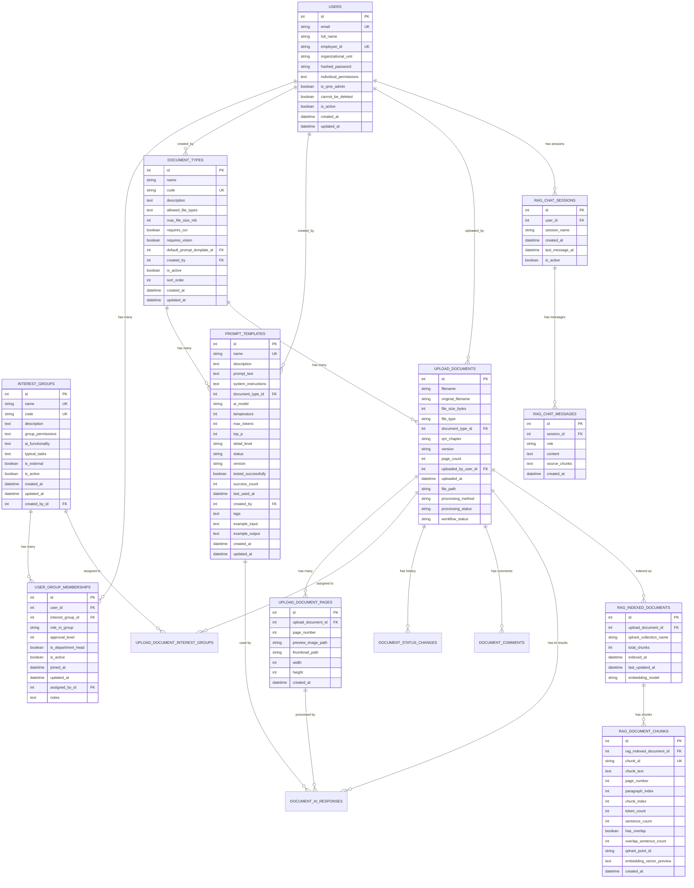

# 📊 DocuMind-AI V2 - Datenbank Schema

**Stand:** 2025-10-28  
**Version:** 2.1.0  
**Engine:** SQLite (Dev) / PostgreSQL (Prod)  
**Tabellen:** 15 (Core: 5 + Document Upload: 6 + RAG: 4)

---

## 🎯 Entity Relationship Diagram



---

## 📋 Tabellen-Details

### **Core System (5 Tabellen)**

#### **1. `users` - Benutzer**
Zentrale User-Tabelle für Authentifizierung und RBAC.

| Feld | Typ | Constraints | Beschreibung |
|------|-----|-------------|--------------|
| `id` | INTEGER | PK, AUTO | Primary Key |
| `email` | VARCHAR(100) | UNIQUE, NOT NULL, INDEX | Email-Adresse (Login) |
| `full_name` | VARCHAR(200) | NOT NULL | Vollständiger Name |
| `employee_id` | VARCHAR(50) | UNIQUE | Mitarbeiter-ID |
| `organizational_unit` | VARCHAR(100) | - | Primäre Organisationseinheit |
| `hashed_password` | VARCHAR(255) | - | bcrypt-Hash |
| `individual_permissions` | TEXT | - | JSON-String mit Permissions |
| `is_qms_admin` | BOOLEAN | NOT NULL, DEFAULT FALSE | QMS-Administrator Flag |
| `cannot_be_deleted` | BOOLEAN | NOT NULL, DEFAULT FALSE | Schutz vor Löschung |
| `is_active` | BOOLEAN | NOT NULL, DEFAULT TRUE | Soft-Delete Flag |
| `created_at` | DATETIME | NOT NULL, DEFAULT NOW | Erstellungsdatum |
| `updated_at` | DATETIME | NOT NULL, DEFAULT NOW | Letzte Änderung |

#### **2. `interest_groups` - Interessensgruppen**
13-Stakeholder-System für organisatorische Einheiten.

| Feld | Typ | Constraints | Beschreibung |
|------|-----|-------------|--------------|
| `id` | INTEGER | PK, AUTO | Primary Key |
| `name` | VARCHAR(100) | UNIQUE, NOT NULL, INDEX | Name (z.B. "Team") |
| `code` | VARCHAR(50) | UNIQUE, NOT NULL, INDEX | Code (z.B. "team") |
| `description` | TEXT | - | Beschreibung |
| `group_permissions` | TEXT | - | JSON-String mit Permissions |
| `ai_functionality` | TEXT | - | Verfügbare KI-Funktionen |
| `typical_tasks` | TEXT | - | Typische Aufgaben |
| `is_external` | BOOLEAN | NOT NULL, DEFAULT FALSE | Intern/Extern |
| `is_active` | BOOLEAN | NOT NULL, DEFAULT TRUE | Soft-Delete Flag |
| `created_at` | DATETIME | NOT NULL, DEFAULT NOW | Erstellungsdatum |
| `updated_at` | DATETIME | NOT NULL, DEFAULT NOW | Letzte Änderung |
| `created_by_id` | INTEGER | FK → users.id | Ersteller |

#### **3. `user_group_memberships` - Zuordnungen**
Many-to-Many Beziehung zwischen Users und Interest Groups.

| Feld | Typ | Constraints | Beschreibung |
|------|-----|-------------|--------------|
| `id` | INTEGER | PK, AUTO | Primary Key |
| `user_id` | INTEGER | FK → users.id, NOT NULL, INDEX | User-Referenz |
| `interest_group_id` | INTEGER | FK → interest_groups.id, NOT NULL, INDEX | Group-Referenz |
| `role_in_group` | VARCHAR(50) | - | Rolle (z.B. "Teamleiter") |
| `approval_level` | INTEGER | NOT NULL, DEFAULT 1 | **1-5** Permission Level |
| `is_department_head` | BOOLEAN | NOT NULL, DEFAULT FALSE | Abteilungsleiter-Flag |
| `is_active` | BOOLEAN | NOT NULL, DEFAULT TRUE | Soft-Delete Flag |
| `joined_at` | DATETIME | NOT NULL, DEFAULT NOW | Beitrittsdatum |
| `updated_at` | DATETIME | NOT NULL, DEFAULT NOW | Letzte Änderung |
| `assigned_by_id` | INTEGER | FK → users.id | Wer hat zugeordnet |
| `notes` | TEXT | - | Bemerkungen |

#### **4. `document_types` - Dokumenttypen**
Verwaltung von Dokumenttypen mit AI-Anforderungen.

| Feld | Typ | Constraints | Beschreibung |
|------|-----|-------------|--------------|
| `id` | INTEGER | PK, AUTO | Primary Key |
| `name` | VARCHAR(100) | NOT NULL, INDEX | Name (z.B. "SOP") |
| `code` | VARCHAR(50) | UNIQUE, NOT NULL, INDEX | Code (z.B. "sop") |
| `description` | TEXT | - | Beschreibung |
| `allowed_file_types` | TEXT | NOT NULL | JSON-Array: ["pdf", "docx"] |
| `max_file_size_mb` | INTEGER | NOT NULL | Max. Dateigröße in MB |
| `requires_ocr` | BOOLEAN | NOT NULL, DEFAULT FALSE | OCR-Verarbeitung erforderlich |
| `requires_vision` | BOOLEAN | NOT NULL, DEFAULT FALSE | Vision-Analyse erforderlich |
| `default_prompt_template_id` | INTEGER | FK → prompt_templates.id | Standard-Prompt |
| `created_by` | INTEGER | FK → users.id | Ersteller |
| `is_active` | BOOLEAN | NOT NULL, DEFAULT TRUE | Aktiv/Inaktiv |
| `sort_order` | INTEGER | NOT NULL, DEFAULT 0 | Sortierreihenfolge |
| `created_at` | DATETIME | NOT NULL, DEFAULT NOW | Erstellungsdatum |
| `updated_at` | DATETIME | NOT NULL, DEFAULT NOW | Letzte Änderung |

#### **5. `prompt_templates` - Prompt-Vorlagen**
AI-Prompt-Templates mit Versionierung und Status-Management.

| Feld | Typ | Constraints | Beschreibung |
|------|-----|-------------|--------------|
| `id` | INTEGER | PK, AUTO | Primary Key |
| `name` | VARCHAR(200) | UNIQUE, NOT NULL, INDEX | Template-Name |
| `description` | TEXT | - | Beschreibung |
| `prompt_text` | TEXT | NOT NULL | Der eigentliche Prompt |
| `system_instructions` | TEXT | - | System-Instruktionen |
| `document_type_id` | INTEGER | FK → document_types.id | Zugeordneter Dokumenttyp |
| `ai_model` | VARCHAR(100) | NOT NULL | AI-Model (gpt-4o-mini, gemini-2.5-flash) |
| `temperature` | INTEGER | NOT NULL | 0-100 (0.0-1.0 als Integer) |
| `max_tokens` | INTEGER | NOT NULL | Max. Token-Limit |
| `top_p` | INTEGER | NOT NULL | 0-100 (0.0-1.0 als Integer) |
| `detail_level` | VARCHAR(10) | NOT NULL | "low", "high" (für Vision-Models) |
| `status` | VARCHAR(20) | NOT NULL, INDEX | "draft", "active", "archived" |
| `version` | VARCHAR(20) | NOT NULL | Versionsnummer (v1.0, v1.1) |
| `tested_successfully` | BOOLEAN | NOT NULL, DEFAULT FALSE | Erfolgreich getestet |
| `success_count` | INTEGER | NOT NULL, DEFAULT 0 | Anzahl erfolgreicher Tests |
| `last_used_at` | DATETIME | - | Letzte Verwendung |
| `created_by` | INTEGER | FK → users.id | Ersteller |
| `tags` | TEXT | - | JSON-Array: ["ocr", "vision"] |
| `example_input` | TEXT | - | Beispiel-Eingabe |
| `example_output` | TEXT | - | Beispiel-Ausgabe |
| `created_at` | DATETIME | NOT NULL, DEFAULT NOW | Erstellungsdatum |
| `updated_at` | DATETIME | NOT NULL, DEFAULT NOW | Letzte Änderung |

---

### **Document Upload System (6 Tabellen)**

#### **6. `upload_documents` - Hochgeladene Dokumente**
Zentrale Tabelle für alle hochgeladenen Dokumente mit Workflow-Status.

| Feld | Typ | Constraints | Beschreibung |
|------|-----|-------------|--------------|
| `id` | INTEGER | PK, AUTO | Primary Key |
| `filename` | VARCHAR(255) | NOT NULL | System-Dateiname |
| `original_filename` | VARCHAR(255) | NOT NULL | Original-Dateiname |
| `file_size_bytes` | INTEGER | NOT NULL | Dateigröße in Bytes |
| `file_type` | VARCHAR(10) | NOT NULL | Dateityp (pdf, docx, png, jpg) |
| `document_type_id` | INTEGER | FK → document_types.id, NOT NULL | Dokumenttyp |
| `qm_chapter` | VARCHAR(50) | - | QM-Kapitel |
| `version` | VARCHAR(20) | NOT NULL | Dokumentversion |
| `page_count` | INTEGER | - | Anzahl Seiten |
| `uploaded_by_user_id` | INTEGER | FK → users.id, NOT NULL | Uploader |
| `uploaded_at` | DATETIME | NOT NULL | Upload-Zeitpunkt |
| `file_path` | VARCHAR(500) | NOT NULL | Pfad zur Datei |
| `processing_method` | VARCHAR(20) | NOT NULL | "ocr" oder "vision" |
| `processing_status` | VARCHAR(20) | NOT NULL | "pending", "processing", "completed", "failed" |
| `workflow_status` | VARCHAR(20) | NOT NULL | "draft", "reviewed", "approved", "rejected" |

#### **7. `upload_document_pages` - Dokument-Seiten**
Einzelne Seiten eines Dokuments mit Preview-Bildern.

| Feld | Typ | Constraints | Beschreibung |
|------|-----|-------------|--------------|
| `id` | INTEGER | PK, AUTO | Primary Key |
| `upload_document_id` | INTEGER | FK → upload_documents.id, NOT NULL | Dokument-Referenz |
| `page_number` | INTEGER | NOT NULL | Seitennummer (1-basiert) |
| `preview_image_path` | VARCHAR(500) | NOT NULL | Pfad zum Preview-Bild |
| `thumbnail_path` | VARCHAR(500) | - | Pfad zum Thumbnail |
| `width` | INTEGER | - | Bildbreite in Pixel |
| `height` | INTEGER | - | Bildhöhe in Pixel |
| `created_at` | DATETIME | NOT NULL | Erstellungsdatum |

#### **8. `upload_document_interest_groups` - Dokument-Zuordnungen**
Zuordnung von Dokumenten zu Interest Groups.

| Feld | Typ | Constraints | Beschreibung |
|------|-----|-------------|--------------|
| `id` | INTEGER | PK, AUTO | Primary Key |
| `upload_document_id` | INTEGER | FK → upload_documents.id, NOT NULL | Dokument-Referenz |
| `interest_group_id` | INTEGER | FK → interest_groups.id, NOT NULL | Group-Referenz |
| `assigned_at` | DATETIME | NOT NULL | Zuordnungs-Zeitpunkt |
| `assigned_by_user_id` | INTEGER | FK → users.id, NOT NULL | Wer hat zugeordnet |

#### **9. `document_status_changes` - Workflow-Historie**
Audit-Trail für alle Workflow-Status-Änderungen.

| Feld | Typ | Constraints | Beschreibung |
|------|-----|-------------|--------------|
| `id` | INTEGER | PK, AUTO | Primary Key |
| `upload_document_id` | INTEGER | FK → upload_documents.id, NOT NULL | Dokument-Referenz |
| `from_status` | VARCHAR(20) | - | Vorheriger Status |
| `to_status` | VARCHAR(20) | NOT NULL | Neuer Status |
| `changed_by_user_id` | INTEGER | FK → users.id, NOT NULL | Wer hat geändert |
| `changed_at` | DATETIME | NOT NULL | Änderungs-Zeitpunkt |
| `change_reason` | TEXT | NOT NULL | Grund für Änderung |
| `comment` | TEXT | - | Zusätzlicher Kommentar |
| `created_at` | DATETIME | NOT NULL | Erstellungsdatum |

#### **10. `document_comments` - Dokument-Kommentare**
Kommentare zu Dokumenten oder spezifischen Seiten.

| Feld | Typ | Constraints | Beschreibung |
|------|-----|-------------|--------------|
| `id` | INTEGER | PK, AUTO | Primary Key |
| `upload_document_id` | INTEGER | FK → upload_documents.id, NOT NULL | Dokument-Referenz |
| `comment_text` | TEXT | NOT NULL | Kommentar-Text |
| `comment_type` | VARCHAR(20) | NOT NULL | "general", "review", "approval" |
| `page_number` | INTEGER | - | Seitennummer (falls seiten-spezifisch) |
| `created_by_user_id` | INTEGER | FK → users.id, NOT NULL | Kommentar-Ersteller |
| `created_at` | DATETIME | NOT NULL | Erstellungsdatum |
| `status_change_id` | INTEGER | FK → document_status_changes.id | Verknüpfung zu Status-Änderung |
| `updated_at` | DATETIME | NOT NULL | Letzte Änderung |

#### **11. `document_ai_responses` - AI-Verarbeitungsergebnisse**
Ergebnisse der AI-Verarbeitung von Dokument-Seiten.

| Feld | Typ | Constraints | Beschreibung |
|------|-----|-------------|--------------|
| `id` | INTEGER | PK, AUTO | Primary Key |
| `upload_document_id` | INTEGER | FK → upload_documents.id, NOT NULL | Dokument-Referenz |
| `upload_document_page_id` | INTEGER | FK → upload_document_pages.id, NOT NULL | Seiten-Referenz |
| `prompt_template_id` | INTEGER | FK → prompt_templates.id, NOT NULL | Verwendetes Template |
| `ai_model_id` | VARCHAR(100) | NOT NULL | AI-Model ID |
| `model_name` | VARCHAR(100) | NOT NULL | AI-Model Name |
| `json_response` | TEXT | NOT NULL | Strukturierte JSON-Antwort |
| `processing_status` | VARCHAR(20) | NOT NULL | "success", "failed", "pending" |
| `tokens_sent` | INTEGER | - | Verwendete Input-Tokens |
| `tokens_received` | INTEGER | - | Verwendete Output-Tokens |
| `total_tokens` | INTEGER | - | Gesamt-Tokens |
| `response_time_ms` | INTEGER | - | Antwortzeit in Millisekunden |
| `error_message` | TEXT | - | Fehlermeldung (falls fehlgeschlagen) |
| `processed_at` | DATETIME | NOT NULL | Verarbeitungs-Zeitpunkt |
| `created_at` | DATETIME | NOT NULL | Erstellungsdatum |
| `updated_at` | DATETIME | NOT NULL | Letzte Änderung |

---

### **RAG System (4 Tabellen)**

#### **12. `rag_indexed_documents` - Indexierte Dokumente**
Dokumente, die für das RAG-System indexiert wurden.

| Feld | Typ | Constraints | Beschreibung |
|------|-----|-------------|--------------|
| `id` | INTEGER | PK, AUTO | Primary Key |
| `upload_document_id` | INTEGER | FK → upload_documents.id, NOT NULL, UNIQUE | Dokument-Referenz |
| `qdrant_collection_name` | VARCHAR(100) | NOT NULL | Qdrant Collection Name |
| `total_chunks` | INTEGER | NOT NULL | Anzahl erstellter Chunks |
| `indexed_at` | DATETIME | NOT NULL | Indexierungs-Zeitpunkt |
| `last_updated_at` | DATETIME | NOT NULL | Letzte Aktualisierung |
| `embedding_model` | VARCHAR(100) | NOT NULL | Verwendetes Embedding-Model |

#### **13. `rag_document_chunks` - Dokument-Chunks**
Einzelne Text-Chunks für Vektor-Suche.

| Feld | Typ | Constraints | Beschreibung |
|------|-----|-------------|--------------|
| `id` | INTEGER | PK, AUTO | Primary Key |
| `rag_indexed_document_id` | INTEGER | FK → rag_indexed_documents.id, NOT NULL | Indexiertes Dokument |
| `chunk_id` | VARCHAR(100) | UNIQUE, NOT NULL | Eindeutige Chunk-ID |
| `chunk_text` | TEXT | NOT NULL | Text-Inhalt des Chunks |
| `page_number` | INTEGER | NOT NULL | Quell-Seitennummer |
| `paragraph_index` | INTEGER | - | Absatz-Index |
| `chunk_index` | INTEGER | NOT NULL | Chunk-Index innerhalb der Seite |
| `token_count` | INTEGER | - | Anzahl Tokens |
| `sentence_count` | INTEGER | - | Anzahl Sätze |
| `has_overlap` | BOOLEAN | NOT NULL | Hat Überlappung mit vorherigem Chunk |
| `overlap_sentence_count` | INTEGER | NOT NULL | Anzahl überlappender Sätze |
| `qdrant_point_id` | VARCHAR(100) | - | Qdrant Point ID |
| `embedding_vector_preview` | TEXT | - | Preview der ersten 50 Dimensionen |
| `created_at` | DATETIME | NOT NULL | Erstellungsdatum |

#### **14. `rag_chat_sessions` - Chat-Sessions**
RAG-Chat-Sessions pro User.

| Feld | Typ | Constraints | Beschreibung |
|------|-----|-------------|--------------|
| `id` | INTEGER | PK, AUTO | Primary Key |
| `user_id` | INTEGER | FK → users.id, NOT NULL | User-Referenz |
| `session_name` | VARCHAR(255) | - | Session-Name |
| `created_at` | DATETIME | NOT NULL | Erstellungsdatum |
| `last_message_at` | DATETIME | - | Letzte Nachricht |
| `is_active` | BOOLEAN | NOT NULL, DEFAULT TRUE | Session aktiv |

#### **15. `rag_chat_messages` - Chat-Nachrichten**
Einzelne Nachrichten in RAG-Chat-Sessions.

| Feld | Typ | Constraints | Beschreibung |
|------|-----|-------------|--------------|
| `id` | INTEGER | PK, AUTO | Primary Key |
| `session_id` | INTEGER | FK → rag_chat_sessions.id, NOT NULL | Session-Referenz |
| `role` | VARCHAR(20) | NOT NULL | "user" oder "assistant" |
| `content` | TEXT | NOT NULL | Nachrichten-Inhalt |
| `source_chunks` | TEXT | - | JSON-Array mit Quell-Chunk-IDs |
| `created_at` | DATETIME | NOT NULL | Erstellungsdatum |

---

## 🎯 Permission Levels (1-5)

Basierend auf dem QMS-System:

| Level | Name | Rechte | Beispiel |
|-------|------|--------|----------|
| **L1** | Mitarbeiter | Lesen, Vorschlagen | Normaler Mitarbeiter |
| **L2** | Teamleiter | L1 + Team-Freigabe | Team Lead |
| **L3** | Abteilungsleiter | L2 + Abteilungs-Freigabe | Department Head |
| **L4** | QM-Manager | L3 + QM-Freigabe | QM-Bereich Verantwortlicher |
| **L5** | System-Admin / QM-Leitung | Alles | QMS-Admin, Vollzugriff |

---

## 🔄 Workflow-Status

### **Document Upload Workflow:**
1. **`draft`** → Dokument hochgeladen, noch nicht bearbeitet
2. **`reviewed`** → Dokument wurde geprüft (Level 2-3)
3. **`approved`** → Dokument wurde freigegeben (Level 4-5)
4. **`rejected`** → Dokument wurde abgelehnt

### **Processing Status:**
1. **`pending`** → Wartet auf Verarbeitung
2. **`processing`** → Wird gerade verarbeitet
3. **`completed`** → Verarbeitung abgeschlossen
4. **`failed`** → Verarbeitung fehlgeschlagen

---

## 📊 Aktuelle Statistiken

**Tabellen:** 15  
**Relationships:** 25+  
**Indexes:** 30+  
**Foreign Keys:** 20+  
**Standard-Daten:** 13 Interest Groups, 7 Document Types, 1 QMS Admin User

**System-Status:**
- ✅ **Core System:** Vollständig implementiert
- ✅ **Document Upload:** Vollständig implementiert mit Workflow
- ✅ **RAG Integration:** Vollständig implementiert
- ✅ **AI Processing:** Vollständig implementiert
- ✅ **Permission System:** Vollständig implementiert

**Letzte Änderung:** 2025-10-28 (Schema-Sync: Backend-Code an DB-Schema angepasst)

---

## 🔄 **SCHEMA-SYNC UPDATE (2025-10-28)**

**Wichtige Änderungen:** Backend-Code wurde an das tatsächliche DB-Schema angepasst:

### **rag_chat_sessions**
- ✅ `session_name` ist jetzt `nullable=True` (VARCHAR(255))
- ✅ `last_activity` → `last_message_at` (nullable=True)
- ✅ `message_count` wird als Property berechnet
- ✅ `is_active` Spalte hinzugefügt

### **rag_chat_messages**
- ✅ `chat_session_id` → `session_id`
- ✅ `source_references` JSON → `source_chunks` TEXT
- ✅ `structured_data` wird als Property berechnet

### **rag_indexed_documents**
- ✅ `document_title`, `document_type`, `status` werden als Properties berechnet
- ✅ `qdrant_collection_name` und `embedding_model` hinzugefügt

### **rag_document_chunks**
- ✅ `indexed_document_id` → `rag_indexed_document_id`
- ✅ `page_numbers` JSON → `page_number` INTEGER
- ✅ Zusätzliche Spalten: `sentence_count`, `has_overlap`, `qdrant_point_id`

**Status:** ✅ **SCHEMA-SYNC ABGESCHLOSSEN** - Backend und DB sind jetzt synchron!

---

## 🎯 Datenbank-Pfad und Initialisierung

**Wichtiger Hinweis:** Die Datenbank befindet sich unter:
```
/Users/reiner/Documents/DocuMind-AI-V2/data/qms.db
```

Dieser Pfad ist fest in der Konfiguration definiert und sollte nicht geändert werden.

### **Initialisierung der Datenbank**

**NEU:** Ab Version 2.1.0 gibt es ein komplettes Initialisierungs-Script, das alle Migration-Scripts ersetzt:

```bash
# Komplette Datenbank-Initialisierung
cd backend
python3 init_database.py

# Mit Force-Flag (ohne Bestätigung)
python3 init_database.py --force
```

**Das Script erstellt:**
- ✅ Alle 15 Tabellen (Core: 5 + Document Upload: 6 + RAG: 4)
- ✅ 30+ Indizes für optimale Performance
- ✅ 20+ Foreign Key Constraints
- ✅ 6 Trigger für automatische Updates
- ✅ 2 Views für komplexe Queries
- ✅ Standard-Seed-Daten (13 Interest Groups, 7 Document Types, 1 QMS Admin)
- ✅ SQLite-Optimierungen
- ✅ Automatisches Backup der bestehenden Datenbank

**Migration-Scripts:** Die alten Migration-Scripts in `backend/migrations/` sind nicht mehr notwendig und können entfernt werden.