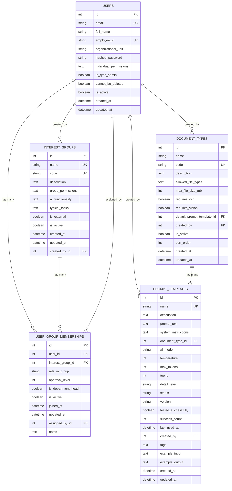

# 📊 DocuMind-AI V2 - Datenbank Schema

**Stand:** 2025-10-08  
**Version:** 2.1.0  
**Engine:** SQLite (Dev) / PostgreSQL (Prod)

---

## 🎯 Entity Relationship Diagram



---

## 📋 Tabellen-Details

### **1. `users` - Benutzer**

Zentrale User-Tabelle für Authentifizierung und RBAC.

| Feld | Typ | Constraints | Beschreibung |
|------|-----|-------------|--------------|
| `id` | INTEGER | PK, AUTO | Primary Key |
| `email` | VARCHAR(100) | UNIQUE, NOT NULL, INDEX | Email-Adresse (Login) |
| `full_name` | VARCHAR(200) | NOT NULL | Vollständiger Name |
| `employee_id` | VARCHAR(50) | UNIQUE | Mitarbeiter-ID |
| `organizational_unit` | VARCHAR(100) | - | Primäre Organisationseinheit |
| `hashed_password` | VARCHAR(255) | - | bcrypt-Hash |
| `individual_permissions` | TEXT | - | JSON-String mit Permissions |
| `is_qms_admin` | BOOLEAN | NOT NULL, DEFAULT FALSE | QMS-Administrator Flag |
| `cannot_be_deleted` | BOOLEAN | NOT NULL, DEFAULT FALSE | Schutz vor Löschung |
| `is_active` | BOOLEAN | NOT NULL, DEFAULT TRUE | Soft-Delete Flag |
| `created_at` | DATETIME | NOT NULL, DEFAULT NOW | Erstellungsdatum |
| `updated_at` | DATETIME | NOT NULL, DEFAULT NOW | Letzte Änderung |

**✅ Verbesserungen:**
- `is_qms_admin` statt `is_department_head` (spezifischer)
- `cannot_be_deleted` für System-User Schutz
- `updated_at` für Audit-Trail
- `approval_level` entfernt (nur in Memberships)

---

### **2. `interest_groups` - Interessensgruppen**

13-Stakeholder-System für organisatorische Einheiten.

| Feld | Typ | Constraints | Beschreibung |
|------|-----|-------------|--------------|
| `id` | INTEGER | PK, AUTO | Primary Key |
| `name` | VARCHAR(100) | UNIQUE, NOT NULL, INDEX | Name (z.B. "Team") |
| `code` | VARCHAR(50) | UNIQUE, NOT NULL, INDEX | Code (z.B. "team") |
| `description` | TEXT | - | Beschreibung |
| `group_permissions` | TEXT | - | JSON-String mit Permissions |
| `ai_functionality` | TEXT | - | Verfügbare KI-Funktionen |
| `typical_tasks` | TEXT | - | Typische Aufgaben |
| `is_external` | BOOLEAN | NOT NULL, DEFAULT FALSE | Intern/Extern |
| `is_active` | BOOLEAN | NOT NULL, DEFAULT TRUE | Soft-Delete Flag |
| `created_at` | DATETIME | NOT NULL, DEFAULT NOW | Erstellungsdatum |
| `updated_at` | DATETIME | NOT NULL, DEFAULT NOW | Letzte Änderung |
| `created_by_id` | INTEGER | FK → users.id | Ersteller |

**✅ Verbesserungen:**
- `updated_at` für Audit-Trail
- `created_by_id` für Audit-Trail

**✅ Aktuelle Gruppen (13):**
1. Einkauf
2. Qualitätsmanagement
3. Entwicklung
4. Produktion
5. Service & Support
6. Vertrieb
7. Regulatorische Angelegenheiten
8. **Team** ✅ (geändert von "Klinik")
9. IT
10. Geschäftsleitung
11. Externe Auditoren
12. Lieferanten
13. Kunden

---

### **3. `user_group_memberships` - Zuordnungen**

Many-to-Many Beziehung zwischen Users und Interest Groups.

| Feld | Typ | Constraints | Beschreibung |
|------|-----|-------------|--------------|
| `id` | INTEGER | PK, AUTO | Primary Key |
| `user_id` | INTEGER | FK → users.id, NOT NULL, INDEX | User-Referenz |
| `interest_group_id` | INTEGER | FK → interest_groups.id, NOT NULL, INDEX | Group-Referenz |
| `role_in_group` | VARCHAR(50) | - | Rolle (z.B. "Teamleiter") |
| `approval_level` | INTEGER | NOT NULL, DEFAULT 1 | **1-5** Permission Level |
| `is_department_head` | BOOLEAN | NOT NULL, DEFAULT FALSE | Abteilungsleiter-Flag |
| `is_active` | BOOLEAN | NOT NULL, DEFAULT TRUE | Soft-Delete Flag |
| `joined_at` | DATETIME | NOT NULL, DEFAULT NOW | Beitrittsdatum |
| `updated_at` | DATETIME | NOT NULL, DEFAULT NOW | Letzte Änderung |
| `assigned_by_id` | INTEGER | FK → users.id | Wer hat zugeordnet |
| `notes` | TEXT | - | Bemerkungen |

**✅ Verbesserungen:**
- `updated_at` für Audit-Trail

**⚠️ Noch zu beheben:**
- **Kein UNIQUE Constraint** auf `(user_id, interest_group_id)` → Duplikate möglich!
- **Kein CHECK Constraint** für `approval_level` (1-5)

---

### **4. `document_types` - Dokumenttypen** ⭐ **NEU**

Verwaltung von Dokumenttypen mit AI-Anforderungen.

| Feld | Typ | Constraints | Beschreibung |
|------|-----|-------------|--------------|
| `id` | INTEGER | PK, AUTO | Primary Key |
| `name` | VARCHAR(100) | NOT NULL, INDEX | Name (z.B. "SOP") |
| `code` | VARCHAR(50) | UNIQUE, NOT NULL, INDEX | Code (z.B. "sop") |
| `description` | TEXT | - | Beschreibung |
| `allowed_file_types` | TEXT | NOT NULL | JSON-Array: ["pdf", "docx"] |
| `max_file_size_mb` | INTEGER | NOT NULL | Max. Dateigröße in MB |
| `requires_ocr` | BOOLEAN | NOT NULL, DEFAULT FALSE | OCR-Verarbeitung erforderlich |
| `requires_vision` | BOOLEAN | NOT NULL, DEFAULT FALSE | Vision-Analyse erforderlich |
| `default_prompt_template_id` | INTEGER | FK → prompt_templates.id | Standard-Prompt |
| `created_by` | INTEGER | FK → users.id | Ersteller |
| `is_active` | BOOLEAN | NOT NULL, DEFAULT TRUE | Aktiv/Inaktiv |
| `sort_order` | INTEGER | NOT NULL, DEFAULT 0 | Sortierreihenfolge |
| `created_at` | DATETIME | NOT NULL, DEFAULT NOW | Erstellungsdatum |
| `updated_at` | DATETIME | NOT NULL, DEFAULT NOW | Letzte Änderung |

**✅ Standard-Dokumenttypen (7):**
1. **SOP** (Standard Operating Procedure)
2. **Arbeitsanweisung** (Work Instruction)
3. **Prüfplan** (Inspection Plan)
4. **Auditbericht** (Audit Report)
5. **Korrekturmaßnahme** (Corrective Action)
6. **Schulungsunterlage** (Training Material)
7. **Qualitätshandbuch** (Quality Manual)

---

### **5. `prompt_templates` - Prompt-Vorlagen** ⭐ **NEU**

AI-Prompt-Templates mit Versionierung und Status-Management.

| Feld | Typ | Constraints | Beschreibung |
|------|-----|-------------|--------------|
| `id` | INTEGER | PK, AUTO | Primary Key |
| `name` | VARCHAR(200) | UNIQUE, NOT NULL, INDEX | Template-Name |
| `description` | TEXT | - | Beschreibung |
| `prompt_text` | TEXT | NOT NULL | Der eigentliche Prompt |
| `system_instructions` | TEXT | - | System-Instruktionen |
| `document_type_id` | INTEGER | FK → document_types.id | Zugeordneter Dokumenttyp |
| `ai_model` | VARCHAR(100) | NOT NULL | AI-Model (gpt-4o-mini, gemini-2.5-flash) |
| `temperature` | INTEGER | NOT NULL | 0-100 (0.0-1.0 als Integer) |
| `max_tokens` | INTEGER | NOT NULL | Max. Token-Limit |
| `top_p` | INTEGER | NOT NULL | 0-100 (0.0-1.0 als Integer) |
| `detail_level` | VARCHAR(10) | NOT NULL | "low", "high" (für Vision-Models) |
| `status` | VARCHAR(20) | NOT NULL, INDEX | "draft", "active", "archived" |
| `version` | VARCHAR(20) | NOT NULL | Versionsnummer (v1.0, v1.1) |
| `tested_successfully` | BOOLEAN | NOT NULL, DEFAULT FALSE | Erfolgreich getestet |
| `success_count` | INTEGER | NOT NULL, DEFAULT 0 | Anzahl erfolgreicher Tests |
| `last_used_at` | DATETIME | - | Letzte Verwendung |
| `created_by` | INTEGER | FK → users.id | Ersteller |
| `tags` | TEXT | - | JSON-Array: ["ocr", "vision"] |
| `example_input` | TEXT | - | Beispiel-Eingabe |
| `example_output` | TEXT | - | Beispiel-Ausgabe |
| `created_at` | DATETIME | NOT NULL, DEFAULT NOW | Erstellungsdatum |
| `updated_at` | DATETIME | NOT NULL, DEFAULT NOW | Letzte Änderung |

**✅ Status-Workflow:**
- `draft` → `active` → `archived`
- Nur ein `active` Template pro Document Type
- Versionierung für Template-Evolution

---

## 🎯 Permission Levels (1-5)

Basierend auf dem QMS-Workflow:

| Level | Name | Rechte | Beispiel |
|-------|------|--------|----------|
| **L1** | Mitarbeiter | Lesen, Vorschlagen | Normaler Mitarbeiter |
| **L2** | Teamleiter | L1 + Team-Freigabe | Team Lead |
| **L3** | Abteilungsleiter | L2 + Abteilungs-Freigabe | Department Head |
| **L4** | QM-Manager | L3 + QM-Freigabe | QM-Bereich Verantwortlicher |
| **L5** | System-Admin / QM-Leitung | Alles | QMS-Admin, Vollzugriff |

**🔥 Wichtig für Matrix-View:**
- Ein User kann **mehrere Memberships** mit **unterschiedlichen Levels** haben
- Beispiel: `reiner@company.com` → QM (L5), Service (L3), IT (L1)

---

## ⚠️ Noch zu behebende Probleme

### **1. Fehlende Constraints**
- **Kein UNIQUE** `(user_id, interest_group_id)` → User kann mehrfach in gleicher Gruppe sein!
- **Kein CHECK** `approval_level BETWEEN 1 AND 5`

**Lösung:** Constraints hinzufügen

### **2. JSON-Strings**
- `individual_permissions` (users)
- `group_permissions` (interest_groups)
- `allowed_file_types` (document_types)
- `tags` (prompt_templates)

**Optionen:**
- **A) Behalten** (einfach, flexibel)
- **B) Eigene Tabellen** (strukturiert, querybar)

### **3. Fehlende Indexes**
Für Performance:
- Composite Index auf `(user_id, interest_group_id, is_active)`
- Index auf `(document_type_id, status)` für prompt_templates

---

## 🔧 Migrations-Vorschläge

### **Option A: Quick Fix** ⚡

**Änderungen:**
1. ✅ UNIQUE Constraint auf `(user_id, interest_group_id, is_active=True)`
2. ✅ CHECK Constraint: `approval_level BETWEEN 1 AND 5`
3. ✅ Composite Index: `(user_id, interest_group_id, is_active)`
4. ✅ Index: `(document_type_id, status)` für prompt_templates

**Migration-Aufwand:** ~15 Minuten  
**Breaking Changes:** Keine

---

### **Option B: Strukturiert** 🎯

Alles aus **Option A** plus:

**Neue Tabellen:**
1. **`permission_levels`** (Lookup)
2. **`user_permissions`** (strukturiert statt JSON)
3. **`file_type_validations`** (strukturiert statt JSON)

**Migration-Aufwand:** ~2 Stunden  
**Breaking Changes:** Moderat

---

## 📊 Matrix-View Beispiel

Wie die Daten im Frontend aussehen sollen:

| User | Email | QM | Service | IT | Entwicklung |
|------|-------|----|---------|----|-------------|
| **QMS Admin** | qms.admin@ | **L5** | - | - | - |
| **Maria QM** | maria.qm@ | **L4** | - | - | - |
| **Reiner** | reiner@ | **L5** | **L3** | **L1** | **L2** |
| **Thomas** | thomas.dev@ | - | - | **L2** | **L5** |

**Backend-Query:**
```sql
SELECT 
    u.id, u.full_name, u.email,
    ig.code as group_code,
    ugm.approval_level
FROM users u
LEFT JOIN user_group_memberships ugm ON u.id = ugm.user_id AND ugm.is_active = TRUE
LEFT JOIN interest_groups ig ON ugm.interest_group_id = ig.id AND ig.is_active = TRUE
WHERE u.is_active = TRUE
ORDER BY u.full_name, ig.name
```

---

## 🎯 Prompt-Verwaltung Workflow

### **Document Type → Prompt Template Beziehung:**

```sql
-- Aktive Templates pro Document Type
SELECT 
    dt.name as document_type,
    pt.name as template_name,
    pt.status,
    pt.version,
    pt.ai_model,
    pt.tested_successfully
FROM document_types dt
LEFT JOIN prompt_templates pt ON dt.id = pt.document_type_id 
    AND pt.status = 'active'
WHERE dt.is_active = TRUE
ORDER BY dt.sort_order, pt.name
```

### **Template-Versionierung:**
- Nur **ein** `active` Template pro Document Type
- Alte Versionen werden auf `archived` gesetzt
- `version` Feld für semantische Versionierung (v1.0, v1.1)

---

## ❓ Nächste Schritte

**Was möchtest du tun?**

1. ✅ **Option A** - Quick Fix (Constraints + Indexes)
2. 🎯 **Option B** - Strukturiert (neue Tabellen)
3. 📊 **Matrix-View** - Frontend für User-Group-Zuordnungen
4. 🔄 **QMS-Workflow** - Document Approval System

**Oder:** Erst visualisieren, dann entscheiden? 😊

---

## 📈 Aktuelle Statistiken

**Tabellen:** 5  
**Relationships:** 7  
**Indexes:** 15  
**Foreign Keys:** 8  
**Standard-Daten:** 13 Interest Groups, 7 Document Types, 1 QMS Admin User

**Letzte Änderung:** 2025-10-08 (Document Types + Prompt Templates hinzugefügt)