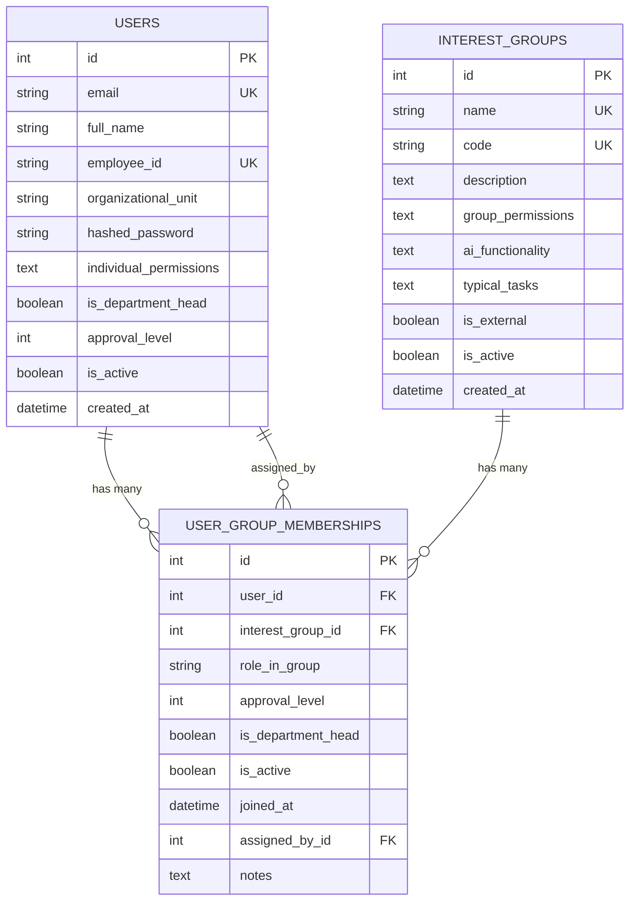

# 📊 DocuMind-AI V2 - Datenbank Schema

**Stand:** 2025-10-01  
**Version:** 2.0.0  
**Engine:** SQLite (Dev) / PostgreSQL (Prod)

---

## 🎯 Entity Relationship Diagram



---

## 📋 Tabellen-Details

### **1. `users` - Benutzer**

Zentrale User-Tabelle für Authentifizierung und RBAC.

| Feld | Typ | Constraints | Beschreibung |
|------|-----|-------------|--------------|
| `id` | INTEGER | PK, AUTO | Primary Key |
| `email` | VARCHAR(100) | UNIQUE, NOT NULL, INDEX | Email-Adresse (Login) |
| `full_name` | VARCHAR(200) | NOT NULL | Vollständiger Name |
| `employee_id` | VARCHAR(50) | UNIQUE | Mitarbeiter-ID |
| `organizational_unit` | VARCHAR(100) | - | Primäre Organisationseinheit |
| `hashed_password` | VARCHAR(255) | - | bcrypt-Hash |
| `individual_permissions` | TEXT | - | **⚠️ JSON-String** mit Permissions |
| `is_department_head` | BOOLEAN | NOT NULL, DEFAULT FALSE | **⚠️ Dupliziert mit Membership** |
| `approval_level` | INTEGER | DEFAULT 1 | **⚠️ 1-5, Dupliziert mit Membership** |
| `is_active` | BOOLEAN | NOT NULL, DEFAULT TRUE | Soft-Delete Flag |
| `created_at` | DATETIME | NOT NULL, DEFAULT NOW | Erstellungsdatum |

**⚠️ Probleme:**
- `approval_level` doppelt (User + Membership)
- `is_department_head` doppelt (User + Membership)
- `individual_permissions` als unstrukturierter JSON-String
- Kein `updated_at` Timestamp

---

### **2. `interest_groups` - Interessensgruppen**

13-Stakeholder-System für organisatorische Einheiten.

| Feld | Typ | Constraints | Beschreibung |
|------|-----|-------------|--------------|
| `id` | INTEGER | PK, AUTO | Primary Key |
| `name` | VARCHAR(100) | UNIQUE, NOT NULL, INDEX | Name (z.B. "Team") |
| `code` | VARCHAR(50) | UNIQUE, NOT NULL, INDEX | Code (z.B. "team") |
| `description` | TEXT | - | Beschreibung |
| `group_permissions` | TEXT | - | **⚠️ JSON-String** mit Permissions |
| `ai_functionality` | TEXT | - | Verfügbare KI-Funktionen |
| `typical_tasks` | TEXT | - | Typische Aufgaben |
| `is_external` | BOOLEAN | NOT NULL, DEFAULT FALSE | Intern/Extern |
| `is_active` | BOOLEAN | NOT NULL, DEFAULT TRUE | Soft-Delete Flag |
| `created_at` | DATETIME | NOT NULL, DEFAULT NOW | Erstellungsdatum |

**⚠️ Probleme:**
- `group_permissions` als unstrukturierter JSON-String
- Kein `updated_at` Timestamp
- Keine Referenz zu Parent-Group (für Hierarchien)

**✅ Aktuelle Gruppen (13):**
1. Einkauf
2. Qualitätsmanagement
3. Entwicklung
4. Produktion
5. Service & Support
6. Vertrieb
7. Regulatorische Angelegenheiten
8. **Team** ✅ (geändert von "Klinik")
9. IT
10. Geschäftsleitung
11. Externe Auditoren
12. Lieferanten
13. Kunden

---

### **3. `user_group_memberships` - Zuordnungen**

Many-to-Many Beziehung zwischen Users und Interest Groups.

| Feld | Typ | Constraints | Beschreibung |
|------|-----|-------------|--------------|
| `id` | INTEGER | PK, AUTO | Primary Key |
| `user_id` | INTEGER | FK → users.id, NOT NULL, INDEX | User-Referenz |
| `interest_group_id` | INTEGER | FK → interest_groups.id, NOT NULL, INDEX | Group-Referenz |
| `role_in_group` | VARCHAR(50) | - | Rolle (z.B. "Teamleiter") |
| `approval_level` | INTEGER | NOT NULL, DEFAULT 1 | **1-5** Permission Level |
| `is_department_head` | BOOLEAN | NOT NULL, DEFAULT FALSE | Abteilungsleiter-Flag |
| `is_active` | BOOLEAN | NOT NULL, DEFAULT TRUE | Soft-Delete Flag |
| `joined_at` | DATETIME | NOT NULL, DEFAULT NOW | Beitrittsdatum |
| `assigned_by_id` | INTEGER | FK → users.id | Wer hat zugeordnet |
| `notes` | TEXT | - | Bemerkungen |

**⚠️ Probleme:**
- **Kein UNIQUE Constraint** auf `(user_id, interest_group_id)` → Duplikate möglich!
- Kein CHECK Constraint für `approval_level` (1-5)
- Kein `updated_at` Timestamp

**✅ Gut:**
- Audit-Trail (joined_at, assigned_by)
- Flexible Rollen pro Group
- Soft-Delete

---

## 🎯 Permission Levels (1-5)

Basierend auf deiner Beschreibung vom QMS-Workflow:

| Level | Name | Rechte | Beispiel |
|-------|------|--------|----------|
| **L1** | Mitarbeiter | Lesen, Vorschlagen | Normaler Mitarbeiter |
| **L2** | Teamleiter | L1 + Team-Freigabe | Team Lead |
| **L3** | Abteilungsleiter | L2 + Abteilungs-Freigabe | Department Head |
| **L4** | QM-Manager | L3 + QM-Freigabe | QM-Bereich Verantwortlicher |
| **L5** | System-Admin / QM-Leitung | Alles | QMS-Admin, Vollzugriff |

**🔥 Wichtig für Matrix-View:**
- Ein User kann **mehrere Memberships** mit **unterschiedlichen Levels** haben
- Beispiel: `reiner@company.com` → QM (L5), Service (L3), IT (L1)

---

## ⚠️ Identifizierte Probleme

### **1. Daten-Redundanz**
- `approval_level` in `users` UND `user_group_memberships`
- `is_department_head` in `users` UND `user_group_memberships`

**Lösung:** Entferne aus `users`, behalte nur in `user_group_memberships`

### **2. Fehlende Constraints**
- **Kein UNIQUE** `(user_id, interest_group_id)` → User kann mehrfach in gleicher Gruppe sein!
- **Kein CHECK** `approval_level BETWEEN 1 AND 5`

**Lösung:** Constraints hinzufügen

### **3. JSON-Strings**
- `individual_permissions` (users)
- `group_permissions` (interest_groups)

**Optionen:**
- **A) Behalten** (einfach, flexibel)
- **B) Eigene Tabelle** `user_permissions`, `group_permissions` (strukturiert, querybar)

### **4. Fehlende Indexes**
Für Matrix-View Performance:
- Composite Index auf `(user_id, interest_group_id, is_active)`

### **5. Fehlende Timestamps**
- Kein `updated_at` überall
- Kein `deleted_at` für Soft-Deletes

---

## 🔧 Migrations-Vorschläge

### **Option A: Minimal (Quick Fix)** ⚡

**Änderungen:**
1. ✅ `approval_level` aus `users` entfernen
2. ✅ `is_department_head` aus `users` entfernen
3. ✅ UNIQUE Constraint auf `(user_id, interest_group_id, is_active=True)`
4. ✅ CHECK Constraint: `approval_level BETWEEN 1 AND 5`
5. ✅ Composite Index: `(user_id, interest_group_id, is_active)`
6. ✅ `updated_at` TIMESTAMP überall hinzufügen

**Migration-Aufwand:** ~30 Minuten  
**Breaking Changes:** Minimal (nur Backend-Code anpassen)

---

### **Option B: Strukturiert (Empfohlen)** 🎯

Alles aus **Option A** plus:

**Neue Tabellen:**
1. **`permission_levels`** (Lookup)
   ```sql
   id | level | name              | description
   ---|-------|-------------------|-------------
   1  | 1     | Mitarbeiter       | Lesen, Vorschlagen
   2  | 2     | Teamleiter        | Team-Freigabe
   3  | 3     | Abteilungsleiter  | Abteilungs-Freigabe
   4  | 4     | QM-Manager        | QM-Freigabe
   5  | 5     | System-Admin      | Vollzugriff
   ```

2. **`user_permissions`** (strukturiert statt JSON)
   ```sql
   id | user_id | permission_key | granted_at | granted_by_id
   ```

**Migration-Aufwand:** ~2 Stunden  
**Breaking Changes:** Moderat (JSON-Parsing ersetzen)

---

### **Option C: Vollständig (Zukunftssicher)** 🚀

Alles aus **Option B** plus:

**Zusätzliche Tabellen für QMS:**
1. **`documents`** - Dokumente (für Workflow)
2. **`document_versions`** - Versionierung
3. **`document_approvals`** - Freigabe-Workflow
4. **`audit_log`** - Compliance-Log

**Migration-Aufwand:** ~1 Tag  
**Breaking Changes:** Major (vollständige Neustrukturierung)

---

## 🤔 Empfehlung

**Für aktuelles Frontend (Matrix-View):**
→ **Option A** (Minimal)

**Begründung:**
- Schnell umsetzbar (heute noch!)
- Behebt kritische Probleme (Duplikate, Constraints)
- Frontend kann sofort weiterlaufen
- Später auf Option B migrieren möglich

**Nächster Schritt:**
1. ✅ Option A Migration durchführen
2. ✅ Matrix-View Frontend implementieren
3. 📊 Mit echten Daten testen
4. 🔄 Später zu Option B migrieren (wenn QMS-Workflow kommt)

---

## 📊 Matrix-View Beispiel

Wie die Daten im Frontend aussehen sollen:

| User | Email | QM | Service | IT | Entwicklung |
|------|-------|----|---------|----|-------------|
| **QMS Admin** | qms.admin@ | **L5** | - | - | - |
| **Maria QM** | maria.qm@ | **L4** | - | - | - |
| **Reiner** | reiner@ | **L5** | **L3** | **L1** | **L2** |
| **Thomas** | thomas.dev@ | - | - | **L2** | **L5** |

**Backend-Query:**
```sql
SELECT 
    u.id, u.full_name, u.email,
    ig.code as group_code,
    ugm.approval_level
FROM users u
LEFT JOIN user_group_memberships ugm ON u.id = ugm.user_id AND ugm.is_active = TRUE
LEFT JOIN interest_groups ig ON ugm.interest_group_id = ig.id AND ig.is_active = TRUE
WHERE u.is_active = TRUE
ORDER BY u.full_name, ig.name
```

---

## ❓ Entscheidung

**Was möchtest du tun?**

1. ✅ **Option A** - Quick Fix (heute noch fertig)
2. 🎯 **Option B** - Strukturiert (morgen fertig)
3. 🚀 **Option C** - Vollständig (nächste Woche)

**Oder:** Erst visualisieren, dann entscheiden? 😊

