# DocuMind-AI

Dein digitales Unternehmensgedaechtnis fuer Dokumente, Wissen und schnelle Antworten.

DocuMind-AI hilft Teams dabei, wichtige Informationen aus internen Dokumenten verstaendlich, nachvollziehbar und in Sekunden zu finden.

---

## Was ist DocuMind-AI?

DocuMind-AI ist eine Plattform fuer Unternehmen, die:

- Wissen aus PDFs, Bildern und Richtlinien zentral nutzbar macht
- komplexe Inhalte in klare Antworten uebersetzt
- den Zugriff auf Dokumentwissen fuer Teams deutlich vereinfacht

Der Fokus liegt auf Alltagstauglichkeit: weniger Suchen, mehr Verstehen, bessere Entscheidungen.

---

## Was du auf dieser Seite findest

- Projektueberblick in einfacher Sprache
- Screenshots aus der Anwendung
- Podcast mit der Projektvorstellung
- Weiterfuehrende Links zum Repository

---

## Screenshots

Alle Screenshots liegen im Ordner `docs/Images/`.

### Einstieg und Benutzerrollen

**Login mit Rollenmodell (RBAC)**

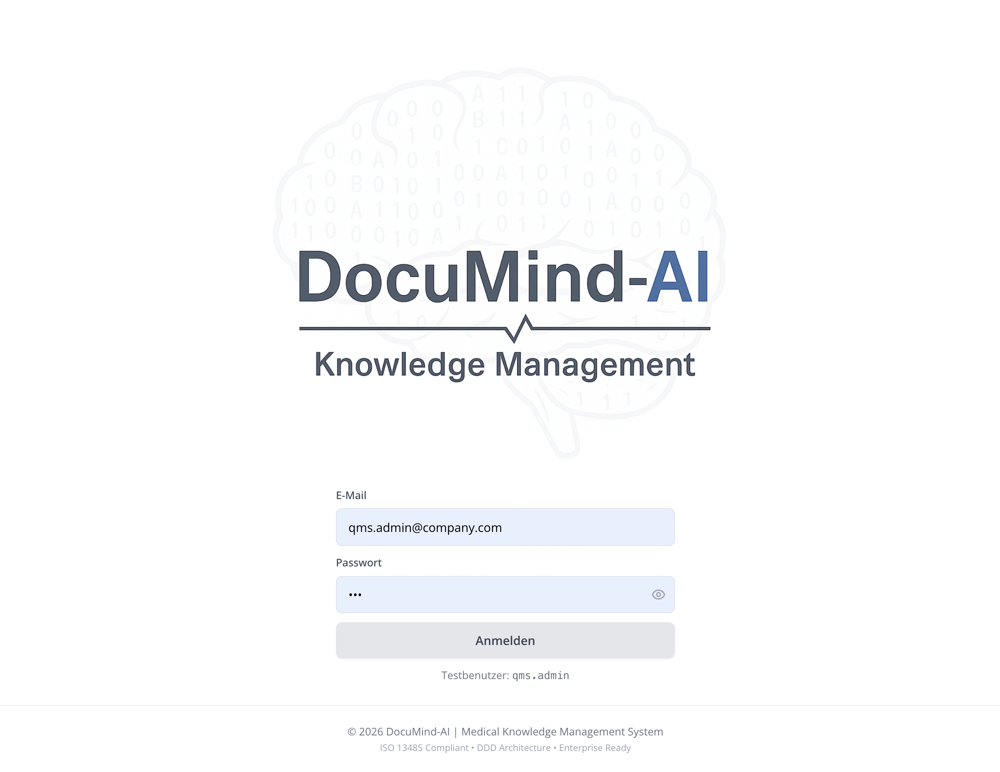

### Dokumente und Workflow

**Dokumentenuebersicht**

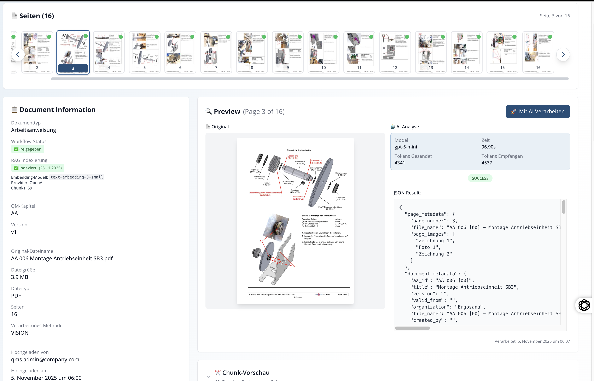

**Tabellarische Verwaltung**

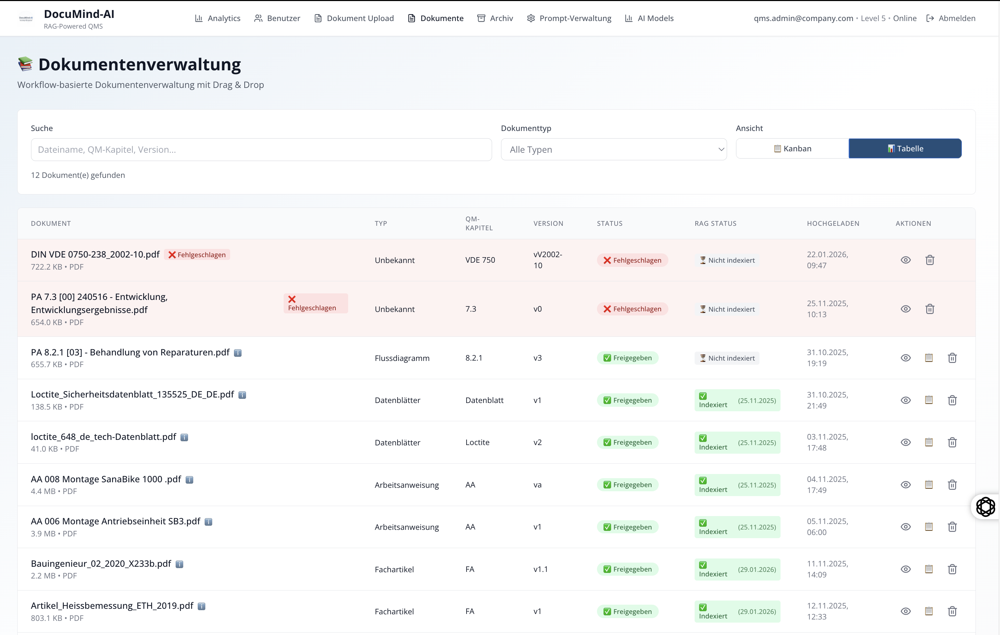

**Kanban-Workflow**

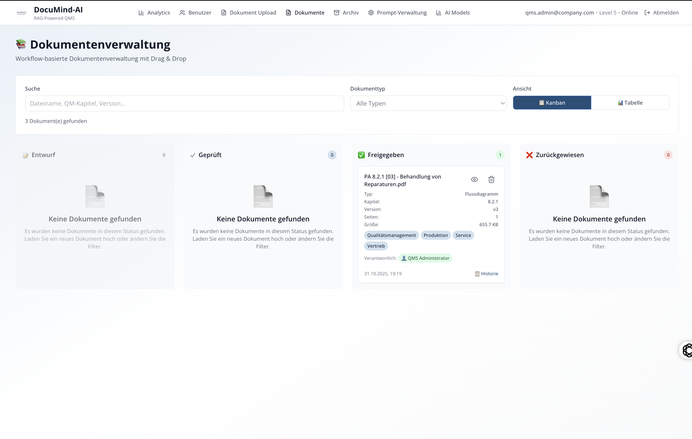

### KI-Assistent und Wissenszugriff

**RAG Chat Dashboard**

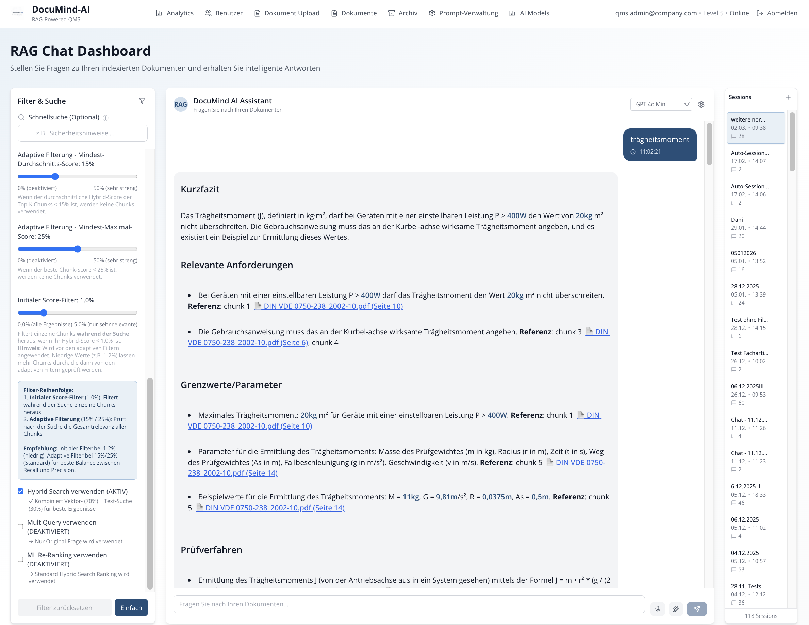

**Beispiel: Montage-Chat**

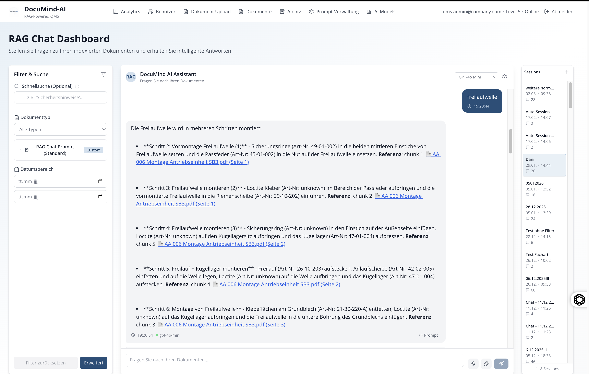

**Beispiel: Multimodale Auswertung**

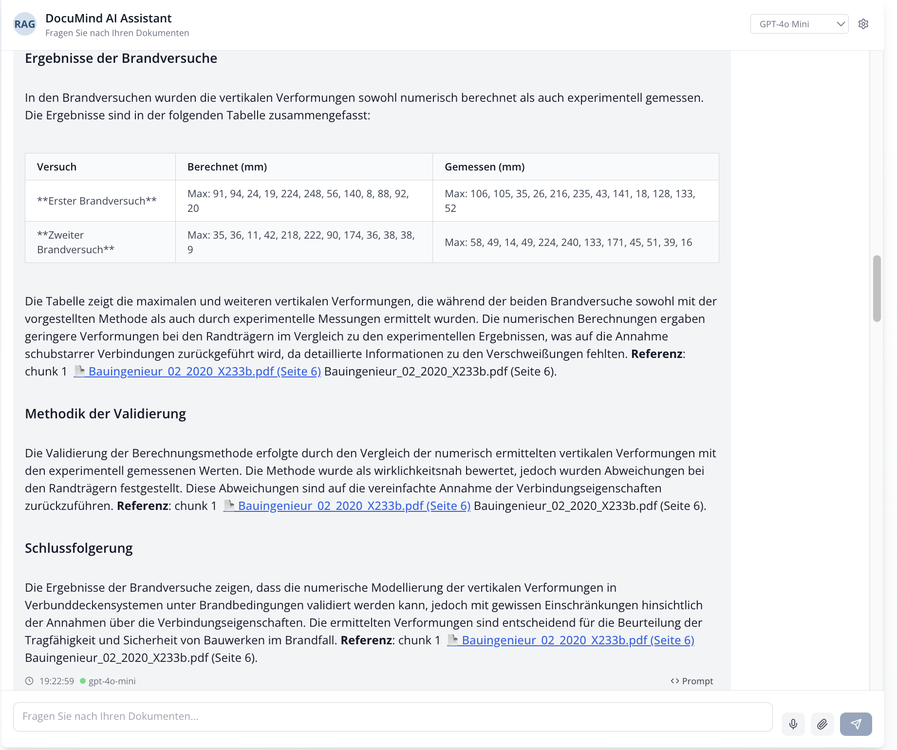

### Quellenbezug und Nachvollziehbarkeit

**Grafik-Quelle im Kontext**

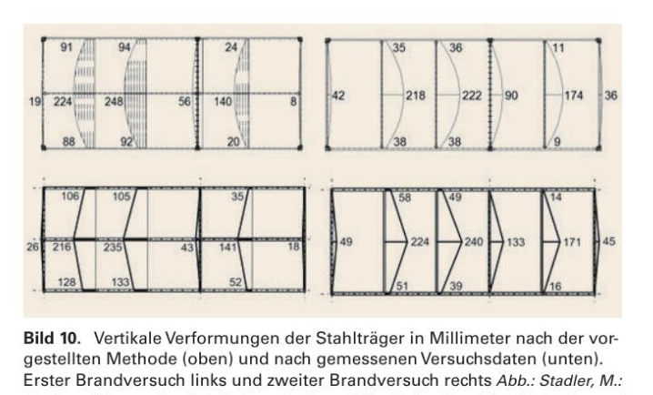

**Montagebild als Quelle**

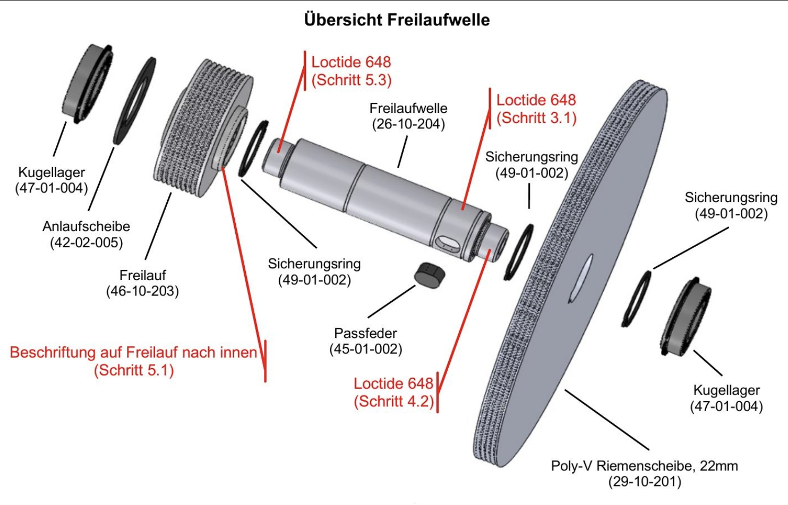

### Systemaufbau und Konfiguration

**Prompt-Management**

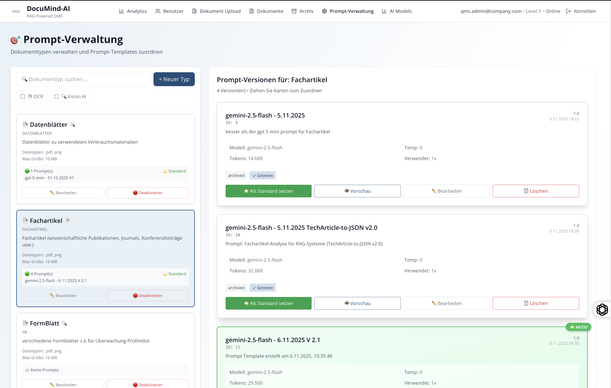

**Architekturansicht**

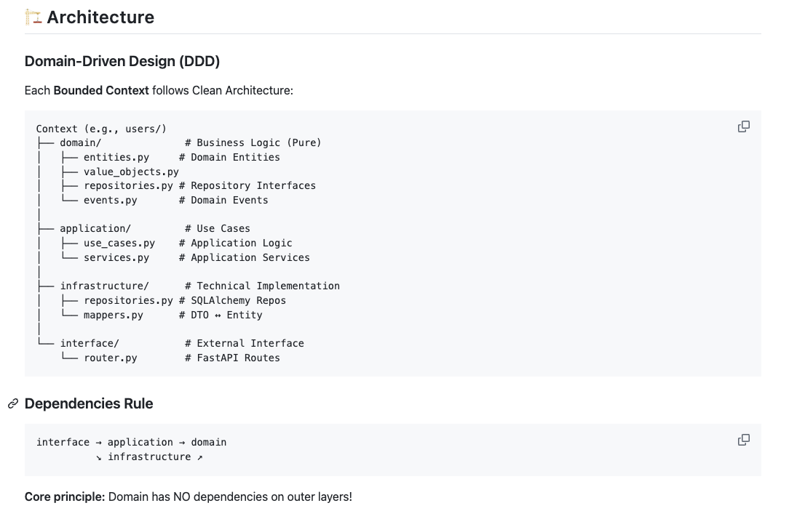

**Projektstruktur**

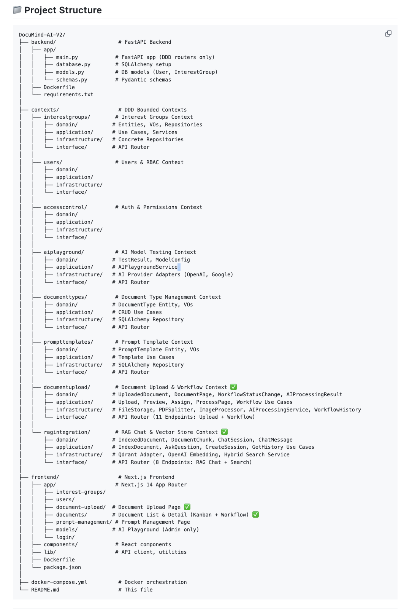

---

## Podcast zur Projektvorstellung

**Titel:** Bauplan fuer ein kontrollierbares KI-Unternehmensgehirn  
**Laenge:** ca. 17 Minuten

Podcast-Datei im Repository:

- [Podcast anhoeren (M4A)](Images/Bauplan_f%C3%BCr_ein_kontrollierbares_KI-Unternehmensgehirn.m4a)

---

## Repository

[GitHub: DocuMind-AI V2](https://github.com/Rei1000/DocuMind-AI-V2)
